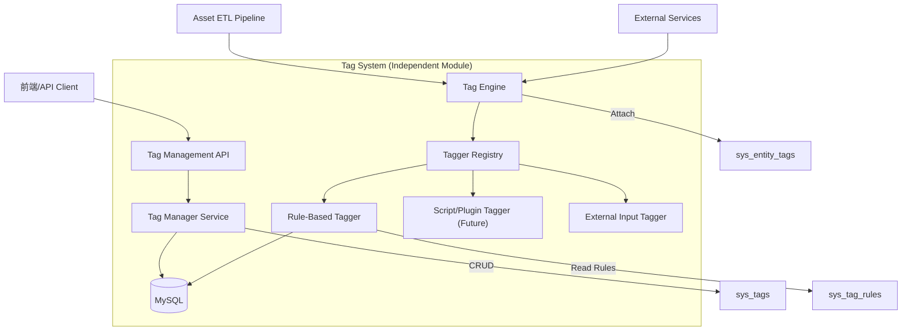

# 设计文档 - 分层标签体系 (Hierarchical Tagging System)

## 架构概览

本设计将标签系统构建为一个独立的服务模块 (`internal/service/tag_system`)，它不依赖具体的业务实体，而是通过接口与外部交互。

### 模块交互图



### 核心接口设计

```go
// Tagger 接口定义：所有打标器必须实现此接口
type Tagger interface {
    // Name 返回打标器的唯一标识，如 "rule_engine_v1"
    Name() string
    
    // Tag 根据实体信息返回匹配的标签ID列表
    // entity 是一个通用的 map 或 struct，包含用于判断的属性 (IP, Domain, OS, etc.)
    Tag(ctx context.Context, entity map[string]interface{}) ([]uint64, error)
}

// TagService 对外暴露的门面接口
type TagService interface {
    // 基础管理
    CreateTag(...)
    MoveTag(...)
    
    // 核心功能：自动打标
    // entityType: "asset", "scan_result", etc.
    // entityID: 唯一ID
    // attributes: 用于规则匹配的属性集合
    AutoTag(ctx context.Context, entityType string, entityID string, attributes map[string]interface{}) error
    
    // 查询
    GetTagsByEntity(...)
}
```

## 详细设计

### 1. 数据库设计 (MySQL) Update

为了支持更灵活的规则，更新 `sys_tag_rules` 表结构。

```sql
-- 标签定义表 (保持不变)
CREATE TABLE `sys_tags` (
  `id` bigint unsigned NOT NULL AUTO_INCREMENT,
  `parent_id` bigint unsigned NOT NULL DEFAULT '0',
  `name` varchar(128) NOT NULL,
  `full_path` varchar(768) NOT NULL, -- Materialized Path: /R/Zone/IDC
  `level` int NOT NULL DEFAULT '1',
  `color` varchar(32) DEFAULT '#2db7f5',
  `description` varchar(255) DEFAULT '',
  `created_at` datetime DEFAULT NULL,
  `updated_at` datetime DEFAULT NULL,
  PRIMARY KEY (`id`),
  KEY `idx_parent` (`parent_id`),
  KEY `idx_full_path` (`full_path`(255))
) ENGINE=InnoDB DEFAULT CHARSET=utf8mb4;

-- 自动打标规则表 (Updated)
CREATE TABLE `sys_tag_rules` (
  `id` bigint unsigned NOT NULL AUTO_INCREMENT,
  `tag_id` bigint unsigned NOT NULL,
  
  -- 新增：指定由哪个 Tagger 来处理这条规则
  `tagger_type` varchar(64) NOT NULL DEFAULT 'basic_rule_engine' COMMENT '处理此规则的打标器类型',
  
  -- 规则内容，支持 JSON 以扩展复杂性
  -- Basic Example: {"type": "cidr", "value": "192.168.0.0/16"}
  -- Complex Example: {"condition": "AND", "rules": [{"field": "os", "op": "contains", "val": "linux"}, ...]}
  `rule_content` json NOT NULL COMMENT '规则配置，格式由 tagger_type 定义',
  
  `priority` int NOT NULL DEFAULT '0',
  `is_active` tinyint(1) NOT NULL DEFAULT '1',
  `created_at` datetime DEFAULT NULL,
  `updated_at` datetime DEFAULT NULL,
  PRIMARY KEY (`id`),
  KEY `idx_tag` (`tag_id`),
  KEY `idx_tagger` (`tagger_type`)
) ENGINE=InnoDB DEFAULT CHARSET=utf8mb4;

-- 实体标签关联表 (保持不变)
CREATE TABLE `sys_entity_tags` (
  `id` bigint unsigned NOT NULL AUTO_INCREMENT,
  `entity_type` varchar(32) NOT NULL,
  `entity_id` varchar(128) NOT NULL,
  `tag_id` bigint unsigned NOT NULL,
  `source` varchar(64) DEFAULT 'manual' COMMENT '来源: manual, auto:rule_engine, etc.',
  `created_at` datetime DEFAULT NULL,
  PRIMARY KEY (`id`),
  UNIQUE KEY `uk_entity_tag` (`entity_type`, `entity_id`, `tag_id`),
  KEY `idx_query` (`entity_type`, `tag_id`)
) ENGINE=InnoDB DEFAULT CHARSET=utf8mb4;
```

### 2. 打标流程 (Auto-Tagging Flow)

1.  **触发**: Asset ETL 解析完一个资产，准备入库。
2.  **构建 Context**: ETL 将资产属性转换为 `map[string]interface{}` (e.g., `{"ip": "1.1.1.1", "os": "linux", "domain": "example.com"}`).
3.  **调用 Service**: `TagService.AutoTag(ctx, "asset", "asset_123", attributes)`.
4.  **Tagger 执行**:
    *   `TagService` 从数据库加载所有 Active Rules。
    *   根据 `tagger_type` 分发给对应的 Tagger 实现。
    *   `BasicRuleTagger` 解析 JSON 规则，进行匹配。
5.  **结果聚合**: 收集所有命中的 Tag IDs。
6.  **持久化**: 批量写入 `sys_entity_tags` (使用 `INSERT IGNORE` 或 `ON DUPLICATE KEY UPDATE` 避免重复)。

### 3. API 接口规范 (RESTful)

| Method | Endpoint | Description |
| :--- | :--- | :--- |
| POST | `/api/v1/tag-system/rules` | 创建打标规则 (需指定 tagger_type 和 rule_content) |
| POST | `/api/v1/tag-system/auto-tag` | 触发一次自动打标 (Debug/Manual Trigger) |
| ... | ... | (其他基础 CRUD 接口保持不变) |

### 4. 扩展性设计 (The "Pluggable" Aspect)

*   **Tagger Registry**: 在系统启动时，各个 Tagger 实现向 Registry 注册自己。
*   **JSON Rules**: 数据库不存储解析后的逻辑，只存 JSON 配置。解析逻辑封装在具体的 Tagger 代码中。这意味着如果我们想要升级规则引擎（例如支持 CEL），只需新增一个 `CELTagger` 并注册，无需迁移旧数据或修改表结构。

## 迁移与实施
1.  **Phase 1**: 实现基础 `TagManager` 和 `BasicRuleTagger` (支持 CIDR/Keyword)。
2.  **Phase 2**: 集成到 Asset ETL。
3.  **Phase 3**: 开发 `AdvancedTagger` (如基于脚本或复杂逻辑)。
