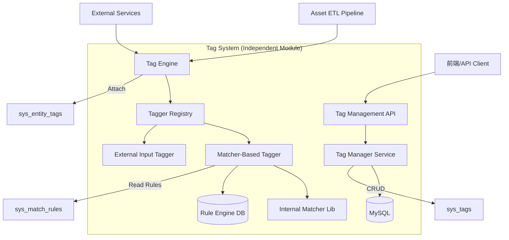

# 设计文档 - 分层标签体系 (Hierarchical Tagging System)

## 架构概览

本设计将标签系统构建为一个独立的服务模块 (`internal/service/tag_system`)，它不依赖具体的业务实体，而是通过接口与外部交互。

### 模块交互图



### 核心接口设计

```go
// Tagger 接口定义：所有打标器必须实现此接口
type Tagger interface {
    // Name 返回打标器的唯一标识，如 "matcher_v1"
    Name() string
    
    // Tag 根据实体信息返回匹配的标签ID列表
    // entity 是一个通用的 map 或 struct，包含用于判断的属性 (IP, Domain, OS, etc.)
    Tag(ctx context.Context, entity map[string]interface{}) ([]uint64, error)
}

// TagService 对外暴露的门面接口
type TagService interface {
    // 基础管理
    CreateTag(...)
    MoveTag(...)
    
    // 核心功能：自动打标 (实时)
    // 场景：新资产入库、资产属性变更
    // entityType: "asset", "scan_result", etc.
    // entityID: 唯一ID
    // attributes: 用于规则匹配的属性集合
    AutoTag(ctx context.Context, entityType string, entityID string, attributes map[string]interface{}) error
    
    // 规则扩散/回溯 (离线/批量)
    // 场景：新建或修改规则后，应用到历史存量数据
    // 场景举例：
    // 1. 网段标签：给 "192.168.1.0/24" 打标 -> 扩散到所有该网段 IP。
    // 2. 域名后缀：给 "*.corp.com" 打标 -> 扩散到所有内部域名资产。
    // ruleID: 刚刚创建/修改的规则ID
    PropagateRule(ctx context.Context, ruleID uint64) error

    // 查询
    GetTagsByEntity(...)
}
```

## 核心业务流程 (Core Workflows)

### 1. 实时自动打标流程 (Real-time Auto-Tagging)
当 ETL 管道处理新资产或更新资产时触发。

1.  **触发**: ETL 解析出资产信息 (Map<String, Any>)，调用 `TagService.AutoTag`。
2.  **加载规则**: `MatcherTagger` 从 `sys_tag_auto_configs` 和 `sys_match_rules` 加载所有**启用**的规则 (通常有缓存)。
3.  **内存匹配**: 遍历规则，调用 `matcher.Match(assetAttributes, rule)`。
4.  **结果聚合**: 收集所有匹配规则对应的 `TagID`。
5.  **持久化**: 将 `(EntityType, EntityID, TagID)` 写入 `sys_entity_tags` 表 (Insert Ignore 或 Upsert)。

### 2. 规则扩散与回溯流程 (Rule Propagation & Backfill)
当用户在后台创建了一条新规则（例如："所有 192.168.0.0/16 的 IP 打上 [办公网] 标签"），需要将此规则应用到系统中已存在的数万条资产上。

**挑战**: 由于规则是复杂的 JSON 逻辑树（包含 OR, AND, CIDR, Regex 等），无法直接生成一条 SQL `UPDATE` 语句来执行。
**解决方案**: **批量拉取 - 内存匹配 - 批量更新 (Batch Fetch & Evaluate)**

**执行步骤**:
1.  **触发**: 用户创建/更新规则后，异步触发 `TagService.PropagateRule(ruleID)`。
2.  **准备**:
    *   读取 `ruleID` 对应的规则详情 (JSON Expression) 和目标 `TagID`。
    *   确定规则适用的实体类型 (e.g., Asset)。
3.  **批处理循环**:
    *   **Fetch**: 分页从资产表 (`asset`) 拉取数据，每次 1000 条。
    *   **Evaluate**: 在内存中对这 1000 条数据逐一运行 `matcher.Match(asset, rule)`。
    *   **Filter**: 筛选出匹配成功的 Asset IDs。
    *   **Bulk Write**: 生成批量插入 SQL，将 `(AssetID, TagID)` 写入 `sys_entity_tags`。
4.  **完成**: 记录任务日志。

**场景案例支持**:
*   **场景 1 (网段标签)**:
    *   规则: `{"field": "ip", "op": "cidr", "value": "192.168.1.0/24"}` -> Tag: `安全域/办公区`
    *   执行: 遍历所有资产 IP，`matcher` 库会自动计算 CIDR 包含关系，匹配的资产会被打上标签。
*   **场景 2 (域名后缀)**:
    *   规则: `{"field": "domain", "op": "ends_with", "value": ".corp.com"}` -> Tag: `内部域名`
    *   执行: 遍历所有域名资产，字符串后缀匹配，匹配的打标。

## 详细设计

### 1. 数据库设计 (MySQL)

```sql
-- 标签定义表
CREATE TABLE `sys_tags` (
  `id` bigint unsigned NOT NULL AUTO_INCREMENT,
  `parent_id` bigint unsigned NOT NULL DEFAULT '0',
  `name` varchar(128) NOT NULL,
  `full_path` varchar(768) NOT NULL, 
  `level` int NOT NULL DEFAULT '1',
  `color` varchar(32) DEFAULT '#2db7f5',
  `description` varchar(255) DEFAULT '',
  `created_at` datetime DEFAULT NULL,
  `updated_at` datetime DEFAULT NULL,
  PRIMARY KEY (`id`),
  KEY `idx_parent` (`parent_id`),
  KEY `idx_full_path` (`full_path`(255))
) ENGINE=InnoDB DEFAULT CHARSET=utf8mb4;

-- 通用匹配规则表
-- 存储复杂的 JSON 逻辑树 (AND/OR/Field/Operator)
CREATE TABLE `sys_match_rules` (
  `id` bigint unsigned NOT NULL AUTO_INCREMENT,
  `name` varchar(128) NOT NULL COMMENT '规则名称',
  `description` varchar(255),
  `entity_type` varchar(32) NOT NULL DEFAULT 'asset' COMMENT '适用的实体类型，用于回溯时查询数据源',
  `expression` json NOT NULL COMMENT '通用的匹配表达式',
  `priority` int NOT NULL DEFAULT '0',
  `is_active` tinyint(1) NOT NULL DEFAULT '1',
  `created_at` datetime DEFAULT NULL,
  `updated_at` datetime DEFAULT NULL,
  PRIMARY KEY (`id`)
) ENGINE=InnoDB DEFAULT CHARSET=utf8mb4 COMMENT='通用匹配规则库';

-- 自动打标配置表
-- 将 "规则" 和 "标签" 关联起来
CREATE TABLE `sys_tag_auto_configs` (
  `id` bigint unsigned NOT NULL AUTO_INCREMENT,
  `tag_id` bigint unsigned NOT NULL,
  `match_rule_id` bigint unsigned NOT NULL COMMENT '引用的通用匹配规则ID',
  `is_active` tinyint(1) NOT NULL DEFAULT '1',
  `created_at` datetime DEFAULT NULL,
  PRIMARY KEY (`id`),
  KEY `idx_tag` (`tag_id`),
  KEY `idx_rule` (`match_rule_id`)
) ENGINE=InnoDB DEFAULT CHARSET=utf8mb4 COMMENT='自动打标配置';

-- 实体标签关联表
CREATE TABLE `sys_entity_tags` (
  `id` bigint unsigned NOT NULL AUTO_INCREMENT,
  `entity_type` varchar(32) NOT NULL,
  `entity_id` varchar(128) NOT NULL,
  `tag_id` bigint unsigned NOT NULL,
  `source` varchar(64) DEFAULT 'manual',
  `created_at` datetime DEFAULT NULL,
  PRIMARY KEY (`id`),
  UNIQUE KEY `uk_entity_tag` (`entity_type`, `entity_id`, `tag_id`),
  KEY `idx_query` (`entity_type`, `tag_id`)
) ENGINE=InnoDB DEFAULT CHARSET=utf8mb4;
```

### 2. 匹配器逻辑 (Reusing Existing Matcher)

我们直接复用 `internal/pkg/matcher` 包。

**核心逻辑**:
`MatcherTagger` (位于 `internal/service/tag_system/tagger/matcher_tagger.go`) 将充当适配器：
1.  从 DB 读取 `sys_match_rules.expression` (JSON)。
2.  调用 `matcher.ParseJSON(jsonStr)` 解析为 `matcher.MatchRule` 对象。
3.  调用 `matcher.Match(entity, rule)` 进行求值。

### 3. API 接口规范 (RESTful)

| Method | Endpoint | Description |
| :--- | :--- | :--- |
| POST | `/api/v1/rules` | 创建通用匹配规则 (存储到 sys_match_rules) |
| POST | `/api/v1/tag-system/configs` | 创建自动打标配置 (关联 Tag 和 Rule) |
| POST | `/api/v1/tag-system/auto-tag` | 触发一次自动打标 (实时) |
| POST | `/api/v1/tag-system/propagate` | 触发规则回溯 (异步任务) |
