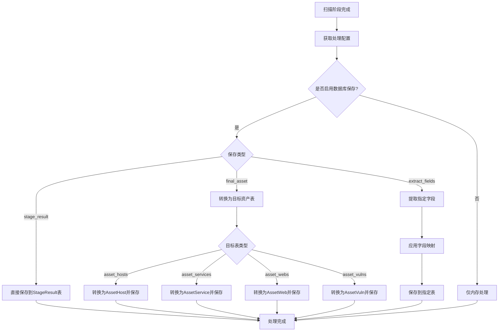
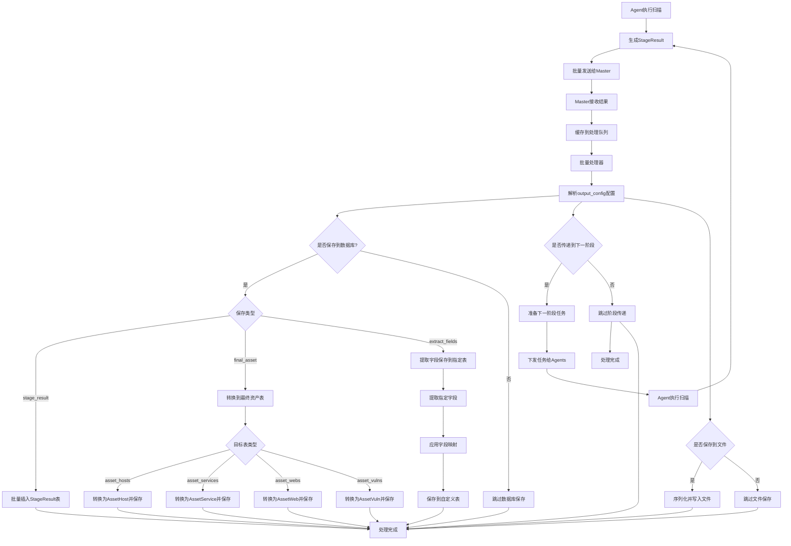
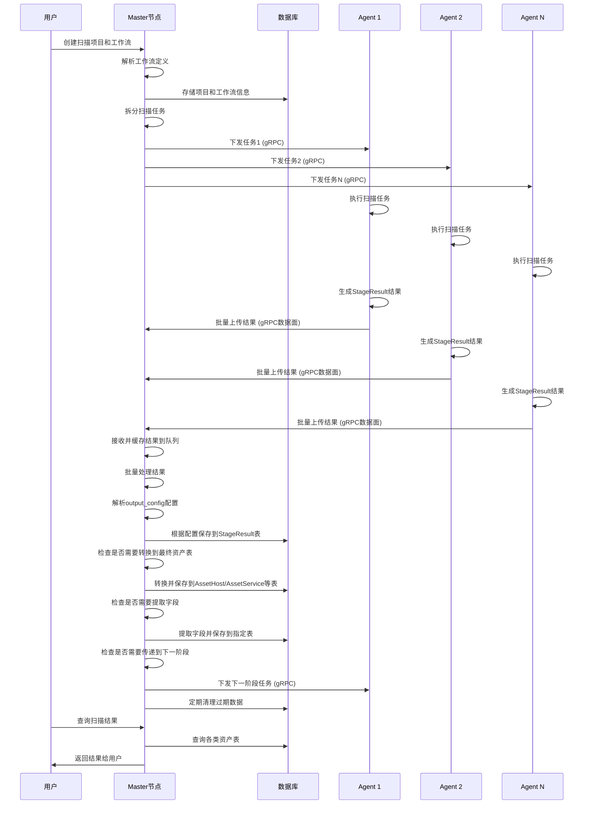
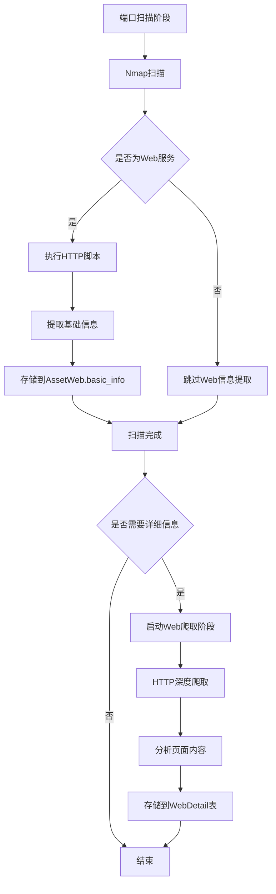

# Asset模型设计v1.0

## 扫描编排器 - 扫描过程梳理
一个扫描项目 --- 多个扫描工作流 --- 每个扫描工作流包含多个扫描阶段 --- 每个扫描阶段只允许一个工具
项目策略：
- 项目调度类型：立即执行/定时执行/手动触发/周期执行
- 是否发送通知 - 是/否(默认否，阶段扫描默认不通知，一个工作流完成默认通知)
    - 通知方式 - 邮件/SEC/蓝信/websocket等
    - 通知接收人 - 接收通知的人或群(多个用逗号分隔)
    - 通知内容 - 自定义通知内容(例如扫描完成，扫描结果等)
- 项目结果报告导出 - 是/否(默认否，结果保存到数据库中) --- 需要定义导出模板，扫描内容过多时需要统计数据导出
    - 导出格式 - CSV/Excel/JSON/HTML/markdown/word文档等
    - 导出路径 - 导出结果的文件路径(例如/var/scan/results/scan_results.csv)


一个扫描流程(工作流)：(举例包含3个阶段)
1.扫描阶段是什么 - 探活阶段 --- (探活阶段，端口扫描阶段，服务扫描阶段，漏洞扫描阶段等)
- 1. 进行哪种类型的扫描 - 探活扫描 ---- (探活，端口扫描，服务扫描，漏洞扫描等)
- 2. 使用哪种扫描的工具 - Nmap --- (Ping，Nmap，nsscan，自定义POC扫描器等)
- 3. 扫描工具的参数 - Nmap的参数 --- (-n -sn -PE -PS80,443,22,445,3389,12345 -PA21 -PU40125,161 --min-rate 50)
- 4. 扫描策略是什么
    - 扫描目标策略是 - 扫描的目标(IP地址/域名/IP范围/域名范围等) 【解决从哪里获取目标数据的问题】
        - 目标获取方式 - 从文件中读取/从数据库中读取/从数据库视图中读取/SQL语句读取(系统内表)/人工输入目标/API接口获取/从其他扫描阶段输出
            - 从文件中读取 - 这里填写文件路径(多个文件用逗号分隔)
            - 从数据库中读取 - 这里填写数据库表名(多个表用逗号分隔)
            - 从数据库视图中读取 - 这里填写数据库视图名(多个视图用逗号分隔) 【数据库抽象一层视图供系统使用】
            - SQL语句读取 - 这里填写SQL语句(例如SELECT ip FROM assets WHERE ip LIKE '192.168.1.%') 
            - 人工输入 - 手动输入目标(多个目标用逗号分隔)
            - API接口获取 - 这里填写API接口地址(例如https://api.xxx.com/scan)[待完善-需要配置API接口参数]
            - 从其他扫描阶段输出 - 这里填写其他扫描阶段的输出字段(多个字段用逗号分隔)
        - 目标类型 - IP地址或IP范围/域名或域名通配符等
    - 白名单策略 - 白名单不扫描
    - 跳过策略 - 如果满足某些条件，就不继续扫描了(例如发现是网络设备，蜜罐设备等)
    - 是否使用代理 - 是/否(默认不使用代理,是的话需要配置代理参数)
    - 代理参数配置
        - 代理类型 - http/https/socks4/socks5
        - 代理地址 - 代理服务器的IP地址或域名
        - 代理端口 - 代理服务器的端口号
        - 代理用户名 - 如果代理服务器需要认证，这里填写用户名
        - 代理密码 - 如果代理服务器需要认证，这里填写密码
    - 扫描参数配置(通用参数不包含扫描工具自带参数)
        - 扫描速率 - 扫描的速率(默认50) - 每秒发包数 pps 
        - 扫描深度 - 扫描的深度(默认1) (可选参数[爬虫类工具参数]，0-仅种子页面,1-种子页+其直接链接,2-种子页+其直接链接+其间接链接)
        - 扫描并发 - 扫描的并发数(默认50) (同时扫描多个目标的最大目标数)
        - 扫描进程数 - 扫描的进程数(默认50) (允许同时运行扫描工具的最大进程数)
        - 超时时间 - 扫描超时时间(默认180秒)
        - 重试次数 - 扫描重试次数(默认3次)
    - 结果是否保存 - 是/否(默认是，是的话需要配置保存的路径或数据表)
    - 结果参数配置
        - 保存类型 - 文件/数据库/输出
        - 保存路径 - 如果选择保存到文件，这里填写文件路径
            - 保存格式 - json/xml/csv/html/markdown/text
            - 保存策略 - 覆盖/追加(默认覆盖)
            - 是否定期清理数据表 - 是/否(默认是，定期清理数据表，留存时间生效，否则不进行定期清理，留存时间为0，不进行定期清理)
            - 留存时间 - 扫描结果留存时间(默认7天)
        - 数据表 - 如果选择保存到数据库，这里填写数据表名(默认保存到数据表中)
            - 保存格式 - 不设置
            - 保存策略 - 覆盖/追加(默认覆盖) - 后续扫描结构将覆盖之前的结果
            - 是否定期清理数据表 - 是/否(默认是，定期清理数据表，留存时间生效，否则不进行定期清理，留存时间为0，不进行定期清理)
            - 留存时间 - 扫描结果留存时间(默认7天) 
        - 输出 - 如果选择输出到下一个扫描阶段，这里填写输出的字段(多个用逗号分隔)
            - 输出到下一个扫描阶段 - 下一个扫描阶段ID
            - 输出字段 - 输出的字段(多个用逗号分隔) --- 这些是下一个阶段的输入
    - 是否发送通知 - 是/否(默认否，阶段扫描默认不通知，一个工作流完成默认通知)
        - 通知方式 - 邮件/SEC/蓝信/websocket等
        - 通知接收人 - 接收通知的人或群(多个用逗号分隔)
        - 通知内容 - 自定义通知内容(例如扫描完成，扫描结果等)


2.扫描阶段是什么 - 端口扫描阶段
- 1. 进行哪种类型的扫描 - 端口扫描 
- 2. 使用哪种扫描的工具 - Nmap 
- 3. 扫描工具的参数 - Nmap的参数 --- (-Pn -sS -O -T4 --open --script firewall-bypass --min-rate=400 --host-timeout 180)
- 4. 扫描策略是什么
    - 扫描目标策略是 - 扫描的目标(IP地址/域名/IP范围/域名范围等) 【解决从哪里获取目标数据的问题】
        - 目标获取方式 - 从文件中读取/从数据库中读取/从数据库视图中读取/SQL语句读取(系统内表)/人工输入目标/API接口获取/从其他扫描阶段输出
            - 从文件中读取 - 这里填写文件路径(多个文件用逗号分隔)
            - 从数据库中读取 - 这里填写数据库表名(多个表用逗号分隔)
            - 从数据库视图中读取 - 这里填写数据库视图名(多个视图用逗号分隔) 【数据库抽象一层视图供系统使用】
            - SQL语句读取 - 这里填写SQL语句(例如SELECT ip FROM assets WHERE ip LIKE '192.168.1.%') 
            - 人工输入 - 手动输入目标(多个目标用逗号分隔)
            - API接口获取 - 这里填写API接口地址(例如https://api.xxx.com/scan)[待完善]
            - 从其他扫描阶段输出 - 这里填写其他扫描阶段的输出字段(多个字段用逗号分隔)
        - 目标类型 - IP地址或IP范围/域名或域名通配符等
    - 白名单策略 - 白名单不扫描
    - 跳过策略 - 如果满足某些条件，就不继续扫描了(例如发现是网络设备，蜜罐设备等)
    - 是否使用代理 - 是/否(默认不使用代理,是的话需要配置代理参数)
    - 代理参数配置
        - 代理类型 - http/https/socks4/socks5
        - 代理地址 - 代理服务器的IP地址或域名
        - 代理端口 - 代理服务器的端口号
        - 代理用户名 - 如果代理服务器需要认证，这里填写用户名
        - 代理密码 - 如果代理服务器需要认证，这里填写密码
    - 扫描参数配置(通用参数不包含扫描工具自带参数)
        - 扫描速率 - 扫描的速率(默认50) - 每秒发包数 pps 
        - 扫描深度 - 扫描的深度(默认1) (可选参数[爬虫类工具参数]，0-仅种子页面,1-种子页+其直接链接,2-种子页+其直接链接+其间接链接)
        - 扫描并发 - 扫描的并发数(默认50) (同时扫描多个目标的最大目标数)
        - 扫描进程数 - 扫描的进程数(默认50) (允许同时运行扫描工具的最大进程数)
        - 超时时间 - 扫描超时时间(默认180秒)
        - 重试次数 - 扫描重试次数(默认3次)
    - 结果是否保存 - 是/否(默认是，是的话需要配置保存的路径或数据表)
    - 结果参数配置
        - 保存类型 - 文件/数据库/输出
        - 保存路径 - 如果选择保存到文件，这里填写文件路径
            - 保存格式 - json/xml/csv/html/markdown/text
            - 保存策略 - 覆盖/追加(默认覆盖)
            - 是否定期清理数据表 - 是/否(默认是，定期清理数据表，留存时间生效，否则不进行定期清理，留存时间为0，不进行定期清理)
            - 留存时间 - 扫描结果留存时间(默认7天)
        - 数据表 - 如果选择保存到数据库，这里填写数据表名(默认保存到数据表中)
            - 保存格式 - 不设置
            - 保存策略 - 覆盖/追加(默认覆盖) - 后续扫描结构将覆盖之前的结果
            - 是否定期清理数据表 - 是/否(默认是，定期清理数据表，留存时间生效，否则不进行定期清理，留存时间为0，不进行定期清理)
            - 留存时间 - 扫描结果留存时间(默认7天) 
        - 输出 - 如果选择输出到下一个扫描阶段，这里填写输出的字段(多个用逗号分隔)
            - 输出到下一个扫描阶段 - 下一个扫描阶段ID
            - 输出字段 - 输出的字段(多个用逗号分隔) --- 这些是下一个阶段的输入
    - 是否发送通知 - 是/否(默认否，阶段扫描默认不通知，一个工作流完成默认通知)
    - 扫描目标策略是 - 扫描的目标(IP地址/域名/IP范围/域名范围等) 【解决从哪里获取目标数据的问题】
        - 目标获取方式 - 从文件中读取/从数据库中读取/从数据库视图中读取/SQL语句读取(系统内表)/人工输入目标/从其他扫描阶段输出
            - 从文件中读取 - 这里填写文件路径(多个文件用逗号分隔)
            - 从数据库中读取 - 这里填写数据库表名(多个表用逗号分隔)
            - 从数据库视图中读取 - 这里填写数据库视图名(多个视图用逗号分隔) 【数据库抽象一层视图供系统使用】
            - SQL语句读取 - 这里填写SQL语句(例如SELECT ip FROM assets WHERE ip LIKE '192.168.1.%') 
            - 人工输入 - 手动输入目标(多个目标用逗号分隔)
            - 从其他扫描阶段输出 - 这里填写其他扫描阶段的输出字段(多个字段用逗号分隔)
        - 目标类型 - IP地址或IP范围/域名或域名通配符等
    - 白名单策略 - 白名单不扫描
    - 跳过策略 - 如果满足某些条件，就不继续扫描了(例如发现是网络设备，蜜罐设备等)
    - 是否使用代理 - 是/否(默认不使用代理,是的话需要配置代理参数)
    - 代理参数配置
        - 代理类型 - http/https/socks4/socks5
        - 代理地址 - 代理服务器的IP地址或域名
        - 代理端口 - 代理服务器的端口号
        - 代理用户名 - 如果代理服务器需要认证，这里填写用户名
        - 代理密码 - 如果代理服务器需要认证，这里填写密码
    - 扫描速率 - 扫描的速率(默认50)
    - 超时时间 - 扫描超时时间(默认180秒)
    - 重试次数 - 扫描重试次数(默认3次)
    - 结果是否保存 - 是/否(默认是，是的话需要配置保存的路径或数据表)
    - 结果参数配置
        - 保存类型 - 文件/数据库/输出
        - 保存路径 - 如果选择保存到文件，这里填写文件路径
            - 保存格式 - json/xml/csv/html/markdown/text
            - 保存策略 - 覆盖/追加(默认覆盖)
            - 是否定期清理数据表 - 是/否(默认是，定期清理数据表，留存时间生效，否则不进行定期清理，留存时间为0，不进行定期清理)
            - 留存时间 - 扫描结果留存时间(默认7天)
        - 数据表 - 如果选择保存到数据库，这里填写数据表名(默认保存到数据表中)
            - 保存格式 - 不设置
            - 保存策略 - 覆盖/追加(默认覆盖) - 后续扫描结构将覆盖之前的结果
            - 是否定期清理数据表 - 是/否(默认是，定期清理数据表，留存时间生效，否则不进行定期清理，留存时间为0，不进行定期清理)
            - 留存时间 - 扫描结果留存时间(默认7天) 
        - 输出 - 如果选择输出到下一个扫描阶段，这里填写输出的字段(多个用逗号分隔)
            - 输出到下一个扫描阶段 - 下一个扫描阶段ID
            - 输出字段 - 输出的字段(多个用逗号分隔) --- 这些是下一个阶段的输入
    - 是否发送通知 - 是/否(默认否，阶段扫描默认不通知，一个工作流完成默认通知)

3.扫描阶段是什么 - 漏洞扫描阶段
- 1. 进行哪种类型的扫描 - 漏洞扫描 
- 2. 使用哪种扫描的工具 - Nuclei
- 3. 扫描工具的参数 - Nuclei的参数 --- (-t cve -l /path/to/hosts.txt -o /path/to/output.txt)
- 4. 扫描策略是什么【同上】

    
## 设计原则
资产分类不是靠“为每种资产新建一张表”来体现，而是靠统一的数据结构与少量枚举/标签在不同层（种子、阶段、最终实体）中表达类型与关系。这种设计消除了特殊情况、降低复杂度，并保持向后兼容

### 数据结构分层清晰：
1. 原料入口统一： RawAsset 吸收异构来源，避免分类在入口处爆炸。
2. 初步规范化：RawAsset经过处理形成RawAssetNetwork（系统内可维护网段资产）
3. 编排种子： AssetNetwork 作为扫描起点，仅用 cidr 驱动目标范围。 
4. 阶段结果统一： StageResult 用 result_type 与 target_type 表示输出种类和目标类型。
5. 最终资产实体： AssetHost/AssetService/AssetWeb 三类规范化实体承载查询与报表；漏洞情报资产独立维护为 AssetVuln。
【三种类型：资产类型 asset_type，目标类型 target_type，结果类型 result_type，类型的取值需要固定】

### 分类体现
资产类型用 asset_type 字段明确表达：AssetService.asset_type=service|database|container，AssetWeb.asset_type=web|api|domain；
- IP/网段资产
  - 编排输入：网段用 AssetNetwork.cidr 表示。
  - 阶段结果：目标类型为 ip （ StageResult.target_type ），探活/端口等由 result_type 区分。
  - 最终实体：主机归一到 AssetHost ，服务归一到 AssetService 。
- 应用资产
  - 网络应用(非Web)：归一到 AssetService ，用 asset_type=service 表示资产类型，cpe/fingerprint(指纹定义专门的json结构和字段) 定义指纹。
  - Web应用：归一到 AssetWeb ，用 asset_type=web 表示资产类型，用 url/tech_stack/status 表示端点与技术栈。
- 域名资产
  - 识别与归类：归一到 AssetWeb ，asset_type=domain 表示资产类型是域名。
  - 阶段结果：目标类型为 target_type=domain (StageResult.target_type)。
  - 最终实体：通常体现在 AssetWeb.domain， host_id 可选用于映射解析归属。
- 容器资产
  - 识别与归类：用 asset_type=container 表示资产类型，由 StageResult.attributes 承载容器/编排信息（如 Docker/K8s 指纹），最终归一到 AssetService （服务进程端口）和 AssetHost （宿主机/节点），通过 fingerprint/tags 标注容器维度。
  - 不单独新建 AssetContainer ，除非报告/查询确实需要一类实体；当前设计用指纹+关系即可体现。
- 数据库资产
  - 识别与归类：归一到 AssetService ，用 asset_type=database 表示资产类型，cpe/fingerprint(指纹定义专门的json结构和字段) 定义指纹。
  - 阶段识别： StageResult.result_type=database。
- API资产
  - 识别与归类：归一到 AssetWeb ，用 asset_type=api 表示资产类型，cpe/fingerprint(指纹定义专门的json结构和字段) 定义指纹。
  - 阶段结果： result_type=web_endpoint ，在 attributes.endpoints 表示 API 端点，技术栈可含 openapi/rest/graphql 等。
  - 最终实体：归一到 AssetWeb ，用 url/tech_stack/status 表示接口端点和框架。
设计原则与理由

- 好品味：不为每种“资产种类”拉一张新表。统一入口（RawAsset）、统一阶段（StageResult）、统一最终实体（Host/Service/Web） + 独立漏洞情报 AssetVuln，资产分类 asset_type 体现。
- Never break userspace：保留 payload/evidence/source_stage_ids 做全链路回溯。
- 实用主义：只在“查询/报表真的需要”时再引入新实体，否则用现有 tech_stack/fingerprint/tags 足以满足分类与检索。


## 资产模型
不同类型的资产通过 RawAsset 进来之后，会被分到特定的模型进行规范化处理，没有对 RawAsset 专门设计 asset_type 字段，而采用 tags 的json方式区分
- 网络资产 需要特殊处理（CIDR分割）并经历 RawAsset → RawAssetNetwork → AssetNetwork → AssetNetworkScan 流程
- 域名资产 直接从RawAsset到AssetWeb等最终实体（后续补充）
- 其他资产类型 有各自的处理路径（后续补充）
### 网段资产数据流转设计
RawAsset (系统外异构原始数据) --- 理论上RawAsset还包含其他类型资产，只是目前只考虑网段资产，别的类型资产处理方式后续规划

    ↓ (规范化处理)

RawAssetNetwork (系统内可维护网段资产)

    ↓ (拆分处理)

AssetNetwork (扫描任务)

    ↓ (扫描执行)

AssetNetworkScan (扫描记录)

### 原料资产模型 --- 需要落库
定义：通过不同的方式接入到本系统的资产数据类型
特点：结构繁杂不统一，不能系统直接使用，需要转换为统一的资产模型
同步方式：文件导入，第三方数据库导入，第三方API接口导入等

字段建议（RawAsset，统一原始入库格式，避免各接入源的特殊情况蔓延到系统内）：
- `id`：自增主键
- `source_type`：数据来源类型（`file`/`db`/`api`/`manual`）
- `source_name`：来源名称或连接标识（文件路径、库名、API标识等）
- `external_id`：来源系统中的主键或唯一键（可选）
- `payload`：原始数据 JSON（不做字段拆分，保证完整可回溯）
- `checksum`：原始记录校验（用于幂等与去重）
- `import_batch_id`：导入批次标识（便于回滚与审计）
- `priority`：处理优先级（整数，越大越优先）
- `asset_metadata`：资产元数据（JSON数组，用于分类标记等）【使用asset_metadata字段区分资产类型，可以同一个资产属于多种类型，文件《RawAsset_asset_metadata结构设计.md》中详细说明asset_metadata结构json设计】
- `tags`：标签（JSON 数组，归档用途，如业务线、敏感域）【["production", "critical", "internal"]】
- `processing_config`：处理配置（JSON，指定该数据源的特殊处理策略）
- `imported_at`：导入时间
- `normalize_status`：规范化状态（`pending`/`success`/`failed`）
- `normalize_error`：规范化失败原因（可选）
- `created_at`：创建时间
- `updated_at`：更新时间

设计理由：
- 用一个统一的原料表承接异构数据，最大化好品味：把特殊情况隔离在入口，后续流程只处理规范化后的统一结构。
- 保留 `payload` 原始 JSON 与批次信息，保证Never break userspace：任何字段变动都可追溯到原始记录。
- 引入 `priority` 字段支持不同数据源的处理优先级
- 添加 `tags` 字段便于对原始资产进行分类标记
- 增加 `processing_config` 字段支持不同来源数据的差异化处理策略

字段使用说明：
1. tags使用：
- 保持标签简洁，使用下划线命名法
- 避免过于复杂的标签层次
- 标签应该具有业务意义
2. asset_metadata使用：
- 遵循预定义的结构
- 避免随意添加未定义的字段
- 保持数据的一致性和完整性


### 系统内网段资产模型 - 系统可维护的网段资产表 --- 需要落库
定义：系统可以使用的原始资产数据(可作为系统使用的资产数据表)，存储网段资产
可以用来生成 asset_network 表并开始扫描任务

字段建议（RawAssetNetwork）：
- `id`：自增主键
- `network`：网段（如 `192.168.0.0/16`）保持原始网段，不进行拆分
- `name`：资产名称（如 `公司内网`）
- `description`: 资产信息描述
- `exclude_ip`: 排除的IP或CIDR（列表）
- `location`：地理位置（可选，可以是机房名称、区域名称等）
- `security_zone`：网络安全区域（可选，逻辑概念，如DMZ，数据防护区等）
- `network_type`：网络类型（`internal`内网/`external`互联网/`isolation`隔离区）
- `priority`：调度优先级（整数，越大越优先）
- `tags`：标签（JSON 数组，归档用途，如业务线、敏感域）
- `source_type`：数据来源类型（`file`/`db`/`api`/`manual`）
- `source_identifier`：来源标识（文件路径、数据库表名、API地址等）
- `status`：`active`(应该扫描)/`paused`(暂停扫描)/`retired`(不再扫描)（用于调度器控制扫描启停策略）
- `note`：备注
- `created_by`：创建人或系统任务 ID
- `created_at`：创建时间
- `updated_at`：更新时间

约束：
- 主键：`id`
- 唯一约束：`network`

RawAssetNetwork 表索引：
- 主键索引：`id`
- 唯一索引：`network`
- 查询索引：`status`, `priority`

设计理由：
- 作为系统内部使用的网段资产表，用于生成扫描任务
- 保持原始网段不进行拆分，由后续处理流程进行拆分
- 包含必要的调度和管理字段
- 通过source_type和source_identifier替代source_ref，提供更清晰的来源信息

### 初始网段资产模型 - 专注于扫描任务 --- 需要落库
定义：系统可以使用的原始资产数据(可作为扫描的开始数据表 - 如 `asset_network`)
特点：结构简单统一，可以作为系统使用的资产数据
同步方式：系统自动生成，定时任务生成，手动生成等

字段建议（AssetNetwork，作为编排器输入的标准化种子资产）：
- `id`：自增主键
- `network`：原始网段（如 `192.168.0.0/16`）
- `cidr`：拆分后的网段（如 `192.168.1.0/24`）
- `split_from_id`：外键，指向 AssetNetwork.id (指向拆分来源网段记录的ID)
- `split_order`：拆分顺序，用于追踪拆分过程
- `round`：扫描轮次（整数，默认为1）【可统计扫描频率，性能趋势，比较不同轮次结果等（骚操作字段）】
- `network_type`：网络类型（`internal`内网/`external`互联网/`isolation`隔离区）
- `priority`：调度优先级（整数，越大越优先）
- `tags`：标签（JSON 数组，归档用途，如业务线、敏感域）
- `source_ref`：来源引用（(指向 RawAssetNetwork.id)
- `status`：`active`(应该扫描)/`paused`(暂停扫描)/`retired`(不再扫描)（用于调度器控制扫描启停策略，语义控制层面，表示网段的可用性状态）【调度状态】
- `scan_status`：扫描状态（`pending`/`scanning`/`completed`/`failed`） (用于扫描执行器和监控系统记录实际扫描状态)【执行状态】
- `last_scan_at`：最后一次扫描完成时间（便于快速查询最近扫描时间）
- `next_scan_at`：预计下次扫描时间（用于定时扫描策略）
- `note`：备注
- `created_by`：创建人或系统任务 ID
- `created_at`：创建时间
- `updated_at`：更新时间（任何字段更新，记录有变动自动更新）

约束：
- 主键：`id`
- 外键：`split_from_id` REFERENCES `AssetNetwork(id)`
- 唯一约束：`(network, cidr)`

AssetNetwork 表索引：
- 主键索引：`id`
- 唯一索引：`(network, cidr)`
- 外键索引：`split_from_id`
- 查询索引：`status`, `scan_status`, `round`, `priority`

设计理由：
- 使用 `cidr` 作为实际扫描单元，确保所有网段都在 /24 或更小范围内，控制扫描任务粒度
- `network` 字段保留原始网段信息，便于追踪和审计
- `split_from_id` 外键实现网段拆分的血缘追踪，符合规范，相比直接存储原始网络字符串更节省空间且查询效率更高
- `split_order` 字段记录网段拆分顺序，支持扫描任务的有序调度、进度跟踪和异常恢复
- 引入 `priority`/`status` 支持编排器的调度与控制，贴合实用主义
- 唯一约束 `(network, cidr)` 防止重复的网段记录，保证数据完整性

样例：
原始网段: 192.168.0.0/16 (id: 1)
拆分后:
192.168.0.0/24 (split_from_id: 1, split_order: 1)
192.168.1.0/24 (split_from_id: 1, split_order: 2)
192.168.2.0/24 (split_from_id: 1, split_order: 3)
  ... 
192.168.255.0/24 (split_from_id: 1, split_order: 256)

split_order 使用方式和场景：
1. 拆分过程追踪：当一个大网段如 192.168.0.0/16 被拆分为 256 个 /24 网段时，split_order 记录了这些子网段的生成顺序（1-256）
2. 扫描任务调度：系统可根据 split_order 按顺序安排扫描任务，优化网络资源使用，例如顺序扫描相邻网段
3. 进度监控：通过查询已完成的最高 split_order 值，可以确定大网段扫描的完成进度
4. 异常恢复：当扫描中断后重启时，可通过 split_order 快速定位从哪个子网段继续扫描
5. 负载均衡：在分布式扫描环境中，可根据 split_order 将连续的网段分配给不同的扫描节点

### 网段扫描记录模型 - 专注于扫描任务过程 --- 需要落库
定义：记录每个网段的扫描历史和当前分配的Agent

字段建议（AssetNetworkScan）：
- `id`：自增主键
- `network_id`：外键，指向 AssetNetwork.id
- `agent_id`：外键，指向执行扫描的Agent ID
- `scan_status`：扫描状态(表示当下扫描状态) （`pending`/`scanning`/`completed`/`failed`） 和 AssetNetwork.scan_status（表示整体扫描状态） 字段一致
- `round`：扫描轮次（与AssetNetwork.round对应）
- `scan_tool`：使用的扫描工具（如 nmap, masscan 等）
- `scan_config`：扫描配置快照（JSON，记录当时使用的扫描参数）
- `result_count`：扫描结果数量（记录本次扫描发现的资产数量）
- `duration`：扫描耗时（秒，记录扫描任务执行时间）
- `error_message`：错误信息（扫描失败时记录详细错误信息）
- `started_at`：扫描开始时间
- `finished_at`：扫描完成时间（可为空）
- `assigned_at`：分配给Agent的时间
- `scan_result_ref`：扫描结果引用（可选，指向扫描结果ID）
- `note`：备注
- `retry_count`：重试次数
- `created_at`：创建时间
- `updated_at`：更新时间

约束：
- 主键：`id`
- 外键：`network_id` REFERENCES `AssetNetwork(id)`
- 外键：`agent_id` REFERENCES `Agent(id)`（假设Agent表存在）
- 索引：`network_id`（提高查询效率）
- 索引：`agent_id`（提高按Agent查询效率）
- 索引：`scan_status`（提高按状态查询效率）

AssetNetworkScan 表索引：
- 主键索引：`id`
- 外键索引：`network_id`, `agent_id`
- 查询索引：`scan_status`, `round`, `started_at`, `finished_at`

设计理由：
- 通过单独的表记录扫描历史，支持一个网段被多次扫描的场景
- 保留完整的扫描生命周期信息（分配时间、开始时间、完成时间）
- 支持按Agent、网段、状态等多种维度查询
- 可扩展性强，便于增加新的扫描相关字段

样例：
network_id=1 的扫描历史：
id=1, scan_status=completed (第一次扫描)
id=2, scan_status=completed (第二次扫描)
id=3, scan_status=scanning  (当前正在进行的第三次扫描)


### 扫描阶段资产模型  --- 需要落库(配置文件可选配落库)
定义：每个扫描阶段（探活、端口、服务、漏洞、Web等）产出的阶段结果，用于驱动下一个阶段的输入。

统一模型（StageResult，消除多表多类型的特殊分支）：
- `id`：自增主键
- `workflow_id`：所属工作流 ID
- `stage_id`：阶段 ID（按编排器定义唯一）
- `agent_id`：执行扫描的 Agent ID（新增字段）【master添加agentID】
- `result_type`：结果类型枚举（`ip_alive`/`port_scan`/`service_fingerprint`/`vuln_finding`/`web_endpoint` 等）
- `target_type`：`ip`/`domain`/`url`
- `target_value`：目标值（如 `192.168.1.10` 或 `example.com`）
- `attributes`：结构化属性 JSON（与工具输出对齐，如端口列表、指纹、CPE、证据）
- `evidence`：原始证据 JSON（工具原始输出的必要片段）
- `produced_at`：产生时间
- `producer`：工具标识与版本（如 `nmap 7.93`，`nuclei 3.x`）
- `output_config`：输出配置 JSON（记录该阶段结果的输出配置，包括是否保存到文件、数据库或传递到下一阶段）
- `created_at`：创建时间
- `updated_at`：更新时间

典型 `result_type` 映射：
- `ip_alive`：探活结果（`attributes.alive=true`，`attributes.protocols=[icmp,tcp]`）
- `port_scan`：端口扫描（`attributes.ports=[{port,proto,state,service_hint}]`）
- `service_fingerprint`：服务指纹（`attributes.services=[{port,proto,name,version,cpe}]`）
- `vuln_finding`：漏洞发现（`attributes.findings=[{id,cve,severity,confidence,evidence_ref}]`）
- `web_endpoint`：Web 端点（`attributes.endpoints=[{url,status,tech,framework}]`）

设计理由：
- 好品味：一个统一的 `StageResult` 让特殊情况消失无需为每个阶段再造一张专用表，减少分支与耦合。
- 保留 `attributes` 与 `evidence` JSON，实现不同工具的输出兼容；下一阶段只消费需要的字段即可。
- 添加 `output_config` 字段用于记录输出配置，支持三种输出方式（文件、数据库、下一阶段）的灵活配置。

注：
- 由于中间结果落表了，所以需要定期清理历史数据，避免数据量过大。（定期清理需要根据留存时间确定）
- 中间结果落表需要考虑数据量，最好是根据大小批量插入（支持事务），避免数据库性能下降。
- 如果阶段结果转存到非默认表stage_results，这里需要做表结构的转换，然后落到对应表中

优化建议：
- 批量大小平衡：批量太小无法有效利用数据库连接，太大可能导致内存压力和超时
- 异步处理：使用缓冲队列和后台goroutine处理写入操作，避免阻塞主线程
- 错误处理：要有完善的错误处理机制，避免因为个别错误影响整个批量操作
- 监控指标：收集性能指标以便优化和故障排查
- 连接池优化：合理配置数据库连接池参数
- 索引设计：为常用查询字段建立合适的索引
- 自适应调整：根据系统负载动态调整批量大小和处理策略
  
matser-agent架构（master通过gRpc接收agent的结果数据）
- 批量传输：Agent端批量发送结果给Master，减少网络开销
- 批量存储：Master端批量写入数据库，提高I/O效率
- 并发处理：使用多个worker并发处理不同Agent的结果
- 流量控制：防止Master被过多结果压垮
- 分区表：数据库表按时间分区，提高查询性能
- 连接池优化：合理配置数据库连接池参数

output_config 结构样例：
```JSON
{
  "output_to_next_stage": {
    "enabled": true,
    "target_stage_id": 2,
    "output_fields": ["ip", "port", "service"]
  },
  "save_to_database": {
    "enabled": true,
    "save_type": "extract_fields",  // 保存类型（stage_result/final_asset/extract_fields）
    "table_name": "extract_fields", // 目标表名（当save_type为final_asset时使用） 如果保存类型为stage_result时保存默认表，为final_asset是说明需要转换
    "extract_fields": {   // 提取字段配置（当save_type为extract_fields时使用）
      "fields": [   // 提取的字段列表
        "target_value",
        "result_type",
        "attributes.os",
        "attributes.hostname",
        "attributes.ports",
        "produced_at"
      ],
      "target_table": "custom_scanned_hosts",  // 这里可以根据实际需求修改表名
      "field_mapping": {   // 提取字段 和 目标表字段的映射关系
        "target_value": "ip_address",
        "attributes.os": "operating_system",
        "attributes.hostname": "host_name",
        "produced_at": "scan_time"
      }
    },
    "retention_days": 30
  },
  "save_to_file": {
    "enabled": true,
    "file_path": "/var/scan/results/stage1_output.json",
    "file_format": "json",
    "retention_days": 7
  }
}

```

阶段扫描完成后处理流程图：

1. 任务下发阶段：Master将任务分配给多个Agent
2. 并行执行阶段：各个Agent并行执行扫描任务
3. 结果上报阶段：Agents通过gRPC将结果批量上传给Master
4. 结果处理阶段：Master根据output_config配置进行不同的处理：
5. 直接保存到StageResult表
6. 转换并保存到最终资产表（AssetHost等）
7. 提取指定字段并保存到自定义表
8. 传递到下一阶段任务
9. 数据维护阶段：定期清理过期数据
10. 结果查询阶段：用户查询各类资产信息

Matser-Agent处理流程



Master-Agent处理全流程图：


### 新增AssetWebDetail实体 --- 需要落库
定义：专门用于存储通过Web爬取获得的详细信息

字段建议（AssetWebDetail）：
- `id`：自增主键
- `asset_web_id`：外键，关联AssetWeb表
- `crawl_time`：爬取时间
- `crawl_status`：爬取状态（success, failed, timeout）
- `error_message`：错误信息（如果爬取失败）
- `content_details`（JSON）：详细内容信息
  - `title`：页面标题
  - `subtitle`：页面副标题
  - `footer`：页面底部信息
  - `cms`：内容管理系统识别
  - `x_powered_by`：服务器技术栈信息
  - `response_headers`：HTTP响应头信息
  - `response_body`：HTTP响应体内容
  - `security_headers`：安全相关头部信息
  - `tech_stack_details`：详细技术栈信息
  - `forms`：页面表单信息
  - `links`：页面链接信息
  - `metadata`：页面元数据
- `login_indicators`：登录相关标识
- `cookies`：Cookie信息
- `screenshot`：页面截图存储路径或base64编码
- `created_at`：创建时间
- `updated_at`：更新时间

设计理由：
- 将Web详细信息与基础Web资产分离，避免AssetWeb表过于臃肿
- 专门处理需要额外工具和时间获取的信息
- 支持按需加载，提高查询性能

查询策略：
1. 基础查询：
    - 直接从AssetWeb.basic_info获取
    - 查询速度快，资源消耗低

2. 详细查询：
    - 通过AssetWeb.id关联查询WebDetail.asset_web_id
    - 获取完整Web资产信息
    - 查询较慢，资源消耗高

### 字段分类
1. 基础字段（扫描工具可获取，例如Nmap）：
    - ip, port, service, product, version等

2. 中级字段（需要专门工具）：
    - title, server, http_code，banner等
    - 存储在 AssetWeb.basic_info JSON字段中

3. 高级字段（需要Web爬取）：
    - cms, x_powered_by, subtitle, footer, response等
    - 存储在独立的WebDetail实体中
    
### Web详细信息获取阶段
1. 输入：AssetWeb实体（包含基础URL信息）
2. 工具：
    - HTTP客户端（获取基础页面信息）
    - WhatWeb/Wappalyzer（CMS识别）
    - 自定义爬虫（获取详细内容）
    - 截图工具（页面截图）
3. 输出：
    - WebDetail实体
    - 更新AssetWeb实体中的部分字段
4. 配置：
    - 深度级别（0-基本信息，1-详细信息，2-完整内容）
    - 超时设置
    - 重试机制

### 最终结果资产模型
定义：面向查询与报表的规范化资产视图，聚合并去重所有阶段结果。

核心实体与字段建议：
- `AssetHost`（主机资产）
  - `id`，
  - `ip`，
  - `hostname`（可选），
  - `os`（可选），
  - `tags`（JSON），
  - `last_seen_at`
  - `source_stage_ids`：来源阶段 ID 列表（追溯）

- `AssetService`（服务资产）
  - `id`，
  - `host_id`，
  - `port`，
  - `proto`，
  - `name`，
  - `version`，
  - `cpe`（可选），
  - `fingerprint`（JSON），
  - `asset_type`（`service|database|container`），
  - `tags`（JSON），
  - `last_seen_at`

- `AssetWeb`（Web 资产）
  - `id`：自增主键
  - `host_id`（可选）：关联的主机资产ID
  - `domain`（可选）：域名信息
  - `url`：完整的URL地址
  - `asset_type`（`web|api|domain`）：资产类型
  - `tech_stack`（JSON）：技术栈信息
  - `status`：资产状态
  - `tags`（JSON）：标签信息
  - `basic_info`（JSON）：基础Web信息（工具可直接获取）【无需额外爬取】
      - `title`：页面标题
      - `server`：服务器类型
      - `http_code`：HTTP状态码
      - `banner`：服务横幅
      - `protocol`: 使用的协议
  - `scan_level`：扫描级别（0-基础信息，1-详细信息，2-完整内容）
  - `last_seen_at`：最后发现时间
  - `created_at`：创建时间
  - `updated_at`：更新时间


聚合与去重策略：
- 以 `ip`、`port+proto`、`url` 建立唯一键；多次扫描合并为同一资产记录，更新 `last_seen_at`。
- 保留 `source_stage_ids` 与 `evidence`，做到Never break userspace：任何报表与审计都可回溯到阶段输出。

设计理由：
- 分离阶段结果（过程数据）与最终资产（沉淀数据），严格遵守层级结构：编排器输出  资产聚合  查询/报表。
- 规范化实体边界（Host/Service/Web/Vuln）使查询简单、索引清晰，避免深层嵌套与过度多态带来的复杂度。
资产类型字段（明确分类，避免歧义）：
- 统一使用 `asset_type` 表达资产类型，不使用 `tags/tech_stack` 中的 `asset_kind`。
- `AssetService.asset_type=service|database|container`；`AssetWeb.asset_type=web|api`。
- `tags/tech_stack` 继续作为信息容器（技术栈、标签），与类型字段解耦。


### 数据的获取流程



## 漏洞情报资产模型
定义：独立维护的漏洞情报实体，来源可为阶段扫描输出（`vuln_finding`）、指纹推断（CPECVE）、外部导入（平台/库/API）、人工确认/复核。

字段建议（AssetVuln）：
- `id`
- `target_type`：`host|service|web|api`
- `target_ref_id`：指向对应实体的 ID（`AssetHost/AssetService/AssetWeb`）
- `cve`/`id`：漏洞标识（优先 CVE）
- `severity`：`low|medium|high|critical`
- `confidence`：置信度（01 或离散等级）
- `evidence`：JSON（工具原始证据片段）
- `attributes`：JSON（CVSS、向量、exploit/patch、advisory_refs、intel_source、intel_ref、detection_method 等）
- `first_seen_at`，`last_seen_at`
- `status`：`open|confirmed|resolved|ignored`

去重与回溯：
- 唯一键：`cve + target_type + target_ref_id`；多来源 upsert，更新 `last_seen_at`。
- 保留 `source_stage_ids` 与 `evidence`，做到 Never break userspace：任何报表与审计都可回溯到阶段输出或外部来源。

设计理由：
- 漏洞是情报/发现，不是主机/服务的固有属性；独立实体消除嵌套存储的特殊情况。
- 查询与报表口径统一（按主机/服务/URL 的漏洞分布、严重度、趋势）。
- 与工作流是否包含漏洞阶段解耦：无该阶段时仍可由推断或外部情报生成，零破坏现有结构。


## 现有的最终资产字段模型说明 asset_detail

### 字段详情说明
| 字段名 | Nmap是否可识别 | Nmap参数 | 原生Nmap字段名称 | 说明 | 字段属性 | 采集工具|
|--------|------------|----------|------------------|------|----------|-----------|
| id | - | - | - | 唯一标识符 | 原有字段 | - |
| ip | 是 | 扫描目标 | ADDRESS | 目标IP地址本身就是扫描输入 | 原有字段 | Nmap |
| port | 是 | -p, 默认端口范围 | PORT | 扫描发现的开放端口 | 原有字段 | Nmap |
| state | 是 | 端口扫描结果 | STATE | 端口状态(open, closed, filtered等) | 原有字段 | Nmap |
| hostname | 部分 | -R | HOSTNAMES | 反向DNS解析得到的主机名 | 新增字段 | 专门工具 |
| mac_address | 部分 | -PR | MAC | 目标MAC地址 | 新增字段 | 专门工具 |
| os | 部分 | -O | OSTYPE | 操作系统类型 | 新增字段 (os_cpe/os_details)| Nmap 或 专门工具 |
| device_type | 部分 | -O | DEVICETYPE | 设备类型 | 新增字段 | Nmap |
| service | 是 | -sV | SERVICE | 端口上运行的服务识别结果 | 原有字段 | Nmap |
| product | 是 | -sV | PRODUCT | 识别出的服务产品名称 | 原有字段 | Nmap |
| version | 是 | -sV | VERSION | 识别出的服务版本 | 原有字段 | Nmap |
| extrainfo | 是 | -sV | EXTRAINFO | 额外的服务信息 | 原有字段 | Nmap |
| protocol | 是 | -sV | PROTOCOL | 服务运行的协议 | 原有字段 | Nmap |
| banner | 是 | --script banner, -sV | BANNER | 服务横幅信息 | 原有字段 | 专门工具 |
| server | 部分 | --script http-server-header 获取server的响应头 | SERVER HEADER | 特定脚本可识别HTTP服务器头 | 原有字段 | 专门工具 |
| status_code | 否 | --script http-headers 识别请求头信息 | http-headers | HTTP状态码需要HTTP脚本 | 原有字段 | 专门工具 |
| title | 部分 | --script http-title 仅当返回是HTML是有效 | http-title | HTTP页面标题需要特定脚本 | 原有字段 | 专门工具 |
| x_powered_by | 否 | 需要专门工具或自定义脚本 | X-POWERED-BY | Web框架信息，Nmap无法直接识别 | 原有字段 | 专门工具 |
| subtitle | 否 | 需要专门工具或自定义脚本 | SUBTITLE | 页面副标题，需要内容分析 | 原有字段 | 专门工具 |
| footer | 否 | 需要专门工具或自定义脚本 | FOOTER | 页面底部信息，需要内容分析 | 原有字段 | 专门工具 |
| cms | 否 | 需要专门工具如WhatWeb | CMS | 内容管理系统识别，超出Nmap常规功能 | 原有字段 | 专门工具 |
| response | 否 | 需要专门工具 | RESPONSE | 完整响应内容，超出Nmap常规功能 | 原有字段 | 专门工具 |
| login | 否 | 需要专门工具或自定义脚本 | LOGIN | 登录相关信息，需要认证探测 | 原有字段 | 专门工具 |
| createTime | 否 | 数据库生成 | CREATE TIME | 记录创建时间戳 | 原有字段 | - |
| updateTime | 否 | 数据库生成 | UPDATE TIME | 记录更新时间戳 | 原有字段 | - |


---
待办：
1. 过程ip_original表待设计，它需要过滤掉加白ip表 asset_ip_white 之后的表供端口扫描和服务探测
2. cms的识别，需要订一个cms指纹库表，用来精准的识别cms
3. os 是单独识别还是放在端口识别中一起识别还需要思考
4. 目前为止没有涉及到扫描策略实体设计，待定