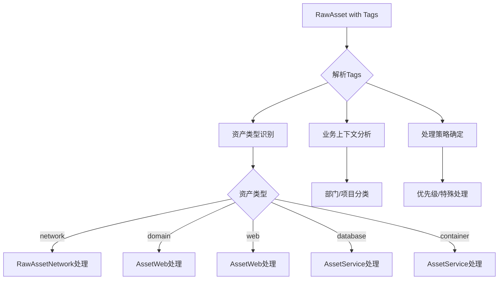
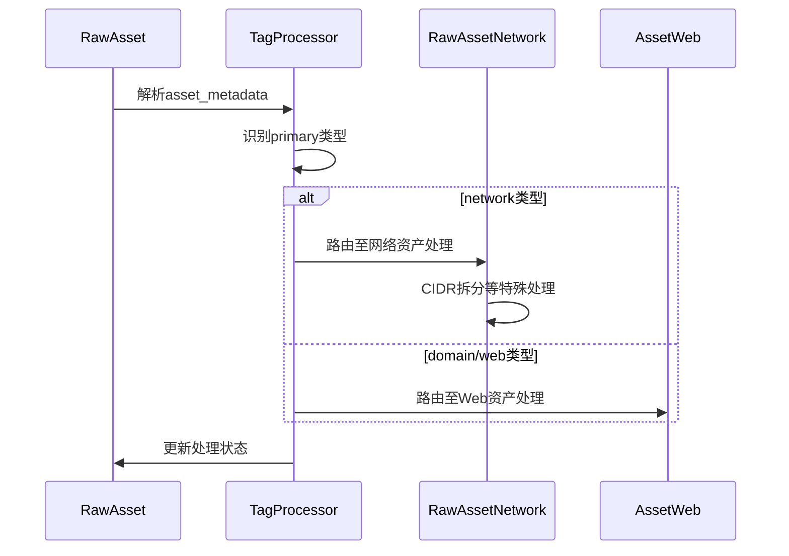

# RawAsset Tags结构设计

## 概述

根据资产模型设计文档，RawAsset模型使用asset_metadata字段（JSON数组）来进行资产分类标记，而不是使用固定的资产类型字段。这种设计提供了更高的灵活性和扩展性。

## Tags结构设计

```json
{
  "asset_types": ["network", "domain", "web", "database", "container"],
  "classification": {
    "primary": "network",
    "secondary": ["internal", "production"]
  },
  "business_context": {
    "department": "IT",
    "project": "infrastructure-discovery",
    "environment": "production",
    "criticality": "high"
  },
  "source_info": {
    "origin": "cmdb",
    "import_batch": "batch-20251127-001",
    "trust_level": "high"
  },
  "processing_hints": {
    "priority_override": 10,
    "exclude_from_scanning": false,
    "special_handling": ["cidr_split_required"]
  }
}
```

## 结构字段详解

### 1. 资产类型 (asset_types)
```json
"asset_types": ["network", "domain", "web", "database", "container"]
```
- 用于标识资产的主要类别
- 支持多类型标记，一个资产可能属于多个类别
- 便于后续处理流程的路由决策

### 2. 分类信息 (classification)
```json
"classification": {
  "primary": "network",
  "secondary": ["internal", "production"]
}
```
- primary: 主要资产类型，用于决定处理流程
- secondary: 次要分类标签，提供更多上下文信息

### 3. 业务上下文 (business_context)
```json
"business_context": {
  "department": "IT",
  "project": "infrastructure-discovery",
  "environment": "production",
  "criticality": "high"
}
```
- department: 负责部门
- project: 所属项目
- environment: 环境类型（生产/测试/开发）
- criticality: 重要性等级

### 4. 来源信息 (source_info)
```json
"source_info": {
  "origin": "cmdb",
  "import_batch": "batch-20251127-001",
  "trust_level": "high"
}
```
- origin: 数据来源（cmdb、手动输入、API等）
- import_batch: 导入批次标识
- trust_level: 数据可信度等级

### 5. 处理提示 (processing_hints)
```json
"processing_hints": {
  "priority_override": 10,
  "exclude_from_scanning": false,
  "special_handling": ["cidr_split_required"]
}
```
- priority_override: 优先级覆盖
- exclude_from_scanning: 是否排除在扫描之外
- special_handling: 特殊处理需求

## 实际应用示例

### 网络资产示例
```json
{
  "asset_types": ["network"],
  "classification": {
    "primary": "network",
    "secondary": ["internal", "production"]
  },
  "business_context": {
    "department": "IT-Network",
    "project": "core-infrastructure",
    "environment": "production",
    "criticality": "critical"
  },
  "source_info": {
    "origin": "network-scan",
    "import_batch": "net-scan-20251127",
    "trust_level": "high"
  },
  "processing_hints": {
    "priority_override": 8,
    "special_handling": ["cidr_split_required", "exclude_broadcast"]
  }
}
```

### 域名资产示例
```json
{
  "asset_types": ["domain"],
  "classification": {
    "primary": "domain",
    "secondary": ["external", "customer-facing"]
  },
  "business_context": {
    "department": "Marketing",
    "project": "public-website",
    "environment": "production",
    "criticality": "high"
  },
  "source_info": {
    "origin": "dns-zone-file",
    "import_batch": "dns-import-20251127",
    "trust_level": "medium"
  },
  "processing_hints": {
    "priority_override": 5,
    "exclude_from_scanning": false
  }
}
```

## 资产处理流程



## 处理流程中的Tags使用



## 优势分析

### 1. 高度灵活性
- 可以轻松添加新的分类维度而不改变数据结构

### 2. 丰富的上下文信息
- 提供业务和技术上下文，有助于决策制定

### 3. 处理指导
- processing_hints可以直接指导资产处理流程

### 4. 可追溯性
- source_info提供了完整的数据来源追踪能力

### 5. 兼容现有设计
- 符合系统使用asset_metadata进行灵活分类的整体设计理念