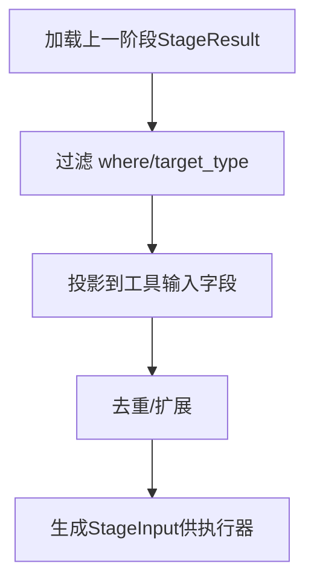

# StageResult到下一阶段输入设计与实现

## 背景

在多阶段扫描工作流中，“上一阶段的结果”需要作为“下一阶段的输入”。错误的做法是把结果数据复制回 `ScanStage`（配置实体）。正确的做法是：在执行时根据 `ScanStage.target_strategy` 引用并解析上一阶段的 `StageResult`，生成当前阶段的目标集。该文档明确两者的分工、输入传递的设计与落地约定。

## 设计原则

- 分层职责：`ScanStage` 负责“意图/配置”；`StageResult` 负责“事实/结果”。
- 单一事实源：意图配置只来源于 `ScanStage.output_config`，结果侧不复制整块配置。
- 消除特殊情况：用统一的输入选择器与投影规则，不在各处散落专用分支。
- 向后兼容：保留对既有 `result_type` 的兼容路径；对齐命名标准，避免双标准。

## 实体职责对齐

- `ScanStage`（配置/意图）
  - 定义阶段类型、工具与参数、`target_strategy`（从何处取输入）、`output_config`（意图级输出策略）。
  - 位置：`neoMaster/docs/asset资产模块设计/ScanStage实体模型定义.md`

- `StageResult`（事实/结果）
  - 记录一次阶段执行的具体发现，统一模型，包含 `result_type/target_type/attributes/evidence/produced_at` 等。
  - 结果侧只保存 `output_config_hash`（意图配置指纹）与 `output_actions`（轻量摘要），不复制整块配置。
  - 位置：`neoMaster/docs/asset资产模块设计/StageResult模型详细说明.md`

## 输入传递设计（不复制，只引用与解析）

在 `ScanStage.target_strategy` 中使用 `source_type=previous_stage` 引用上一阶段的 `StageResult`，并通过统一的“选择器/投影/去重/扩展”生成本阶段工具所需的输入集。

### 规范字段

- `source_type`: 固定为 `previous_stage` 表示来源于上一阶段结果。
- `source_stage_selector`: 指定来源范围
  - `by_stage_id`: `[<prev_stage_id>]` 或相对标识（如 `"prev"`）
  - `by_result_type`: `[...]`（如 `fast_port_scan/full_port_scan/service_fingerprint/...`）
  - `time_window_minutes`: 限定最近结果的时间窗口
- `record_selector`: 过滤谓词与基本约束
  - `target_type`: `ip/domain/url`
  - `where`: 例如 `{"field":"attributes.ports.state","op":"equals","value":"open"}`
  - `limit`: 上限
- `projection`: 将 `StageResult.attributes` 投影为当前工具输入字段
  - `to_inputs`: 指定输入字段与来源路径映射
- `dedupe`: 去重键（如 `ip/port/proto/url`）
- `expand`: 模板扩展（如从 `ip+port` 拼接 `url`）

### 示例：服务指纹阶段以开放端口为输入

```json
{
  "target_strategy": {
    "target_sources": [
      {
        "source_type": "previous_stage",
        "source_stage_selector": {
          "by_stage_id": [2],
          "by_result_type": ["fast_port_scan","full_port_scan"],
          "time_window_minutes": 60
        },
        "record_selector": {
          "target_type": "ip",
          "where": [
            {"field": "attributes.ports.state", "op": "equals", "value": "open"},
            {"field": "attributes.ports.proto", "op": "equals", "value": "tcp"}
          ],
          "limit": 20000
        },
        "projection": {
          "to_inputs": [
            {"input_field": "ip", "from": "target_value"},
            {"input_field": "port", "from": "attributes.ports.port"},
            {"input_field": "proto", "from": "attributes.ports.proto"}
          ]
        },
        "dedupe": ["ip","port","proto"]
      }
    ]
  }
}
```

### 示例：Web端点阶段以HTTP服务指纹为输入并拼URL

```json
{
  "target_strategy": {
    "target_sources": [
      {
        "source_type": "previous_stage",
        "source_stage_selector": {
          "by_result_type": ["service_fingerprint"]
        },
        "record_selector": {
          "where": [
            {"field": "attributes.services.name", "op": "in", "value": ["http","Apache httpd","nginx"]}
          ]
        },
        "projection": {
          "to_inputs": [
            {"input_field": "ip", "from": "target_value"},
            {"input_field": "port", "from": "attributes.services.port"},
            {"input_field": "tech", "from": "attributes.services.name"}
          ]
        },
        "expand": {
          "url": {"template": "http://{ip}:{port}"}
        },
        "dedupe": ["url"]
      }
    ]
  }
}
```

## 执行流程（InputResolver）

- 加载：根据 `ScanStage.stage_id` 与 `target_strategy` 查询上一阶段的 `StageResult`。
- 过滤：应用 `record_selector.where` 与 `target_type`。
- 投影：按 `projection.to_inputs` 将 `attributes` 映射为工具输入字段。
- 去重/扩展：应用 `dedupe` 与 `expand` 生成最终目标集。
- 产出：得到 `StageInput`（内存集合或临时表），保留源 `stage_result_id` 引用用于审计。



## 输出配置引用与审计

- 意图配置：`ScanStage.output_config` 是唯一的输出配置来源。
- 结果侧快照：`StageResult` 只保存 `output_config_hash`（指纹）与 `output_actions`（轻量摘要），避免复制整块配置。
- 指纹用途：配置变更后，历史结果仍可通过指纹审计还原当时行为。

示例（结果侧快照）：

```json
{
  "output_config_hash": "sha256:a1b2c3...",
  "output_actions": {
    "save_type": "extract_fields",
    "target_table": "custom_scanned_hosts",
    "retention_days": 30,
    "extract_fields_id": "ef-123"
  }
}
```

## 命名与枚举策略

- 建议统一 `result_type`：
  - 端口扫描策略二选一：
    - 统一为 `port_scan`，差异通过 `attributes.summary.scan_strategy=fast/full` 表达；
    - 或坚持 `fast_port_scan/full_port_scan` 两类，禁止引入第三个 `port_scan` 名称。
- 参考枚举来源：`StageResult模型详细说明.md:31-46`。

## 性能与清理

- 大规模输入建议落库至短期TTL临时表 `stage_inputs`（按 `workflow_id+stage_id` 分区），便于批量分发与断点续扫。
- 定期清理过期数据，避免膨胀；为常用查询字段建索引（如 `workflow_id/stage_id/result_type/produced_at`）。

## 验收标准

- 正确性：输入解析按选择器生成目标集，审计可基于 `stage_result_id` 与 `output_config_hash` 复现。
- 兼容性：不破坏既有工作流；旧 `result_type` 保持可过滤可映射。
- 性能：在百万级结果下仍可通过批量与索引稳定解析与分发。

## 变更记录

- `StageResult` 字段从 `output_config` 调整为 `output_config_hash` 与 `output_actions`（轻量摘要）。
- 文档已在以下位置同步：
  - `neoMaster/docs/asset资产模块设计/StageResult模型详细说明.md`
  - `neoMaster/docs/asset资产模块设计/Asset模型设计v1.0.md`
  - `neoMaster/docs/asset资产模块设计/ScanStage实体模型定义.md`

