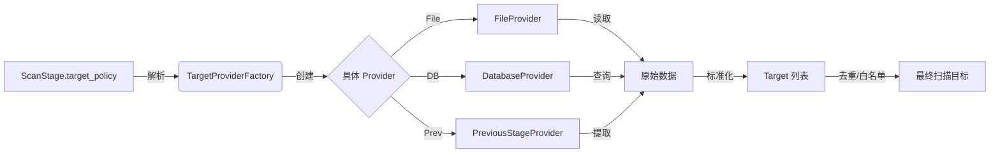

# TargetProvider 逻辑实体设计

## 概述

TargetProvider 是一个 **逻辑实体**（不对应数据库表），负责在运行时解析 `ScanStage.target_policy` 配置，从不同来源（文件、数据库、API、上阶段结果）“供应”标准化的扫描目标列表。它是连接“静态配置”与“动态执行”的桥梁。

## 核心模型

虽然 TargetProvider 不落库，但它有严格的配置结构（Schema）和运行时对象模型。

### 1. 配置结构 (TargetSource Config)

这是 `ScanStage.target_policy.target_sources` 数组中每一项的 JSON 结构：

| 字段名 | 类型 | 必填 | 描述 |
|--------|------|------|------|
| `source_type` | string | 是 | 来源类型枚举 (`file`, `database`, `api`, `manual`, `previous_stage`) |
| `target_type` | string | 是 | 目标数据类型 (`ip`, `ip_range`, `domain`, `url`) |
| `source_value` | string | 否 | 来源主值（如文件路径、表名、API地址、阶段ID引用） |
| `filter_rules` | JSON | 否 | 过滤/查询规则（针对 DB/API/PreviousStage） |
| `auth_config` | JSON | 否 | 认证配置（针对 API/DB） |
| `parser_config` | JSON | 否 | 解析配置（如 CSV 分隔符、JSON 路径） |

### 2. 运行时对象 (Target Object)

TargetProvider 解析后输出的标准目标对象：

| 字段名 | 类型 | 描述 |
|--------|------|------|
| `Type` | string | 目标类型 (`ip`, `domain`, `url`) |
| `Value` | string | 目标值 (`192.168.1.1`, `example.com`) |
| `Source` | string | 来源标识（用于回溯，如 `file:hosts.txt`） |
| `Meta` | map | 元数据（如端口、协议、标签，随目标携带） |

## 策略详解

不同 `source_type` 对应的特有配置字段设计。

### 1. FileProvider (文件来源)

从本地文件或对象存储读取目标。

- **source_value**: 文件绝对路径 或 S3 URI。
- **parser_config**:
  ```json
  {
    "format": "line", // line (每行一个), csv, json_array
    "csv_column": "ip", // 如果是 CSV，指定列名
    "json_path": "data.targets[*].ip" // 如果是 JSON，指定提取路径
  }
  ```

### 2. DatabaseProvider (数据库来源)

从系统资产表或外部数据库视图查询目标。

- **source_value**: 表名或视图名 (如 `asset_networks`, `custom_view_targets`)。
- **filter_rules** (SQL 构建器):
  ```json
  {
    "where": [
      {"field": "status", "op": "=", "value": "active"},
      {"field": "tags", "op": "contains", "value": "production"}
    ],
    "limit": 1000
  }
  ```
- **auth_config** (可选): 如果是连接外部数据库，需提供连接凭证引用。

### 3. APIProvider (API 来源)

调用外部 CMDB 或资产管理系统的 API 获取目标。

- **source_value**: API URL (如 `https://cmdb.example.com/api/v1/hosts`)。
- **auth_config**:
  ```json
  {
    "type": "bearer_token", // basic, api_key
    "token_env": "CMDB_API_TOKEN" // 从环境变量读取 Token，不硬编码
  }
  ```
- **parser_config**:
  ```json
  {
    "response_format": "json",
    "extract_path": "data.items[*].primary_ip"
  }
  ```

### 4. PreviousStageProvider (上阶段结果)

最常用的策略，依赖上一个扫描阶段的 `StageResult`。

- **source_value**: 上一阶段的 `stage_name` 或相对引用 (`prev`, `stage_1`)。
- **filter_rules**:
  ```json
  {
    "result_type": ["port_scan", "service_scan"], // 仅提取特定类型的输出
    "attributes_filter": {
      "state": "open", // 仅提取端口开放的目标
      "service": "http" // 仅提取 HTTP 服务
    }
  }
  ```
- **mapping**:
  ```json
  {
    "input_field": "target_value", // 提取 StageResult.target_value
    "meta_fields": ["port", "proto"] // 提取 attributes 中的字段作为 Meta
  }
  ```

### 5. ManualProvider (人工输入)

用于测试或临时任务，直接在配置中写死目标。

- **source_value**: 逗号分隔的字符串 (`192.168.1.1, 10.0.0.1/24`)。
- **parser_config**:
  ```json
  {
    "delimiter": "," // 分隔符
  }
  ```

## 接口定义 (Go Interface)

```go
type TargetProvider interface {
    // Name 返回 Provider 名称
    Name() string
    
    // Provide 执行获取逻辑
    // ctx: 包含 workflow_id, stage_id 等上下文
    // config: 上述 JSON 配置结构
    Provide(ctx context.Context, config TargetSourceConfig) ([]Target, error)
}
```

## 数据流向


