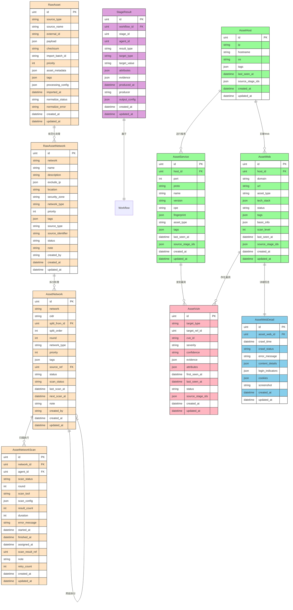

# 资产模型ER图

```mermaid
erDiagram
    %% 核心资产模型实体
    RawAsset ||--o{ RawAssetNetwork : "规范化处理"
    RawAssetNetwork ||--o{ AssetNetwork : "拆分处理"
    AssetNetwork ||--o{ AssetNetworkScan : "扫描执行"
    AssetNetwork ||--|{ AssetNetwork : "网段拆分"
    
    %% 阶段结果模型
    StageResult ||--|| Workflow : "属于"
    
    %% 最终资产模型实体
    AssetHost ||--o{ AssetService : "运行服务"
    AssetHost ||--o{ AssetWeb : "关联Web"
    AssetService ||--o{ AssetVuln : "发现漏洞"
    AssetWeb ||--o{ AssetVuln : "存在漏洞"
    AssetWeb ||--|| AssetWebDetail : "详细信息"
    
    classDef coreEntity fill:#FFE4C4,stroke:#333;
    classDef stageEntity fill:#DDA0DD,stroke:#333;
    classDef assetEntity fill:#98FB98,stroke:#333;
    classDef vulnEntity fill:#FFB6C1,stroke:#333;
    classDef detailEntity fill:#87CEEB,stroke:#333;
    
    class RawAsset,RawAssetNetwork,AssetNetwork,AssetNetworkScan coreEntity
    class StageResult stageEntity
    class AssetHost,AssetService,AssetWeb assetEntity
    class AssetVuln vulnEntity
    class AssetWebDetail detailEntity
    
    RawAsset {
        uint id PK
        string source_type
        string source_name
        string external_id
        json payload
        string checksum
        string import_batch_id
        int priority
        json asset_metadata
        json tags
        json processing_config
        datetime imported_at
        string normalize_status
        string normalize_error
        datetime created_at
        datetime updated_at
    }
    
    RawAssetNetwork {
        uint id PK
        string network
        string name
        string description
        json exclude_ip
        string location
        string security_zone
        string network_type
        int priority
        json tags
        string source_type
        string source_identifier
        string status
        string note
        string created_by
        datetime created_at
        datetime updated_at
    }
    
    AssetNetwork {
        uint id PK
        string network
        string cidr
        uint split_from_id FK
        int split_order
        int round
        string network_type
        int priority
        json tags
        uint source_ref FK
        string status
        string scan_status
        datetime last_scan_at
        datetime next_scan_at
        string note
        string created_by
        datetime created_at
        datetime updated_at
    }
    
    AssetNetworkScan {
        uint id PK
        uint network_id FK
        uint agent_id FK
        string scan_status
        int round
        string scan_tool
        json scan_config
        int result_count
        int duration
        string error_message
        datetime started_at
        datetime finished_at
        datetime assigned_at
        uint scan_result_ref
        string note
        int retry_count
        datetime created_at
        datetime updated_at
    }
    
    StageResult {
        uint id PK
        uint workflow_id FK
        uint stage_id
        uint agent_id
        string result_type
        string target_type
        string target_value
        json attributes
        json evidence
        datetime produced_at
        string producer
        json output_config
        datetime created_at
        datetime updated_at
    }
    
    AssetHost {
        uint id PK
        string ip
        string hostname
        string os
        json tags
        datetime last_seen_at
        json source_stage_ids
        datetime created_at
        datetime updated_at
    }
    
    AssetService {
        uint id PK
        uint host_id FK
        int port
        string proto
        string name
        string version
        string cpe
        json fingerprint
        string asset_type
        json tags
        datetime last_seen_at
        json source_stage_ids
        datetime created_at
        datetime updated_at
    }
    
    AssetWeb {
        uint id PK
        uint host_id FK
        string domain
        string url
        string asset_type
        json tech_stack
        string status
        json tags
        json basic_info
        int scan_level
        datetime last_seen_at
        json source_stage_ids
        datetime created_at
        datetime updated_at
    }
    
    AssetVuln {
        uint id PK
        string target_type
        uint target_ref_id
        string cve_id
        string severity
        string confidence
        json evidence
        json attributes
        datetime first_seen_at
        datetime last_seen_at
        string status
        json source_stage_ids
        datetime created_at
        datetime updated_at
    }
    
    AssetWebDetail {
        uint id PK
        uint asset_web_id FK
        datetime crawl_time
        string crawl_status
        string error_message
        json content_details
        json login_indicators
        json cookies
        string screenshot
        datetime created_at
        datetime updated_at
    }
```