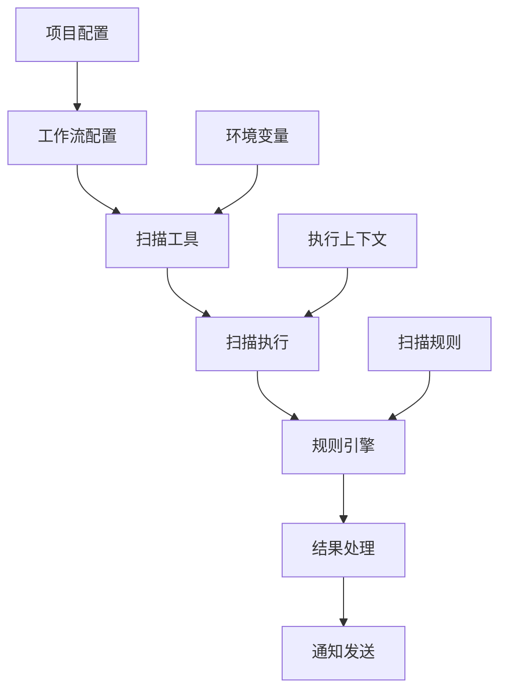

# Orchestrator 模块扫描任务完整流程说明

## 模块概述

`orchestrator` 模块是 NeoScan 系统的**配置管理核心**，负责统一管理所有扫描相关的配置和策略。该模块遵循 Linus Torvalds 的"好品味"设计原则，消除了传统扫描系统中的特殊情况，用统一的配置模型解决所有扫描场景。

### 核心设计理念

1. **"好品味"设计原则**
   - 消除特殊情况：用统一的 ProjectConfig 替代"工程方案"和"非工程方案"的分离
   - 数据结构优先：先设计好数据模型，代码逻辑自然简洁
   - 线性化处理：避免复杂的条件分支，用规则引擎统一处理

2. **严格分层架构**
   ```
   Handler (HTTP接口) → Service (业务逻辑) → Repository (数据访问) → Database
   ```

3. **实用主义实现**
   - 解决扫描配置管理的实际痛点
   - 向后兼容现有 Agent 和扫描执行逻辑
   - 渐进式增强，可逐步迁移现有配置

## 四大核心组件

### 1. 项目配置管理 (ProjectConfig)
**职责**: 统一的扫描项目配置管理
**文件**: `project_config.go`

### 2. 工作流编排 (WorkflowConfig)
**职责**: 编排复杂的扫描工作流
**文件**: `workflow.go`

### 3. 扫描工具管理 (ScanTool)
**职责**: 管理各种第三方扫描工具
**文件**: `scan_tool.go`

### 4. 规则引擎 (ScanRule)
**职责**: 智能决策和策略执行
**文件**: `scan_rule.go`

## 完整扫描任务执行流程

### 阶段1: 项目配置初始化

#### 1.1 创建项目配置
**API**: `POST /api/v1/orchestrator/projects`

**请求数据结构**:
```json
{
  "name": "web_security_scan",                    // 必选：项目名称
  "display_name": "Web安全扫描项目",               // 可选：显示名称
  "description": "针对Web应用的安全扫描项目",       // 可选：项目描述
  "target_scope": "192.168.1.0/24,example.com",  // 必选：扫描目标范围
  "exclude_list": "192.168.1.1,admin.example.com", // 可选：排除列表
  "scan_frequency": 24,                           // 可选：扫描频率(小时)，默认24
  "max_concurrent": 10,                           // 可选：最大并发数，默认10
  "timeout_second": 300,                          // 可选：超时时间(秒)，默认300
  "priority": 5,                                  // 可选：优先级(1-10)，默认5
  "notify_on_success": false,                     // 可选：成功时是否通知，默认false
  "notify_on_failure": true,                      // 可选：失败时是否通知，默认true
  "notify_emails": "admin@example.com,sec@example.com", // 可选：通知邮箱列表
  "tags": "web,security,production",              // 可选：项目标签
  "metadata": {                                   // 可选：扩展元数据
    "department": "security",
    "owner": "security_team"
  }
}
```

**响应数据结构**:
```json
{
  "code": 200,
  "message": "项目配置创建成功",
  "data": {
    "id": 1,
    "name": "web_security_scan",
    "display_name": "Web安全扫描项目",
    "description": "针对Web应用的安全扫描项目",
    "target_scope": "192.168.1.0/24,example.com",
    "exclude_list": "192.168.1.1,admin.example.com",
    "scan_frequency": 24,
    "max_concurrent": 10,
    "timeout_second": 300,
    "priority": 5,
    "notify_on_success": false,
    "notify_on_failure": true,
    "notify_emails": "admin@example.com,sec@example.com",
    "status": 1,                                  // 1-激活，0-未激活，2-已归档
    "is_enabled": true,
    "tags": "web,security,production",
    "metadata": "{\"department\":\"security\",\"owner\":\"security_team\"}",
    "created_by": 1001,
    "updated_by": 1001,
    "created_at": "2025-01-11T10:00:00Z",
    "updated_at": "2025-01-11T10:00:00Z",
    "last_scan": null
  }
}
```

### 阶段2: 扫描工具配置

#### 2.1 创建扫描工具
**API**: `POST /api/v1/orchestrator/tools`

**请求数据结构**:
```json
{
  "name": "nmap_port_scanner",                    // 必选：工具名称(唯一)
  "display_name": "Nmap端口扫描器",               // 可选：显示名称
  "description": "使用Nmap进行端口扫描",           // 可选：工具描述
  "type": "port_scan",                           // 必选：工具类型
  "version": "7.94",                             // 可选：工具版本
  "executable_path": "/usr/bin/nmap",            // 必选：可执行文件路径
  "working_dir": "/tmp/nmap_scans",              // 可选：工作目录
  "command_template": "nmap -sS -O -sV -oX {{output_file}} {{target}}", // 必选：命令模板
  "default_params": {                            // 可选：默认参数配置
    "scan_type": "-sS",
    "version_detection": true,
    "os_detection": true,
    "output_format": "xml"
  },
  "param_schema": {                              // 可选：参数模式定义
    "scan_type": {
      "type": "string",
      "enum": ["-sS", "-sT", "-sU"],
      "default": "-sS",
      "description": "扫描类型"
    },
    "version_detection": {
      "type": "boolean",
      "default": true,
      "description": "是否启用版本检测"
    }
  },
  "output_format": "xml",                        // 可选：输出格式，默认json
  "output_parser": "nmap_xml_parser",            // 可选：输出解析器名称
  "result_mapping": {                            // 可选：结果字段映射配置
    "host": "address",
    "port": "portid",
    "service": "service.name",
    "version": "service.version"
  },
  "max_execution_time": 3600,                    // 可选：最大执行时间(秒)，默认3600
  "max_memory_mb": 1024,                         // 可选：最大内存使用(MB)，默认1024
  "requires_sudo": false,                        // 可选：是否需要sudo权限，默认false
  "supported_os": "linux,darwin,windows",       // 可选：支持的操作系统
  "dependencies": "nmap >= 7.0",                // 可选：依赖项说明
  "install_guide": "sudo apt-get install nmap", // 可选：安装指南
  "tags": "network,port_scan,nmap"              // 可选：工具标签
}
```

#### 2.2 工具类型枚举
```go
const (
    ScanToolTypePortScan    = "port_scan"    // 端口扫描
    ScanToolTypeVulnScan    = "vuln_scan"    // 漏洞扫描
    ScanToolTypeWebScan     = "web_scan"     // Web扫描
    ScanToolTypeNetworkScan = "network_scan" // 网络扫描
    ScanToolTypeCustom      = "custom"       // 自定义工具
)
```

### 阶段3: 扫描规则配置

#### 3.1 创建扫描规则
**API**: `POST /api/v1/orchestrator/rules`

**请求数据结构**:
```json
{
  "name": "high_risk_port_filter",               // 必选：规则名称(唯一)
  "display_name": "高风险端口过滤规则",           // 可选：显示名称
  "description": "过滤出高风险端口的扫描结果",     // 可选：规则描述
  "type": "filter",                              // 必选：规则类型
  "category": "security",                        // 可选：规则分类
  "condition": "port in [22,23,80,443,3389] and state == 'open'", // 必选：规则条件表达式
  "actions": [                                   // 可选：规则动作定义(数组格式)
    {
      "type": "alert",
      "parameters": {
        "level": "high",
        "message": "发现高风险开放端口"
      }
    },
    {
      "type": "log",
      "parameters": {
        "message": "High risk port detected: {{port}} on {{host}}"
      }
    }
  ],
  "parameters": {                                // 可选：规则参数配置
    "risk_ports": [22, 23, 80, 443, 3389],
    "alert_threshold": 3
  },
  "applicable_tools": "nmap_port_scanner,masscan", // 可选：适用的扫描工具
  "target_types": "ip,domain",                   // 可选：适用的目标类型
  "scan_phases": "discovery,enumeration",        // 可选：适用的扫描阶段
  "severity": "high",                            // 可选：规则严重程度，默认medium
  "priority": 8,                                 // 可选：规则优先级(1-10)，默认5
  "confidence": 0.9,                             // 可选：规则置信度(0-1)，默认0.8
  "max_executions": 0,                           // 可选：最大执行次数，0表示无限制
  "timeout_seconds": 30,                         // 可选：执行超时时间(秒)，默认30
  "continue_on_error": true,                     // 可选：出错时是否继续，默认true
  "tags": "security,port_scan,high_risk"        // 可选：规则标签
}
```

#### 3.2 规则类型和严重程度枚举
```go
// 规则类型
const (
    ScanRuleTypeFilter     = "filter"     // 过滤规则
    ScanRuleTypeValidation = "validation" // 验证规则
    ScanRuleTypeTransform  = "transform"  // 转换规则
    ScanRuleTypeAlert      = "alert"      // 告警规则
    ScanRuleTypeCustom     = "custom"     // 自定义规则
)

// 严重程度
const (
    ScanRuleSeverityLow      = "low"      // 低
    ScanRuleSeverityMedium   = "medium"   // 中
    ScanRuleSeverityHigh     = "high"     // 高
    ScanRuleSeverityCritical = "critical" // 严重
)
```

#### 3.3 规则条件表达式语法
支持的操作符：
- **比较操作符**: `eq`, `ne`, `gt`, `lt`, `gte`, `lte`
- **包含操作符**: `in`, `not_in`, `contains`
- **正则操作符**: `regex`
- **逻辑操作符**: `and`, `or`, `not`

示例条件表达式：
```javascript
// 端口过滤
"port in [80,443,8080] and state == 'open'"

// 服务版本检查
"service == 'ssh' and version regex '^OpenSSH_[1-7]\\.' and state == 'open'"

// 复合条件
"(port in [21,22,23] or service contains 'ftp') and host not in ['192.168.1.1']"
```

### 阶段4: 工作流编排

#### 4.1 创建工作流配置
**API**: `POST /api/v1/orchestrator/workflows`

**请求数据结构**:
```json
{
  "name": "comprehensive_security_scan",         // 必选：工作流名称
  "display_name": "综合安全扫描工作流",           // 可选：显示名称
  "description": "包含端口扫描、漏洞扫描、Web扫描的综合安全扫描流程", // 可选：描述
  "version": "1.0",                              // 可选：工作流版本，默认1.0
  "project_id": 1,                               // 必选：所属项目ID
  "trigger_type": "manual",                      // 必选：触发类型
  "cron_expr": "0 2 * * *",                     // 可选：定时表达式(仅定时触发时使用)
  "event_filter": {                              // 可选：事件过滤条件(仅事件触发时使用)
    "event_type": "target_discovered",
    "source": "discovery_service"
  },
  "steps": [                                     // 必选：工作流步骤定义
    {
      "id": "port_scan",
      "name": "端口扫描",
      "type": "scan_tool",
      "tool_id": 1,
      "parameters": {
        "scan_type": "-sS",
        "version_detection": true,
        "os_detection": true
      },
      "timeout": 1800,
      "retry_count": 2,
      "continue_on_error": false
    },
    {
      "id": "vuln_scan",
      "name": "漏洞扫描",
      "type": "scan_tool",
      "tool_id": 2,
      "depends_on": ["port_scan"],
      "parameters": {
        "scan_level": "aggressive",
        "update_db": true
      },
      "timeout": 3600,
      "retry_count": 1,
      "continue_on_error": true
    },
    {
      "id": "web_scan",
      "name": "Web应用扫描",
      "type": "scan_tool",
      "tool_id": 3,
      "depends_on": ["port_scan"],
      "condition": "has_web_service == true",
      "parameters": {
        "crawl_depth": 3,
        "check_sql_injection": true,
        "check_xss": true
      },
      "timeout": 7200,
      "retry_count": 1,
      "continue_on_error": true
    },
    {
      "id": "report_generation",
      "name": "生成报告",
      "type": "script",
      "command": "python3 /opt/scripts/generate_report.py --input {{scan_results}} --output {{report_file}}",
      "depends_on": ["vuln_scan", "web_scan"],
      "parameters": {
        "report_format": "pdf",
        "include_charts": true
      },
      "timeout": 300,
      "retry_count": 0,
      "continue_on_error": false
    },
    {
      "id": "notification",
      "name": "发送通知",
      "type": "notification",
      "depends_on": ["report_generation"],
      "parameters": {
        "notification_type": "email",
        "recipients": ["admin@example.com"],
        "template": "scan_complete",
        "attach_report": true
      },
      "timeout": 60,
      "retry_count": 2,
      "continue_on_error": true
    }
  ],
  "variables": {                                 // 可选：工作流变量定义
    "scan_results_dir": "/tmp/scan_results",
    "report_output_dir": "/opt/reports",
    "max_scan_targets": 1000
  },
  "environment": {                               // 可选：环境变量配置
    "SCAN_MODE": "production",
    "LOG_LEVEL": "info",
    "PARALLEL_WORKERS": "4"
  },
  "max_execution_time": 14400,                   // 可选：最大执行时间(秒)，默认3600
  "max_retry_count": 3,                          // 可选：最大重试次数，默认1
  "notification_on_success": true,               // 可选：成功时是否通知，默认false
  "notification_on_failure": true,               // 可选：失败时是否通知，默认true
  "tags": "security,comprehensive,automated"    // 可选：工作流标签
}
```

#### 4.2 工作流步骤类型
```go
// 步骤类型
const (
    WorkflowStepTypeScanTool     = "scan_tool"     // 扫描工具
    WorkflowStepTypeScript       = "script"        // 脚本执行
    WorkflowStepTypeCondition    = "condition"     // 条件判断
    WorkflowStepTypeNotification = "notification"  // 通知
)
```

#### 4.3 触发类型
```go
const (
    WorkflowTriggerTypeManual    = "manual"    // 手动触发
    WorkflowTriggerTypeScheduled = "scheduled" // 定时触发
    WorkflowTriggerTypeEvent     = "event"     // 事件触发
)
```

### 阶段5: 执行扫描任务

#### 5.1 执行工作流
**API**: `POST /api/v1/orchestrator/workflows/{id}/execute`

**请求数据结构**:
```json
{
  "execution_params": {                          // 可选：执行参数
    "target_override": "192.168.1.100-110",     // 覆盖目标范围
    "priority_override": 9,                      // 覆盖优先级
    "timeout_override": 7200                     // 覆盖超时时间
  },
  "variables": {                                 // 可选：运行时变量
    "custom_scan_profile": "aggressive",
    "output_format": "json"
  }
}
```

**响应数据结构**:
```json
{
  "code": 200,
  "message": "工作流执行启动成功",
  "data": {
    "execution_id": "exec_20250111_100001_001",  // 执行ID
    "workflow_id": 1,
    "workflow_name": "comprehensive_security_scan",
    "status": "running",                          // 执行状态
    "started_at": "2025-01-11T10:00:01Z",
    "estimated_completion": "2025-01-11T14:00:01Z",
    "current_step": "port_scan",
    "progress": {
      "completed_steps": 0,
      "total_steps": 5,
      "percentage": 0
    }
  }
}
```

#### 5.2 监控工作流执行状态
**API**: `GET /api/v1/orchestrator/workflows/{id}/status`

**响应数据结构**:
```json
{
  "code": 200,
  "message": "获取工作流状态成功",
  "data": {
    "execution_id": "exec_20250111_100001_001",
    "workflow_id": 1,
    "workflow_name": "comprehensive_security_scan",
    "status": "running",                          // running, completed, failed, paused, stopped
    "started_at": "2025-01-11T10:00:01Z",
    "updated_at": "2025-01-11T10:30:15Z",
    "estimated_completion": "2025-01-11T13:45:30Z",
    "current_step": "vuln_scan",
    "progress": {
      "completed_steps": 2,
      "total_steps": 5,
      "percentage": 40
    },
    "step_details": [
      {
        "step_id": "port_scan",
        "step_name": "端口扫描",
        "status": "completed",
        "started_at": "2025-01-11T10:00:01Z",
        "completed_at": "2025-01-11T10:15:30Z",
        "execution_time": 929,
        "result": {
          "targets_scanned": 256,
          "open_ports_found": 45,
          "services_identified": 23
        }
      },
      {
        "step_id": "vuln_scan",
        "step_name": "漏洞扫描",
        "status": "running",
        "started_at": "2025-01-11T10:15:35Z",
        "progress": 65,
        "current_target": "192.168.1.105"
      },
      {
        "step_id": "web_scan",
        "step_name": "Web应用扫描",
        "status": "pending",
        "depends_on": ["port_scan"]
      }
    ],
    "metrics": {
      "total_targets": 256,
      "completed_targets": 105,
      "failed_targets": 2,
      "total_findings": 127,
      "high_severity_findings": 8,
      "medium_severity_findings": 34,
      "low_severity_findings": 85
    }
  }
}
```

### 阶段6: 规则引擎处理

#### 6.1 执行单个规则
**API**: `POST /api/v1/orchestrator/rule-engine/execute`

**请求数据结构**:
```json
{
  "rule_id": 1,                                  // 必选：规则ID
  "input_data": {                                // 必选：输入数据
    "host": "192.168.1.100",
    "port": 22,
    "service": "ssh",
    "version": "OpenSSH_7.4",
    "state": "open",
    "banner": "SSH-2.0-OpenSSH_7.4"
  },
  "context": {                                   // 可选：执行上下文
    "scan_id": "scan_20250111_001",
    "project_id": 1,
    "execution_id": "exec_20250111_100001_001"
  }
}
```

**响应数据结构**:
```json
{
  "code": 200,
  "message": "规则执行成功",
  "data": {
    "rule_id": 1,
    "rule_name": "high_risk_port_filter",
    "execution_id": "rule_exec_20250111_100530_001",
    "matched": true,                             // 是否匹配规则条件
    "execution_time": 15.6,                      // 执行时间(毫秒)
    "actions_executed": [                        // 执行的动作列表
      {
        "type": "alert",
        "status": "success",
        "result": {
          "alert_id": "alert_20250111_100530_001",
          "level": "high",
          "message": "发现高风险开放端口: SSH (22) on 192.168.1.100"
        }
      },
      {
        "type": "log",
        "status": "success",
        "result": {
          "log_entry": "High risk port detected: 22 on 192.168.1.100",
          "timestamp": "2025-01-11T10:05:30Z"
        }
      }
    ],
    "metadata": {
      "confidence_score": 0.9,
      "severity": "high",
      "tags": ["security", "port_scan", "high_risk"]
    }
  }
}
```

#### 6.2 批量执行规则
**API**: `POST /api/v1/orchestrator/rule-engine/batch-execute`

**请求数据结构**:
```json
{
  "rule_ids": [1, 2, 3],                        // 可选：指定规则ID列表
  "rule_filters": {                              // 可选：规则过滤条件
    "type": "filter",
    "category": "security",
    "applicable_tools": "nmap_port_scanner"
  },
  "input_data": [                                // 必选：输入数据数组
    {
      "host": "192.168.1.100",
      "port": 22,
      "service": "ssh",
      "version": "OpenSSH_7.4",
      "state": "open"
    },
    {
      "host": "192.168.1.101",
      "port": 80,
      "service": "http",
      "version": "Apache/2.4.41",
      "state": "open"
    }
  ],
  "execution_options": {                         // 可选：执行选项
    "parallel": true,                            // 是否并行执行
    "max_workers": 4,                            // 最大工作线程数
    "timeout": 300,                              // 总超时时间(秒)
    "stop_on_error": false                       // 出错时是否停止
  }
}
```

## 数据流转和状态管理

### 数据流转图


### 状态枚举定义

#### 项目配置状态
```go
const (
    ProjectConfigStatusInactive = 0 // 未激活
    ProjectConfigStatusActive   = 1 // 激活
    ProjectConfigStatusArchived = 2 // 已归档
)
```

#### 工作流状态
```go
const (
    WorkflowStatusDraft    = 0 // 草稿
    WorkflowStatusActive   = 1 // 激活
    WorkflowStatusInactive = 2 // 未激活
    WorkflowStatusArchived = 3 // 已归档
)
```

#### 扫描工具状态
```go
const (
    ScanToolStatusDisabled = 0 // 禁用
    ScanToolStatusEnabled  = 1 // 启用
    ScanToolStatusTesting  = 2 // 测试中
)
```

#### 扫描规则状态
```go
const (
    ScanRuleStatusDisabled = 0 // 禁用
    ScanRuleStatusEnabled  = 1 // 启用
    ScanRuleStatusTesting  = 2 // 测试中
)
```

## API 接口完整列表

### 项目配置管理
- `GET /api/v1/orchestrator/projects` - 获取项目配置列表
- `GET /api/v1/orchestrator/projects/{id}` - 获取项目配置详情
- `POST /api/v1/orchestrator/projects` - 创建项目配置
- `PUT /api/v1/orchestrator/projects/{id}` - 更新项目配置
- `DELETE /api/v1/orchestrator/projects/{id}` - 删除项目配置
- `POST /api/v1/orchestrator/projects/{id}/enable` - 启用项目配置
- `POST /api/v1/orchestrator/projects/{id}/disable` - 禁用项目配置
- `POST /api/v1/orchestrator/projects/{id}/sync` - 同步项目配置
- `POST /api/v1/orchestrator/projects/{id}/reload` - 热重载项目配置

### 工作流管理
- `GET /api/v1/orchestrator/workflows` - 获取工作流列表
- `GET /api/v1/orchestrator/workflows/{id}` - 获取工作流详情
- `POST /api/v1/orchestrator/workflows` - 创建工作流
- `PUT /api/v1/orchestrator/workflows/{id}` - 更新工作流
- `DELETE /api/v1/orchestrator/workflows/{id}` - 删除工作流
- `POST /api/v1/orchestrator/workflows/{id}/execute` - 执行工作流
- `POST /api/v1/orchestrator/workflows/{id}/stop` - 停止工作流
- `POST /api/v1/orchestrator/workflows/{id}/pause` - 暂停工作流
- `POST /api/v1/orchestrator/workflows/{id}/resume` - 恢复工作流
- `POST /api/v1/orchestrator/workflows/{id}/retry` - 重试工作流
- `POST /api/v1/orchestrator/workflows/{id}/enable` - 启用工作流
- `POST /api/v1/orchestrator/workflows/{id}/disable` - 禁用工作流
- `GET /api/v1/orchestrator/workflows/{id}/status` - 获取工作流状态
- `GET /api/v1/orchestrator/workflows/{id}/logs` - 获取工作流日志
- `GET /api/v1/orchestrator/workflows/{id}/metrics` - 获取工作流指标
- `GET /api/v1/orchestrator/workflows/project/{project_id}` - 按项目获取工作流

### 扫描工具管理
- `GET /api/v1/orchestrator/tools` - 获取扫描工具列表
- `GET /api/v1/orchestrator/tools/{id}` - 获取扫描工具详情
- `POST /api/v1/orchestrator/tools` - 创建扫描工具
- `PUT /api/v1/orchestrator/tools/{id}` - 更新扫描工具
- `DELETE /api/v1/orchestrator/tools/{id}` - 删除扫描工具
- `POST /api/v1/orchestrator/tools/{id}/enable` - 启用扫描工具
- `POST /api/v1/orchestrator/tools/{id}/disable` - 禁用扫描工具
- `POST /api/v1/orchestrator/tools/{id}/install` - 安装扫描工具
- `POST /api/v1/orchestrator/tools/{id}/uninstall` - 卸载扫描工具
- `GET /api/v1/orchestrator/tools/{id}/health` - 检查工具健康状态
- `GET /api/v1/orchestrator/tools/available` - 获取可用扫描工具
- `GET /api/v1/orchestrator/tools/type/{type}` - 按类型获取扫描工具
- `GET /api/v1/orchestrator/tools/{id}/metrics` - 获取工具指标

### 扫描规则管理
- `GET /api/v1/orchestrator/rules` - 获取扫描规则列表
- `GET /api/v1/orchestrator/rules/{id}` - 获取扫描规则详情
- `POST /api/v1/orchestrator/rules` - 创建扫描规则
- `PUT /api/v1/orchestrator/rules/{id}` - 更新扫描规则
- `DELETE /api/v1/orchestrator/rules/{id}` - 删除扫描规则
- `POST /api/v1/orchestrator/rules/{id}/enable` - 启用扫描规则
- `POST /api/v1/orchestrator/rules/{id}/disable` - 禁用扫描规则
- `POST /api/v1/orchestrator/rules/{id}/test` - 测试扫描规则
- `GET /api/v1/orchestrator/rules/category/{category}` - 按分类获取规则
- `GET /api/v1/orchestrator/rules/type/{type}` - 按类型获取规则
- `GET /api/v1/orchestrator/rules/{id}/metrics` - 获取规则指标

### 规则引擎
- `POST /api/v1/orchestrator/rule-engine/execute` - 执行单个规则
- `POST /api/v1/orchestrator/rule-engine/batch-execute` - 批量执行规则
- `GET /api/v1/orchestrator/rule-engine/status` - 获取规则引擎状态
- `GET /api/v1/orchestrator/rule-engine/metrics` - 获取规则引擎指标
- `POST /api/v1/orchestrator/rule-engine/reload` - 重载规则引擎

## 错误处理和异常情况

### 常见错误码
- `400` - 请求参数错误
- `401` - 未授权访问
- `403` - 权限不足
- `404` - 资源不存在
- `409` - 资源冲突（如名称重复）
- `422` - 数据验证失败
- `500` - 服务器内部错误
- `503` - 服务不可用

### 错误响应格式
```json
{
  "code": 400,
  "message": "请求参数错误",
  "error": "validation_failed",
  "details": {
    "field": "target_scope",
    "reason": "target_scope is required"
  },
  "timestamp": "2025-01-11T10:00:00Z",
  "request_id": "req_20250111_100000_001"
}
```

## 性能优化和最佳实践

### 1. 数据库优化
- 使用索引优化查询性能
- 分页查询避免大量数据加载
- 使用连接池管理数据库连接

### 2. 缓存策略
- 规则引擎使用内存缓存提升执行效率
- 工具配置缓存减少数据库访问
- 扫描结果缓存避免重复计算

### 3. 并发控制
- 工作流执行支持并行处理
- 规则引擎支持批量并行执行
- 使用队列管理大量扫描任务

### 4. 监控和日志
- 详细的执行日志记录
- 性能指标监控
- 错误告警机制

## 总结

Orchestrator 模块通过统一的配置管理和智能的规则引擎，实现了扫描任务的自动化编排和执行。其核心优势包括：

1. **统一配置管理**: 消除了配置分散的问题，提供一站式配置中心
2. **灵活的工作流编排**: 支持复杂的扫描流程定义和执行
3. **智能规则引擎**: 提供强大的条件判断和动作执行能力
4. **完善的API接口**: 支持所有配置和执行操作的程序化管理
5. **良好的扩展性**: 支持自定义工具和规则的集成

通过这套完整的流程，用户可以轻松配置和管理复杂的安全扫描任务，实现自动化的安全检测和响应。