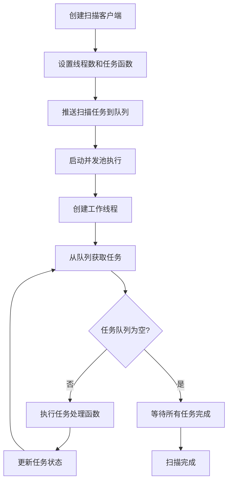
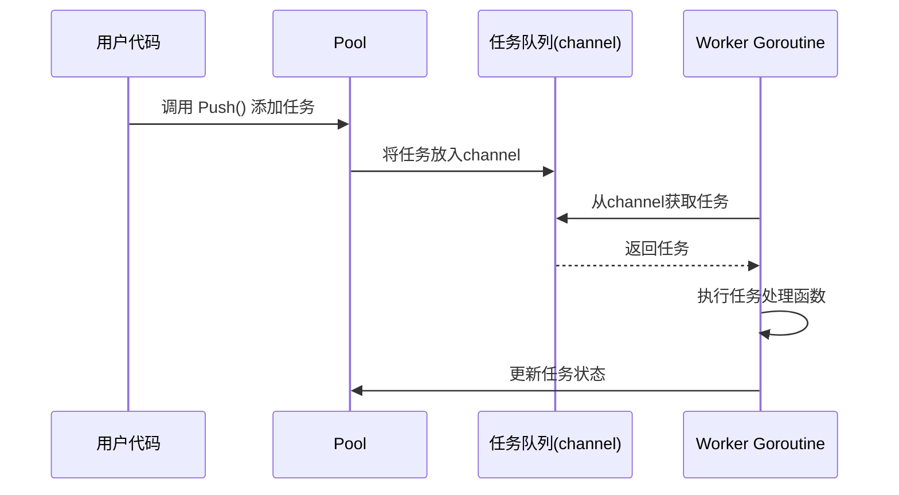

# 并发扫描机制说明文档

## 1. 概述

本文档详细描述了 qscan 项目中并发扫描机制的实现原理和流程。qscan 通过使用 Goroutine 和自定义任务池实现高并发扫描，显著提升了扫描速度和效率。项目中的各种扫描任务（如 IP 存活检测、端口扫描、服务识别等）都采用了并发处理机制。

## 2. 核心组件结构

### 2.1 Pool 结构体

并发机制的核心是 [Pool](qscan/lib/pool/pool.go#L35-L48) 结构体，定义在 [lib/pool/pool.go](qscan/lib/pool/pool.go) 文件中：

```go
type Pool struct {
    // 母版函数
    Function func(interface{})
    // Pool输入队列
    in chan interface{}
    // size用来表明池的大小，不能超发。
    threads int
    // 启动协程等待时间
    Interval time.Duration
    // 正在执行的任务清单
    JobsList *sync.Map
    // 正在工作的协程数量
    length int32
    // 用于阻塞
    wg *sync.WaitGroup
    // 提前结束标识符
    Done bool
}
```

各字段说明：
- `Function`: 任务处理函数，所有任务都通过这个函数处理
- `in`: 任务输入通道，用于传递待处理的任务
- `threads`: 线程数限制，控制最大并发数
- `Interval`: 启动协程的时间间隔
- `JobsList`: 正在执行的任务清单，使用 sync.Map 保证线程安全
- `length`: 正在工作的协程数量，使用原子操作保证一致性
- `wg`: WaitGroup，用于等待所有任务完成
- `Done`: 提前结束标识符

### 2.2 Worker 结构体

每个任务由 [Worker](qscan/lib/pool/pool.go#L17-L19) 结构体表示：

```go
type Worker struct {
    f func(interface{})
}
```

### 2.3 Scanner 客户端

项目中的各种扫描器（如 [IPClient](qscan/core/scanner/type-client-ip.go#L10-L14)、[PortClient](qscan/core/scanner/type-client-port.go#L13-L22) 等）都封装了 [Pool](qscan/lib/pool/pool.go#L35-L48)，通过 [client](qscan/core/scanner/type-client.go#L5-L9) 结构体实现：

```go
type client struct {
    config *Config
    pool   *pool.Pool

    deferFunc func()
}
```

## 3. 并发机制工作流程

### 3.1 整体流程图



### 3.2 初始化并发池

在 [New](qscan/lib/pool/pool.go#L51-L62) 函数中创建并发池：

```go
func New(threads int) *Pool {
    return &Pool{
        threads:  threads,
        JobsList: &sync.Map{},
        wg:       &sync.WaitGroup{},
        in:       make(chan interface{}),
        Function: nil,
        Done:     true,
        Interval: time.Duration(0),
    }
}
```

### 3.3 启动并发执行

通过 [Run](qscan/lib/pool/pool.go#L82-L94) 方法启动并发执行：

```go
func (p *Pool) Run() {
    p.Done = false
    // 只启动有限大小的协程，协程的数量不可以超过工作池设定的数量，防止计算资源崩溃
    for i := 0; i < p.threads; i++ {
        p.wg.Add(1)
        time.Sleep(p.Interval)
        go p.work()
        if p.Done == true {
            break
        }
    }
    p.wg.Wait()
}
```

### 3.4 工作线程处理

[work](qscan/lib/pool/pool.go#L97-L125) 方法是每个工作线程的实际处理逻辑：

```go
func (p *Pool) work() {
    var Tick string
    var param interface{}
    // 减少waitGroup计数器的值
    defer func() {
        defer func() {
            if e := recover(); e != nil {
                logger.Println(Tick, param, e)
            }
        }()
        p.wg.Done()
    }()
    for param = range p.in {
        if p.Done {
            return
        }
        atomic.AddInt32(&p.length, 1)
        // 获取任务唯一票据
        Tick = p.generateTick()
        // 压入工作任务到工作清单
        p.JobsList.Store(Tick, param)
        // 设置工作内容
        f := generateWorker(p.Function)
        // 开始工作，输出工作结果
        f.run(param)
        // 工作结束，删除工作清单
        p.JobsList.Delete(Tick)
        atomic.AddInt32(&p.length, -1)
    }
}
```

## 4. 不同类型扫描器的并发实现

### 4.1 IP 存活检测并发

在 [generateIPScanner](qscan/run/run.go#L239-L263) 函数中设置了 IP 扫描器的并发参数：

```go
func generateIPScanner(wg *sync.WaitGroup) *scanner.IPClient {
    IPConfig := scanner.DefaultConfig()
    IPConfig.Threads = 200  // 设置200个并发线程
    IPConfig.Timeout = 200 * time.Millisecond
    IPConfig.HostDiscoverClosed = app.Setting.ClosePing
    client := scanner.NewIPScanner(IPConfig)
    // ... 设置回调函数
    client.Defer(func() {
        wg.Done()
    })
    return client
}
```

### 4.2 端口扫描并发

在 [generatePortScanner](qscan/run/run.go#L274-L298) 函数中设置了端口扫描器的并发参数：

```go
func generatePortScanner(wg *sync.WaitGroup) *scanner.PortClient {
    PortConfig := scanner.DefaultConfig()
    PortConfig.Threads = app.Setting.Threads  // 使用用户设置的线程数
    PortConfig.Timeout = getTimeout(len(app.Setting.Port))
    if app.Setting.ScanVersion == true {
        PortConfig.DeepInspection = true
    }
    client := scanner.NewPortScanner(PortConfig)
    // ... 设置回调函数
    client.Defer(func() {
        wg.Done()
    })
    return client
}
```

### 4.3 URL 扫描并发

在 [generateURLScanner](qscan/run/run.go#L353-L372) 函数中设置了 URL 扫描器的并发参数：

```go
func generateURLScanner(wg *sync.WaitGroup) *scanner.URLClient {
    URLConfig := scanner.DefaultConfig()
    URLConfig.Threads = app.Setting.Threads/2 + 1  // 设置为端口扫描线程数的一半加1
    client := scanner.NewURLScanner(URLConfig)
    // ... 设置回调函数
    client.Defer(func() {
        wg.Done()
    })
    return client
}
```

## 5. 线程数配置

### 5.1 默认线程数

在 [DefaultConfig](qscan/core/scanner/type-config.go#L13-L21) 函数中设置了默认线程数：

```go
func DefaultConfig() *Config {
    return &Config{
        DeepInspection:     false,
        Timeout:            time.Second * 2,
        Threads:            800,  // 默认800个线程
        Interval:           time.Millisecond * 300,
        HostDiscoverClosed: false,
    }
}
```

### 5.2 用户自定义线程数

用户可以通过 [--threads](qscan/app/type-args.go#L39-L39) 参数自定义线程数，最大值为 2048：

```go
if o.Threads != 0 && o.Threads > 2048 {
    fmt.Print("--threads参数最大值为2048")
    os.Exit(0)
}
```

## 6. 并发控制策略

### 6.1 线程数量限制

通过设置 [threads](qscan/lib/pool/pool.go#L38-L38) 参数限制最大并发数，防止因创建过多协程导致系统资源耗尽。

### 6.2 时间间隔控制

通过 [Interval](qscan/lib/pool/pool.go#L40-L40) 参数控制协程启动的时间间隔，避免瞬间创建大量协程对系统造成冲击。

### 6.3 任务队列管理

使用 Go 的 channel 机制管理任务队列，实现生产者-消费者模式，平衡任务生产和消费速度。

## 7. 调用链路

并发扫描的完整调用链路如下：

1. 用户启动程序并设置线程参数
2. 程序初始化各种扫描器（IP、端口、URL等），设置各自的线程数
3. 程序向扫描器推送扫描任务
4. 调用 [Start()](qscan/core/scanner/type-client.go#L15-L17) 或 [Run()](qscan/core/scanner/type-client.go#L23-L25) 方法启动扫描
5. 扫描器内部调用 [Pool.Run()](qscan/lib/pool/pool.go#L82-L94) 启动并发执行
6. 根据设置的线程数创建工作线程
7. 每个工作线程从任务队列中获取任务并执行
8. 执行结果通过回调函数处理
9. 所有任务完成后扫描结束

## 8. 任务队列实现方式和流程

### 8.1 队列结构

任务队列是并发扫描机制的核心组件之一，用于协调任务的生产者和消费者。在 [Pool](qscan/lib/pool/pool.go#L35-L48) 结构体中，任务队列由 `in` 字段表示：

```go
//Pool输入队列
in chan interface{}
```

这是一个 Go 语言的 channel，类型为 `chan interface{}`，可以接收任意类型的值。

### 8.2 队列初始化

在 [New](qscan/lib/pool/pool.go#L51-L62) 函数中，任务队列被初始化为一个无缓冲的 channel：

```go
func New(threads int) *Pool {
    return &Pool{
        threads:  threads,
        JobsList: &sync.Map{},
        wg:       &sync.WaitGroup{},
        in:       make(chan interface{}),  // 创建无缓冲channel作为任务队列
        Function: nil,
        Done:     true,
        Interval: time.Duration(0),
    }
}
```

### 8.3 任务入队

任务通过 [Push](qscan/lib/pool/pool.go#L74-L79) 方法加入队列：

```go
//结束整个工作
func (p *Pool) Push(i interface{}) {
    if p.Done {
        return
    }
    p.in <- i  // 将任务放入队列
}
```

### 8.4 任务处理流程



### 8.5 工作线程消费队列

在 [work](qscan/lib/pool/pool.go#L97-L125) 方法中，工作线程不断地从任务队列中获取任务：

```go
for param = range p.in {
    if p.Done {
        return
    }
    atomic.AddInt32(&p.length, 1)
    //获取任务唯一票据
    Tick = p.generateTick()
    //压入工作任务到工作清单
    p.JobsList.Store(Tick, param)
    //设置工作内容
    f := generateWorker(p.Function)
    //开始工作，输出工作结果
    f.run(param)
    //工作结束，删除工作清单
    p.JobsList.Delete(Tick)
    atomic.AddInt32(&p.length, -1)
}
```

工作线程通过 `for param = range p.in` 循环从 channel 中获取任务，这是一种阻塞式操作，当 channel 中没有任务时，工作线程会等待直到有新任务到来。

### 8.6 队列关闭

当需要停止任务处理时，通过 [Stop](qscan/lib/pool/pool.go#L82-L88) 方法关闭队列：

```go
//结束整个工作
func (p *Pool) Stop() {
    if p.Done != true {
        close(p.in)  // 关闭channel
    }
    p.Done = true
}
```

关闭 channel 后，所有正在等待从 channel 读取任务的工作线程将立即返回，不再阻塞。

## 9. 特点总结

1. **高并发性**: 通过 Goroutine 实现高并发处理，极大提升扫描速度
2. **资源控制**: 通过线程数限制防止系统资源耗尽
3. **灵活性**: 不同类型的扫描器可以设置不同的并发级别
4. **稳定性**: 使用同步机制保证线程安全，通过 recover 机制处理异常
5. **扩展性**: 采用统一的并发池设计，易于扩展新的扫描类型
6. **可观测性**: 提供运行状态监控接口，如 [RunningThreads()](qscan/lib/pool/pool.go#L140-L142) 方法