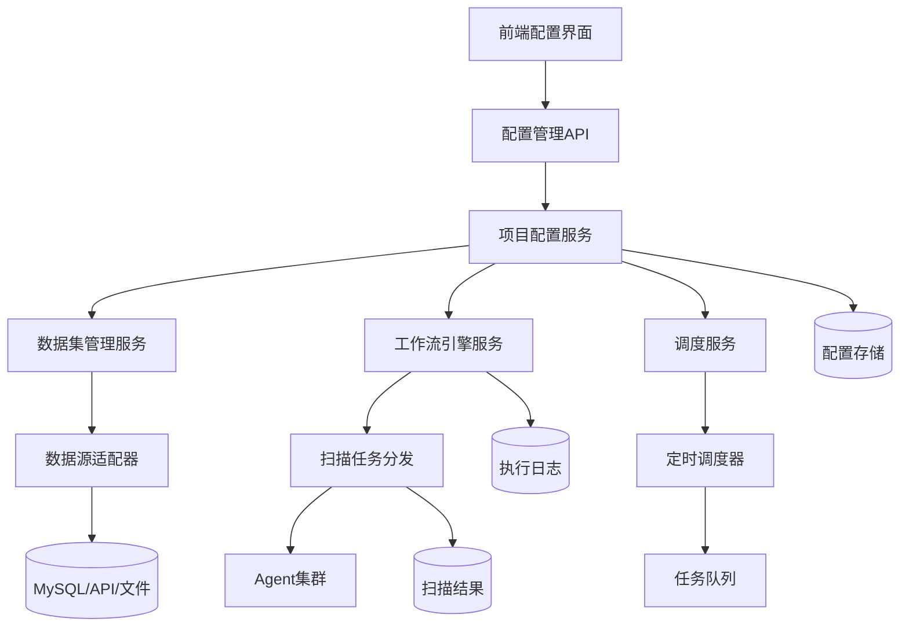
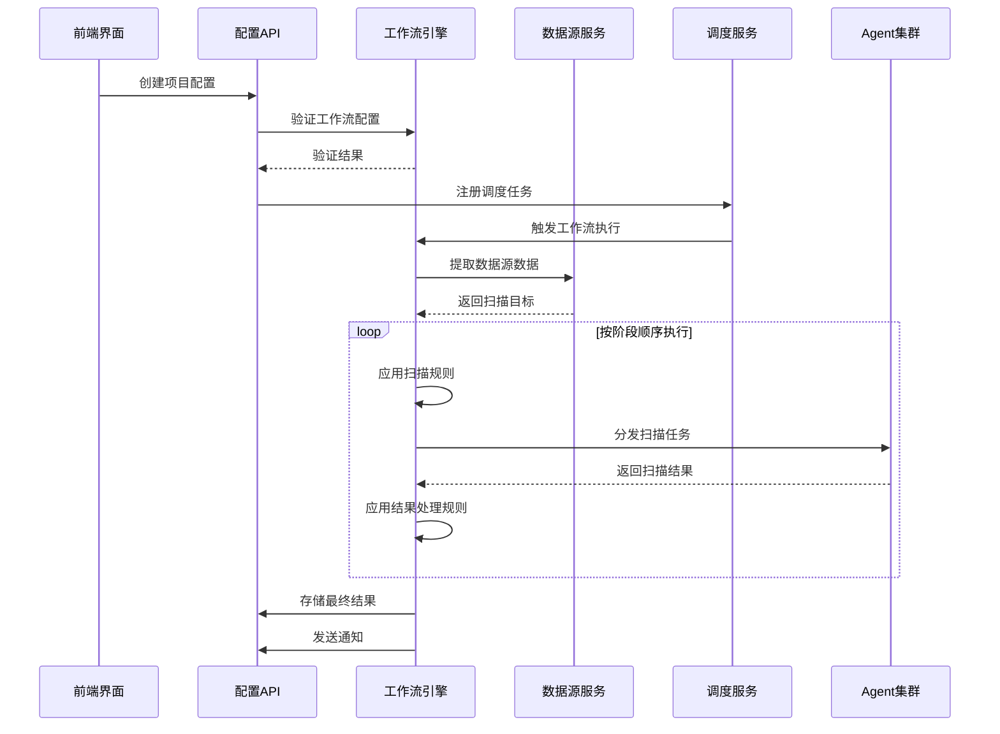

# 设计文档 - 扫描配置工作流v1.0

## 架构概览

### 整体架构图


### 核心设计原则

**1. Linus式"好品味"设计**
- **统一配置模型**：消除工程方案/非工程方案的特殊情况
- **线性化工作流**：避免复杂的节点依赖关系
- **规则引擎统一**：扫描策略和结果处理使用同一套规则系统

**2. 数据结构优先**
- **ProjectConfig** - 统一的项目配置结构
- **Dataset/DataView** - easeData概念的Go实现
- **WorkflowStage** - 简化的工作流阶段
- **ScanRule** - 统一的规则配置

**3. 分层架构严格遵守**
```
Controller/Handler → Service → Repository → Database
```

## 核心组件设计

### 1. 数据模型层 (Model)

#### 1.1 项目配置核心结构
```go
// ProjectConfig - 统一的项目配置结构（消除工程方案/非工程方案特殊情况）
type ProjectConfig struct {
    BaseModel
    Name            string                 `json:"name" gorm:"not null;comment:项目名称"`
    Description     string                 `json:"description" gorm:"comment:项目描述"`
    IsActive        bool                   `json:"is_active" gorm:"default:true;comment:是否启用"`
    
    // 时间周期配置 - 统一使用cron表达式
    ScheduleConfig  *ScheduleConfig        `json:"schedule_config" gorm:"embedded;comment:调度配置"`
    
    // 数据源配置 - easeData概念实现
    DataSources     []DataSource           `json:"data_sources" gorm:"foreignKey:ProjectID;comment:数据源列表"`
    
    // 工作流配置 - 线性化的阶段列表
    WorkflowStages  []WorkflowStage        `json:"workflow_stages" gorm:"foreignKey:ProjectID;comment:工作流阶段"`
    
    // 统一规则配置 - 合并扫描策略和结果处理
    ScanRules       []ScanRule             `json:"scan_rules" gorm:"foreignKey:ProjectID;comment:扫描规则"`
    
    // 结果存储配置
    ResultConfig    *ResultConfig          `json:"result_config" gorm:"embedded;comment:结果配置"`
    
    // 通知配置
    NotificationConfig *NotificationConfig `json:"notification_config" gorm:"embedded;comment:通知配置"`
    
    // AI工作流预留字段
    AIWorkflowConfig map[string]interface{} `json:"ai_workflow_config" gorm:"type:json;comment:AI工作流配置"`
}

// ScheduleConfig - 时间周期配置
type ScheduleConfig struct {
    Type        string `json:"type" gorm:"comment:调度类型(immediate/cron/once)"`
    CronExpr    string `json:"cron_expr" gorm:"comment:cron表达式"`
    StartTime   *time.Time `json:"start_time" gorm:"comment:开始时间"`
    EndTime     *time.Time `json:"end_time" gorm:"comment:结束时间"`
    Timezone    string `json:"timezone" gorm:"default:Asia/Shanghai;comment:时区"`
}
```

#### 1.2 easeData概念实现
```go
// DataSource - 数据集概念（系统处理数据的最开始单位）
type DataSource struct {
    BaseModel
    ProjectID   uint   `json:"project_id" gorm:"not null;comment:项目ID"`
    Name        string `json:"name" gorm:"not null;comment:数据集名称"`
    Type        string `json:"type" gorm:"not null;comment:数据源类型(mysql/api/file/manual)"`
    
    // 数据源连接配置
    Config      map[string]interface{} `json:"config" gorm:"type:json;comment:数据源配置"`
    
    // 数据视图列表
    DataViews   []DataView `json:"data_views" gorm:"foreignKey:DataSourceID;comment:数据视图"`
}

// DataView - 数据视图概念（从数据集中获取具体数据的"菜谱"）
type DataView struct {
    BaseModel
    DataSourceID uint   `json:"data_source_id" gorm:"not null;comment:数据源ID"`
    Name         string `json:"name" gorm:"not null;comment:视图名称"`
    Description  string `json:"description" gorm:"comment:视图描述"`
    
    // 数据提取规则（本质上是SQL语句或API查询参数）
    QueryRule    string `json:"query_rule" gorm:"type:text;comment:查询规则"`
    
    // 字段映射配置
    FieldMapping map[string]interface{} `json:"field_mapping" gorm:"type:json;comment:字段映射"`
}
```

#### 1.3 工作流引擎设计
```go
// WorkflowStage - 线性化的工作流阶段（消除复杂依赖关系）
type WorkflowStage struct {
    BaseModel
    ProjectID    uint   `json:"project_id" gorm:"not null;comment:项目ID"`
    Name         string `json:"name" gorm:"not null;comment:阶段名称"`
    StageType    string `json:"stage_type" gorm:"not null;comment:阶段类型(scan/process/notify/ai)"`
    Order        int    `json:"order" gorm:"not null;comment:执行顺序"`
    IsEnabled    bool   `json:"is_enabled" gorm:"default:true;comment:是否启用"`
    
    // 扫描工具配置（第三方工具支持）
    ScanTool     *ScanToolConfig        `json:"scan_tool" gorm:"embedded;comment:扫描工具配置"`
    
    // 阶段配置
    Config       map[string]interface{} `json:"config" gorm:"type:json;comment:阶段配置"`
    
    // AI节点预留配置
    AIConfig     map[string]interface{} `json:"ai_config" gorm:"type:json;comment:AI配置"`
}

// ScanToolConfig - 第三方扫描工具配置
type ScanToolConfig struct {
    BaseModel
    ToolName     string                 `json:"tool_name" gorm:"comment:工具名称(nmap/masscan/nuclei/etc)"`
    ToolVersion  string                 `json:"tool_version" gorm:"comment:工具版本"`
    ToolPath     string                 `json:"tool_path" gorm:"comment:工具路径"`
    
    // 工具参数配置
    Arguments    []string               `json:"arguments" gorm:"type:json;comment:工具参数列表"`
    Options      map[string]interface{} `json:"options" gorm:"type:json;comment:工具选项配置"`
    
    // 执行环境配置
    Environment  map[string]string      `json:"environment" gorm:"type:json;comment:环境变量"`
    WorkingDir   string                 `json:"working_dir" gorm:"comment:工作目录"`
    Timeout      int                    `json:"timeout" gorm:"default:300;comment:超时时间(秒)"`
    
    // 输出配置
    OutputFormat string                 `json:"output_format" gorm:"comment:输出格式(json/xml/txt)"`
    OutputFile   string                 `json:"output_file" gorm:"comment:输出文件路径"`
}

// ScanRule - 统一的规则配置（合并扫描策略和结果处理）
type ScanRule struct {
    BaseModel
    ProjectID    uint   `json:"project_id" gorm:"not null;comment:项目ID"`
    Name         string `json:"name" gorm:"not null;comment:规则名称"`
    RuleType     string `json:"rule_type" gorm:"not null;comment:规则类型(whitelist/blacklist/skip/timeout/retry/merge/extract)"`
    Stage        string `json:"stage" gorm:"comment:应用阶段(pre_scan/post_scan/result_process)"`
    
    // 规则条件和动作
    Conditions   map[string]interface{} `json:"conditions" gorm:"type:json;comment:规则条件"`
    Actions      map[string]interface{} `json:"actions" gorm:"type:json;comment:规则动作"`
    
    Priority     int    `json:"priority" gorm:"default:0;comment:优先级"`
    IsEnabled    bool   `json:"is_enabled" gorm:"default:true;comment:是否启用"`
}
```

#### 1.4 结果和通知配置
```go
// ResultConfig - 结果存储配置
type ResultConfig struct {
    StorageType     string `json:"storage_type" gorm:"comment:存储类型(database/file/api)"`
    TableName       string `json:"table_name" gorm:"comment:存储表名"`
    RetentionDays   int    `json:"retention_days" gorm:"default:30;comment:保留天数"`
    
    // 结果处理配置
    ProcessConfig   map[string]interface{} `json:"process_config" gorm:"type:json;comment:处理配置"`
}

// NotificationConfig - 通知配置
type NotificationConfig struct {
    IsEnabled       bool     `json:"is_enabled" gorm:"default:false;comment:是否启用通知"`
    Channels        []string `json:"channels" gorm:"type:json;comment:通知渠道"`
    TriggerEvents   []string `json:"trigger_events" gorm:"type:json;comment:触发事件"`
    
    // 通知内容模板
    Templates       map[string]interface{} `json:"templates" gorm:"type:json;comment:通知模板"`
}
```

### 2. 服务层设计 (Service)

#### 2.1 项目配置服务
```go
type ProjectConfigService interface {
    // 项目配置CRUD
    CreateProject(config *ProjectConfig) error
    UpdateProject(id uint, config *ProjectConfig) error
    GetProject(id uint) (*ProjectConfig, error)
    ListProjects(filter ProjectFilter) ([]*ProjectConfig, error)
    DeleteProject(id uint) error
    
    // 配置验证
    ValidateConfig(config *ProjectConfig) error
    
    // 配置热重载
    ReloadConfig(id uint) error
}
```

#### 2.2 数据源管理服务
```go
type DataSourceService interface {
    // 数据源管理
    CreateDataSource(dataSource *DataSource) error
    UpdateDataSource(id uint, dataSource *DataSource) error
    GetDataSource(id uint) (*DataSource, error)
    ListDataSources(projectID uint) ([]*DataSource, error)
    DeleteDataSource(id uint) error
    
    // 数据视图管理
    CreateDataView(dataView *DataView) error
    UpdateDataView(id uint, dataView *DataView) error
    GetDataView(id uint) (*DataView, error)
    ListDataViews(dataSourceID uint) ([]*DataView, error)
    DeleteDataView(id uint) error
    
    // 数据提取
    ExtractData(dataViewID uint) ([]map[string]interface{}, error)
    TestConnection(dataSource *DataSource) error
}
```

#### 2.3 工作流引擎服务
```go
type WorkflowEngineService interface {
    // 工作流执行
    ExecuteWorkflow(projectID uint) (*WorkflowExecution, error)
    StopWorkflow(executionID uint) error
    GetWorkflowStatus(executionID uint) (*WorkflowStatus, error)
    
    // 阶段管理
    CreateStage(stage *WorkflowStage) error
    UpdateStage(id uint, stage *WorkflowStage) error
    GetStage(id uint) (*WorkflowStage, error)
    ListStages(projectID uint) ([]*WorkflowStage, error)
    DeleteStage(id uint) error
    
    // 规则引擎
    ApplyRules(projectID uint, stage string, data interface{}) (interface{}, error)
    ValidateRules(rules []ScanRule) error
}
```

### 3. 控制器层设计 (Handler)

#### 3.1 项目配置API
```go
// POST /api/v1/projects - 创建项目配置
// PUT /api/v1/projects/{id} - 更新项目配置
// GET /api/v1/projects/{id} - 获取项目配置
// GET /api/v1/projects - 列出项目配置
// DELETE /api/v1/projects/{id} - 删除项目配置
// POST /api/v1/projects/{id}/reload - 重载项目配置
```

#### 3.2 数据源管理API
```go
// POST /api/v1/projects/{projectId}/datasources - 创建数据源
// PUT /api/v1/datasources/{id} - 更新数据源
// GET /api/v1/datasources/{id} - 获取数据源
// GET /api/v1/projects/{projectId}/datasources - 列出数据源
// DELETE /api/v1/datasources/{id} - 删除数据源
// POST /api/v1/datasources/{id}/test - 测试数据源连接

// POST /api/v1/datasources/{dataSourceId}/dataviews - 创建数据视图
// PUT /api/v1/dataviews/{id} - 更新数据视图
// GET /api/v1/dataviews/{id} - 获取数据视图
// GET /api/v1/datasources/{dataSourceId}/dataviews - 列出数据视图
// DELETE /api/v1/dataviews/{id} - 删除数据视图
// POST /api/v1/dataviews/{id}/extract - 提取数据
```

#### 3.3 工作流管理API
```go
// POST /api/v1/projects/{projectId}/execute - 执行工作流
// POST /api/v1/workflows/{executionId}/stop - 停止工作流
// GET /api/v1/workflows/{executionId}/status - 获取工作流状态

// POST /api/v1/projects/{projectId}/stages - 创建工作流阶段
// PUT /api/v1/stages/{id} - 更新工作流阶段
// GET /api/v1/stages/{id} - 获取工作流阶段
// GET /api/v1/projects/{projectId}/stages - 列出工作流阶段
// DELETE /api/v1/stages/{id} - 删除工作流阶段

// POST /api/v1/projects/{projectId}/rules - 创建扫描规则
// PUT /api/v1/rules/{id} - 更新扫描规则
// GET /api/v1/rules/{id} - 获取扫描规则
// GET /api/v1/projects/{projectId}/rules - 列出扫描规则
// DELETE /api/v1/rules/{id} - 删除扫描规则
```

## 接口设计

### API规范

#### 创建项目配置
```http
POST /api/v1/projects
Content-Type: application/json

{
  "name": "Web应用安全扫描",
  "description": "针对Web应用的综合安全扫描项目",
  "schedule_config": {
    "type": "cron",
    "cron_expr": "0 2 * * *",
    "timezone": "Asia/Shanghai"
  },
  "data_sources": [
    {
      "name": "目标主机列表",
      "type": "mysql",
      "config": {
        "host": "localhost",
        "database": "assets",
        "table": "hosts"
      }
    }
  ],
  "workflow_stages": [
    {
      "name": "端口扫描",
      "stage_type": "scan",
      "order": 1,
      "scan_tool": {
        "tool_name": "nmap",
        "tool_version": "7.94",
        "tool_path": "/usr/bin/nmap",
        "arguments": ["-sS", "-O", "-sV", "--script=default"],
        "options": {
          "ports": "1-65535",
          "timing": "T4",
          "max_retries": 2
        },
        "environment": {
          "NMAP_PRIVILEGED": "1"
        },
        "timeout": 600,
        "output_format": "json",
        "output_file": "/tmp/nmap_results.json"
      },
      "config": {
        "target_type": "ip_range",
        "parallel_tasks": 10
      }
    },
    {
      "name": "快速端口扫描",
      "stage_type": "scan", 
      "order": 2,
      "scan_tool": {
        "tool_name": "masscan",
        "tool_version": "1.3.2",
        "tool_path": "/usr/bin/masscan",
        "arguments": ["--rate=1000", "--wait=0"],
        "options": {
          "ports": "80,443,8080,8443,3389,22,21,23,25,53,110,143,993,995",
          "exclude_ports": "0"
        },
        "timeout": 300,
        "output_format": "json"
      }
    },
    {
      "name": "漏洞扫描",
      "stage_type": "scan",
      "order": 3,
      "scan_tool": {
        "tool_name": "nuclei",
        "tool_version": "3.1.0",
        "tool_path": "/usr/bin/nuclei",
        "arguments": ["-silent", "-no-color"],
        "options": {
          "templates": "/opt/nuclei-templates/",
          "severity": "critical,high,medium",
          "rate_limit": 150,
          "bulk_size": 25
        },
        "timeout": 1800,
        "output_format": "json"
      }
    }
  ],
  "scan_rules": [
    {
      "name": "跳过内网地址",
      "rule_type": "skip",
      "stage": "pre_scan",
      "conditions": {
        "ip_range": ["192.168.0.0/16", "10.0.0.0/8"]
      }
    },
    {
      "name": "nmap超时重试",
      "rule_type": "retry",
      "stage": "scan_execution",
      "conditions": {
        "tool_name": "nmap",
        "error_type": "timeout"
      },
      "actions": {
        "max_retries": 3,
        "retry_delay": 30,
        "fallback_args": ["-T2", "--host-timeout=300s"]
      }
    }
  ]
}
```

#### 响应格式
```json
{
  "code": 200,
  "message": "success",
  "data": {
    "id": 1,
    "name": "Web应用安全扫描",
    "is_active": true,
    "created_at": "2024-01-15T10:30:00Z",
    "updated_at": "2024-01-15T10:30:00Z"
  }
}
```

### 错误处理
```json
{
  "code": 400,
  "message": "配置验证失败",
  "errors": [
    {
      "field": "schedule_config.cron_expr",
      "message": "cron表达式格式错误"
    }
  ]
}
```

## 数据流设计

### 扫描执行流程


## 技术实现要点

### 1. 第三方扫描工具集成
基于现有的`ScanType`模型，扩展工具配置能力：

```go
// 扩展现有的ScanType结构
type ScanType struct {
    ID             uint                   `json:"id" gorm:"primaryKey"`
    Name           string                 `json:"name" gorm:"unique;not null"`
    DisplayName    string                 `json:"display_name"`
    Description    string                 `json:"description"`
    Category       string                 `json:"category"`
    IsActive       bool                   `json:"is_active" gorm:"default:true"`
    ConfigTemplate map[string]interface{} `json:"config_template" gorm:"type:json"`
    
    // 新增字段：工具执行配置
    ToolConfig     *ScanToolConfig        `json:"tool_config" gorm:"type:json"`
}

// 工具配置模板，支持多种扫描工具
type ScanToolConfig struct {
    ToolName      string            `json:"tool_name"`      // nmap, masscan, nuclei等
    ToolVersion   string            `json:"tool_version"`   // 工具版本
    ToolPath      string            `json:"tool_path"`      // 工具可执行文件路径
    Arguments     []string          `json:"arguments"`      // 基础参数
    Options       map[string]string `json:"options"`        // 可配置选项
    Environment   map[string]string `json:"environment"`    // 环境变量
    WorkDir       string            `json:"work_dir"`       // 工作目录
    Timeout       int               `json:"timeout"`        // 超时时间(秒)
    OutputFormat  string            `json:"output_format"`  // 输出格式
    OutputFile    string            `json:"output_file"`    // 输出文件路径
}
```

### 2. 工具参数动态组装
```go
// 工具执行器接口
type ScanToolExecutor interface {
    BuildCommand(config *ScanToolConfig, targets []string) (*exec.Cmd, error)
    ParseOutput(outputPath string) (*ScanResult, error)
    ValidateConfig(config *ScanToolConfig) error
}

// Nmap工具执行器实现
type NmapExecutor struct{}

func (n *NmapExecutor) BuildCommand(config *ScanToolConfig, targets []string) (*exec.Cmd, error) {
    args := append(config.Arguments, targets...)
    
    // 动态添加选项参数
    for key, value := range config.Options {
        switch key {
        case "ports":
            args = append(args, "-p", value)
        case "timing":
            args = append(args, "-"+value)
        case "max_retries":
            args = append(args, "--max-retries", value)
        }
    }
    
    cmd := exec.Command(config.ToolPath, args...)
    
    // 设置环境变量
    for key, value := range config.Environment {
        cmd.Env = append(cmd.Env, fmt.Sprintf("%s=%s", key, value))
    }
    
    if config.WorkDir != "" {
        cmd.Dir = config.WorkDir
    }
    
    return cmd, nil
}
```

### 3. 配置热重载机制
- 基于现有的`ConfigWatcher`扩展
- 支持项目级别的配置重载
- 确保正在执行的任务不受影响

### 2. 规则引擎实现
```go
type RuleEngine struct {
    rules []ScanRule
}

func (re *RuleEngine) ApplyRules(stage string, data interface{}) (interface{}, error) {
    // 按优先级排序规则
    stageRules := re.getRulesByStage(stage)
    sort.Slice(stageRules, func(i, j int) bool {
        return stageRules[i].Priority > stageRules[j].Priority
    })
    
    // 依次应用规则
    result := data
    for _, rule := range stageRules {
        if rule.IsEnabled {
            result = re.applyRule(rule, result)
        }
    }
    
    return result, nil
}
```

### 3. AI工作流预留设计
- 在`WorkflowStage`中预留`AIConfig`字段
- 在`ProjectConfig`中预留`AIWorkflowConfig`字段
- 支持动态加载AI处理节点

### 4. 数据源适配器模式
```go
type DataSourceAdapter interface {
    Connect(config map[string]interface{}) error
    ExtractData(query string) ([]map[string]interface{}, error)
    TestConnection() error
    Close() error
}

// 实现不同类型的适配器
type MySQLAdapter struct{}
type APIAdapter struct{}
type FileAdapter struct{}
type ManualAdapter struct{}
```

## 安全考虑

### 1. 配置安全
- 敏感信息（数据库密码、API密钥）使用加密存储
- 支持环境变量和配置文件分离
- 配置访问权限控制

### 2. 数据源安全
- 数据源连接信息加密
- 支持SSL/TLS连接
- 访问权限验证

### 3. 执行安全
- 扫描规则沙箱执行
- 资源使用限制
- 异常处理和恢复

## 性能优化

### 1. 配置缓存
- Redis缓存热点配置
- 配置变更通知机制
- 分布式缓存一致性

### 2. 数据源优化
- 连接池管理
- 查询结果缓存
- 分页查询支持

### 3. 工作流优化
- 阶段并行执行支持
- 任务队列优化
- 结果流式处理

## 监控和日志

### 1. 执行监控
- 工作流执行状态跟踪
- 阶段执行时间统计
- 错误率和成功率监控

### 2. 日志记录
- 结构化日志输出
- 关键操作审计日志
- 性能指标日志

### 3. 告警机制
- 执行失败告警
- 性能异常告警
- 资源使用告警

---

## 下一步行动

1. **确认架构设计** - 请确认整体架构是否符合预期
2. **进入原子化阶段** - 将架构设计拆分为具体的开发任务
3. **数据库设计** - 详细设计数据表结构和索引
4. **API接口设计** - 完善API接口规范和文档