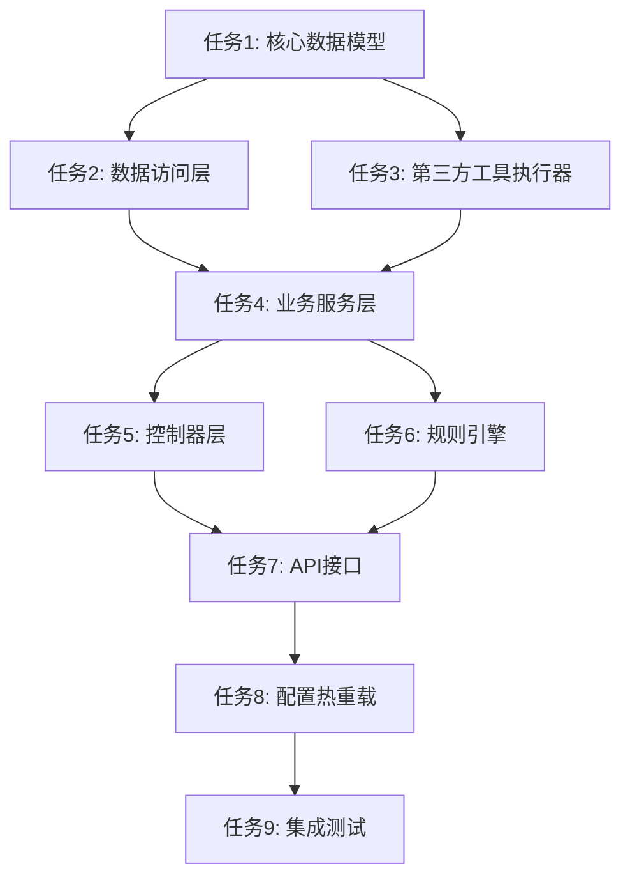

# 任务拆分文档 - 扫描配置工作流v1.0

## 基于Linus设计哲学的任务拆分原则

### 核心原则
1. **"好品味"原则**：每个任务都应该消除特殊情况，让代码自然流畅
2. **数据结构优先**：先实现核心数据模型，再实现业务逻辑
3. **分层架构严格**：Controller → Service → Repository → Database
4. **原子性保证**：每个任务可独立编译、测试、验证

## 任务依赖关系图



## 任务列表

### 任务1：核心数据模型实现
**优先级**: P0 (最高)
**复杂度**: 中等
**预估时间**: 2-3小时

#### 输入契约
- 前置依赖：DESIGN文档中的数据结构定义
- 输入数据：现有的`ScanType`模型结构
- 环境依赖：Go 1.19+, GORM v2

#### 输出契约
- 输出数据：完整的数据模型结构体
- 交付物：
  - `internal/model/project_config.go` - 项目配置模型
  - `internal/model/scan_tool.go` - 扫描工具配置模型  
  - `internal/model/workflow.go` - 工作流模型
  - `internal/model/scan_rule.go` - 扫描规则模型
- 验收标准：
  - [ ] 所有模型结构体定义完整
  - [ ] GORM标签正确配置
  - [ ] JSON序列化标签完整
  - [ ] 数据库迁移文件生成
  - [ ] 单元测试覆盖率 > 90%

#### 实现约束
- 技术栈：Go + GORM + MySQL
- 接口规范：遵循现有项目的模型定义规范
- 质量要求：
  - 严格遵循现有代码风格
  - 扩展现有`ScanType`而非重写
  - 使用统一的JSON配置存储
  - 支持数据库事务

#### 依赖关系
- 后置任务：任务2、任务3
- 并行任务：无

---

### 任务2：数据访问层(Repository)实现
**优先级**: P0 (最高)
**复杂度**: 中等
**预估时间**: 3-4小时

#### 输入契约
- 前置依赖：任务1完成的数据模型
- 输入数据：数据库连接配置
- 环境依赖：MySQL数据库，GORM配置

#### 输出契约
- 输出数据：完整的数据访问接口
- 交付物：
  - `internal/repository/scan_config/project_config_repo.go` - 项目配置数据访问
  - `internal/repository/scan_config/scan_tool_repo.go` - 扫描工具数据访问
  - `internal/repository/scan_config/workflow_repo.go` - 工作流数据访问
  - `internal/repository/scan_config/scan_rule_repo.go` - 扫描规则数据访问
- 验收标准：
  - [ ] 实现CRUD基础操作
  - [ ] 支持复杂查询（按条件筛选、分页）
  - [ ] 事务支持
  - [ ] 错误处理完善
  - [ ] 单元测试覆盖率 > 85%

#### 实现约束
- 技术栈：GORM + MySQL
- 接口规范：遵循Repository模式
- 质量要求：
  - 统一错误处理
  - 支持软删除
  - 查询性能优化
  - 数据一致性保证

#### 依赖关系
- 前置任务：任务1
- 后置任务：任务4
- 并行任务：任务3

---

### 任务3：第三方扫描工具执行器
**优先级**: P0 (最高)  
**复杂度**: 高
**预估时间**: 4-5小时

#### 输入契约
- 前置依赖：任务1完成的`ScanToolConfig`模型
- 输入数据：扫描工具配置参数
- 环境依赖：系统已安装nmap、masscan、nuclei等工具

#### 输出契约
- 输出数据：标准化的扫描结果
- 交付物：
  - `internal/executor/scan_tool_executor.go` - 工具执行器接口
  - `internal/executor/nmap_executor.go` - Nmap执行器实现
  - `internal/executor/masscan_executor.go` - Masscan执行器实现
  - `internal/executor/nuclei_executor.go` - Nuclei执行器实现
  - `internal/executor/executor_factory.go` - 执行器工厂
- 验收标准：
  - [ ] 支持动态参数组装
  - [ ] 命令执行超时控制
  - [ ] 输出结果标准化解析
  - [ ] 错误处理和重试机制
  - [ ] 工具版本兼容性检查
  - [ ] 单元测试覆盖率 > 80%

#### 实现约束
- 技术栈：Go标准库 + os/exec
- 接口规范：统一的执行器接口
- 质量要求：
  - 安全的命令执行（防注入）
  - 资源清理（进程、文件）
  - 并发安全
  - 详细的执行日志

#### 依赖关系
- 前置任务：任务1
- 后置任务：任务4
- 并行任务：任务2

---

### 任务4：业务服务层(Service)实现
**优先级**: P1 (高)
**复杂度**: 高
**预估时间**: 5-6小时

#### 输入契约
- 前置依赖：任务2、任务3完成
- 输入数据：HTTP请求参数、配置数据
- 环境依赖：完整的数据访问层和工具执行器

#### 输出契约
- 输出数据：业务处理结果
- 交付物：
  - `internal/service/scan_config/project_config_service.go` - 项目配置服务
  - `internal/service/scan_config/workflow_service.go` - 工作流执行服务
  - `internal/service/scan_config/scan_rule_service.go` - 规则引擎服务
  - `internal/service/scan_config/scan_execution_service.go` - 扫描执行服务
- 验收标准：
  - [ ] 完整的业务逻辑实现
  - [ ] 数据验证和转换
  - [ ] 工作流编排和执行
  - [ ] 异常处理和回滚
  - [ ] 业务日志记录
  - [ ] 单元测试覆盖率 > 85%

#### 实现约束
- 技术栈：Go + 业务逻辑框架
- 接口规范：遵循Service层模式
- 质量要求：
  - 事务一致性
  - 幂等性保证
  - 性能优化
  - 可扩展性设计

#### 依赖关系
- 前置任务：任务2、任务3
- 后置任务：任务5、任务6
- 并行任务：无

---

### 任务5：控制器层(Handler)实现
**优先级**: P1 (高)
**复杂度**: 中等
**预估时间**: 3-4小时

#### 输入契约
- 前置依赖：任务4完成的业务服务
- 输入数据：HTTP请求
- 环境依赖：Gin框架，中间件配置

#### 输出契约
- 输出数据：HTTP响应
- 交付物：
  - `internal/app/master/handler/scan_config/project_config_handler.go` - 项目配置控制器
  - `internal/app/master/handler/scan_config/workflow_handler.go` - 工作流控制器
  - `internal/app/master/handler/scan_config/scan_rule_handler.go` - 规则配置控制器
- 验收标准：
  - [ ] RESTful API设计
  - [ ] 请求参数验证
  - [ ] 响应格式统一
  - [ ] 错误处理标准化
  - [ ] API文档完整
  - [ ] 集成测试通过

#### 实现约束
- 技术栈：Gin + 现有中间件
- 接口规范：遵循RESTful设计
- 质量要求：
  - 统一的响应格式
  - 完善的参数验证
  - 安全性检查
  - 性能监控

#### 依赖关系
- 前置任务：任务4
- 后置任务：任务7
- 并行任务：任务6

---

### 任务6：规则引擎实现
**优先级**: P1 (高)
**复杂度**: 高
**预估时间**: 4-5小时

#### 输入契约
- 前置依赖：任务4完成的服务层
- 输入数据：规则配置、扫描上下文
- 环境依赖：规则表达式解析器

#### 输出契约
- 输出数据：规则执行结果
- 交付物：
  - `internal/engine/rule_engine.go` - 规则引擎核心
  - `internal/engine/rule_parser.go` - 规则解析器
  - `internal/engine/condition_evaluator.go` - 条件评估器
  - `internal/engine/action_executor.go` - 动作执行器
- 验收标准：
  - [ ] 支持多种规则类型（skip、retry、filter）
  - [ ] 条件表达式解析
  - [ ] 动作执行机制
  - [ ] 规则优先级处理
  - [ ] 性能优化
  - [ ] 单元测试覆盖率 > 90%

#### 实现约束
- 技术栈：Go + 表达式解析库
- 接口规范：可扩展的规则引擎
- 质量要求：
  - 高性能执行
  - 内存安全
  - 规则隔离
  - 错误恢复

#### 依赖关系
- 前置任务：任务4
- 后置任务：任务7
- 并行任务：任务5

---

### 任务7：API路由和集成
**优先级**: P1 (高)
**复杂度**: 中等
**预估时间**: 2-3小时

#### 输入契约
- 前置依赖：任务5、任务6完成
- 输入数据：路由配置需求
- 环境依赖：现有的路由系统

#### 输出契约
- 输出数据：完整的API路由
- 交付物：
  - `internal/app/master/router/scan_config_router.go` - 扫描配置路由
  - API文档更新
- 验收标准：
  - [ ] 路由注册正确
  - [ ] 中间件配置完整
  - [ ] API版本管理
  - [ ] 权限控制集成
  - [ ] API测试通过

#### 实现约束
- 技术栈：Gin路由 + 现有中间件
- 接口规范：遵循现有API设计规范
- 质量要求：
  - 路由性能优化
  - 安全性检查
  - 监控集成
  - 文档同步

#### 依赖关系
- 前置任务：任务5、任务6
- 后置任务：任务8
- 并行任务：无

---

### 任务8：配置热重载机制
**优先级**: P2 (中)
**复杂度**: 中等
**预估时间**: 3-4小时

#### 输入契约
- 前置依赖：任务7完成的完整系统
- 输入数据：配置变更事件
- 环境依赖：现有的ConfigWatcher机制

#### 输出契约
- 输出数据：配置重载结果
- 交付物：
  - `internal/config/scan_config_watcher.go` - 扫描配置监听器
  - `internal/service/scan_config/config_reload_service.go` - 配置重载服务
- 验收标准：
  - [ ] 配置变更实时检测
  - [ ] 无损热重载
  - [ ] 回滚机制
  - [ ] 重载状态监控
  - [ ] 集成测试通过

#### 实现约束
- 技术栈：基于现有ConfigWatcher扩展
- 接口规范：遵循现有配置管理模式
- 质量要求：
  - 零停机重载
  - 数据一致性
  - 错误恢复
  - 性能影响最小

#### 依赖关系
- 前置任务：任务7
- 后置任务：任务9
- 并行任务：无

---

### 任务9：集成测试和验证
**优先级**: P2 (中)
**复杂度**: 中等
**预估时间**: 4-5小时

#### 输入契约
- 前置依赖：任务8完成的完整系统
- 输入数据：测试用例和测试数据
- 环境依赖：测试环境、测试工具

#### 输出契约
- 输出数据：测试报告和验证结果
- 交付物：
  - `test/integration/scan_config_test.go` - 集成测试
  - `test/e2e/workflow_test.go` - 端到端测试
  - 测试报告文档
- 验收标准：
  - [ ] 完整工作流测试通过
  - [ ] 性能基准测试
  - [ ] 错误场景测试
  - [ ] 并发安全测试
  - [ ] 文档验证完整

#### 实现约束
- 技术栈：Go testing + testify
- 接口规范：遵循现有测试规范
- 质量要求：
  - 测试覆盖率 > 80%
  - 性能基准达标
  - 内存泄漏检查
  - 安全性验证

#### 依赖关系
- 前置任务：任务8
- 后置任务：无
- 并行任务：无

## 优化后的目录结构说明

### 扫描配置模块目录组织
为了更好地组织代码结构，避免文件混乱，我们在关键目录下创建专门的子目录：

```
neoMaster/internal/
├── model/                          # 数据模型层
│   ├── project_config.go          # 项目配置模型
│   ├── scan_tool.go               # 扫描工具配置模型
│   ├── workflow.go                # 工作流模型
│   └── scan_rule.go               # 扫描规则模型
├── repository/                     # 数据访问层
│   └── scan_config/               # 扫描配置数据访问子目录
│       ├── project_config_repo.go     # 项目配置数据访问
│       ├── scan_tool_repo.go          # 扫描工具数据访问
│       ├── workflow_repo.go           # 工作流数据访问
│       └── scan_rule_repo.go          # 扫描规则数据访问
├── executor/                       # 工具执行器层
│   ├── scan_tool_executor.go      # 工具执行器接口
│   ├── nmap_executor.go           # Nmap执行器实现
│   ├── masscan_executor.go        # Masscan执行器实现
│   ├── nuclei_executor.go         # Nuclei执行器实现
│   └── executor_factory.go        # 执行器工厂
├── service/                        # 业务服务层
│   └── scan_config/               # 扫描配置服务子目录
│       ├── project_config_service.go    # 项目配置服务
│       ├── workflow_service.go          # 工作流执行服务
│       ├── scan_rule_service.go         # 规则引擎服务
│       ├── scan_execution_service.go    # 扫描执行服务
│       └── config_reload_service.go     # 配置重载服务
├── app/master/handler/             # 控制器层
│   └── scan_config/               # 扫描配置控制器子目录
│       ├── project_config_handler.go   # 项目配置控制器
│       ├── workflow_handler.go         # 工作流控制器
│       └── scan_rule_handler.go        # 规则配置控制器
├── app/master/router/              # 路由层
│   └── scan_config_router.go      # 扫描配置路由
├── engine/                         # 规则引擎层
│   ├── rule_engine.go             # 规则引擎核心
│   ├── rule_parser.go             # 规则解析器
│   ├── condition_evaluator.go     # 条件评估器
│   └── action_executor.go         # 动作执行器
└── config/                         # 配置层
    └── scan_config_watcher.go     # 扫描配置监听器
```

### 目录组织原则
1. **功能模块化**：相关功能的文件放在同一个子目录下
2. **层次清晰**：严格按照分层架构组织文件
3. **易于维护**：避免单个目录文件过多，便于查找和维护
4. **扩展友好**：为未来功能扩展预留清晰的目录结构

## 风险评估和缓解策略

### 高风险任务
1. **任务3 - 第三方工具执行器**
   - 风险：工具版本兼容性、安全性问题
   - 缓解：版本检查、沙箱执行、输入验证

2. **任务6 - 规则引擎**
   - 风险：性能瓶颈、内存泄漏
   - 缓解：性能测试、内存监控、规则优化

### 关键路径
任务1 → 任务2 → 任务4 → 任务5 → 任务7 → 任务8 → 任务9

### 并行执行策略
- 任务2和任务3可并行开发
- 任务5和任务6可并行开发
- 其他任务需严格按依赖顺序执行

## 质量门控标准

### 代码质量
- [ ] 单元测试覆盖率 > 80%
- [ ] 代码审查通过
- [ ] 静态分析无高危问题
- [ ] 性能基准达标

### 功能完整性
- [ ] 所有API接口正常工作
- [ ] 工作流执行正确
- [ ] 规则引擎功能完整
- [ ] 配置热重载正常

### 安全性
- [ ] 输入验证完善
- [ ] 权限控制正确
- [ ] 敏感信息保护
- [ ] 安全扫描通过

## 下一步行动
1. 等待用户确认任务拆分方案
2. 开始执行任务1：核心数据模型实现
3. 建立持续集成流水线
4. 准备测试环境和数据