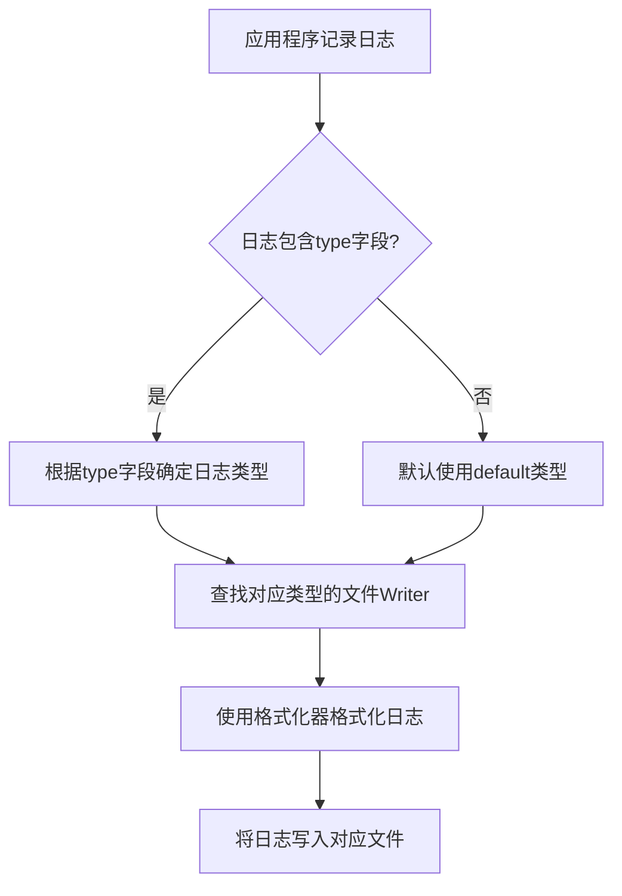

# 日志Hook机制使用说明

## 概述

本文档介绍了如何使用Logrus的Hook机制实现将不同类型日志输出到不同文件的功能。通过自定义FileHook，系统可以根据日志中的"type"字段将日志路由到不同的文件中。

## Hook机制工作原理

### 1. Hook接口

Logrus的Hook机制基于以下接口：

```go
type Hook interface {
    Levels() []Level
    Fire(*Entry) error
}
```

- `Levels()` 方法返回此Hook关心的日志级别列表
- `Fire()` 方法在匹配的日志级别被触发时执行

### 2. 工作流程



## 实现细节

### 1. FileHook结构

FileHook结构包含以下主要组件：

- `logConfig`: 日志配置信息
- `writers`: 存储不同类型日志的Writer映射
- `formatter`: 日志格式化器
- `mutex`: 保证并发安全的互斥锁

### 2. 日志类型映射

系统支持以下日志类型：

- `access`: 访问日志 (logs/access.log)
- `business`: 业务日志 (logs/business.log)
- `error`: 错误日志 (logs/error.log)
- `system`: 系统日志 (logs/system.log)
- `audit`: 审计日志 (logs/audit.log)
- `debug`: 调试日志 (logs/debug.log)
- `default`: 默认日志 (logs/app.log)

### 3. 日志轮转

所有日志文件都使用lumberjack进行轮转，支持以下配置：

- `MaxSize`: 单个日志文件最大大小(MB)
- `MaxBackups`: 保留的日志文件数量
- `MaxAge`: 日志文件保留天数
- `Compress`: 是否压缩日志文件

## 问题修复说明

### 问题分析

在初始实现中，发现日志仍然只输出到主日志文件(app.log)中，而不是根据类型分别输出到不同的文件。经过分析，发现以下问题：

1. **日志输出设置冲突**：
   在logger.go的setLogOutput函数中设置了全局的日志输出目标，这会将所有日志直接写入到主日志文件，绕过了Hook机制。

2. **Hook机制工作原理理解有误**：
   Logrus的Hook机制是在日志条目被处理后触发的，但它不会阻止默认的日志输出。

3. **日志类型字段格式处理不当**：
   日志类型字段在代码中使用了枚举类型，但在Hook中没有正确处理这种类型转换。

### 解决方案

1. **修改Logger初始化过程**：
   修改了setLogOutput函数，根据日志级别决定是否同时输出到控制台，确保在调试模式下控制台也有输出。

2. **改进Hook中的类型处理**：
   在Hook的Fire方法中增加了对LogType枚举类型的处理，确保能正确识别日志类型。

3. **确保目录存在**：
   在创建日志文件时，确保对应的目录已经存在。

## 使用方法

### 1. 初始化Hook

在Logger初始化时自动添加FileHook：

```go
// 设置日志输出，根据日志级别决定是否输出到控制台
if err := setLogOutput(logger, cfg); err != nil {
    return nil, fmt.Errorf("failed to set log output: %w", err)
}

// 添加FileHook以支持不同类型的日志输出到不同文件
logger.AddHook(NewFileHook(cfg))
```

### 2. 记录不同类型日志

使用WithFields方法添加"type"字段来指定日志类型：

```go
// 记录访问日志
logger.WithFields(logrus.Fields{
    "type":        "access",
    "method":      "GET",
    "path":        "/api/users",
    "status_code": 200,
}).Info("HTTP request processed")

// 记录业务日志
logger.WithFields(logrus.Fields{
    "type":      "business",
    "operation": "user_login",
    "user_id":   12345,
    "result":    "success",
}).Info("User login")
```

## 配置说明

日志配置在`configs/config.yaml`中定义：

```yaml
log:
  level: "debug"
  format: "json"
  output: "file"
  file_path: "logs/app.log"
  max_size: 100
  max_backups: 5
  max_age: 30
  compress: true
```

在调试模式下（日志级别为debug），日志会同时输出到控制台和通过Hook机制处理。
在生产模式下（日志级别不是debug），日志只通过Hook机制处理。

系统使用`file_path`配置项的目录部分作为所有日志文件的存储目录。例如，如果`file_path`设置为`/var/log/neoscan/app.log`，那么所有日志文件都会存储在`/var/log/neoscan/`目录下：
- `/var/log/neoscan/app.log` (默认日志文件)
- `/var/log/neoscan/access.log`
- `/var/log/neoscan/business.log`
- `/var/log/neoscan/error.log`
- 等等...

## 扩展性

### 添加新的日志类型

1. 在`getWriter`方法中添加新的日志类型映射
2. 指定新日志类型的文件路径
3. 重启应用或重新加载配置

### 自定义轮转策略

可以为不同类型的日志配置不同的轮转策略，只需在创建lumberjack.Logger时传入不同的参数。

## 注意事项

1. Hook机制不会影响现有日志调用方式
2. 未指定"type"字段的日志将使用默认日志文件
3. 所有日志类型共享相同的格式化器和基础配置
4. 文件Writer按需创建，提高资源利用率
5. setLogOutput函数根据日志级别决定是否同时输出到控制台，确保调试时的可见性
6. 通过file_path配置项的目录部分确定所有日志文件的存储目录