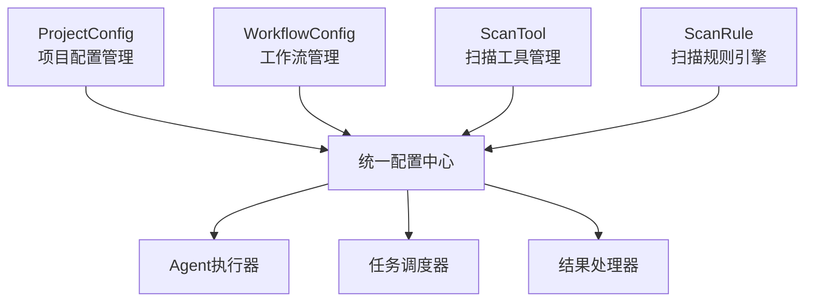
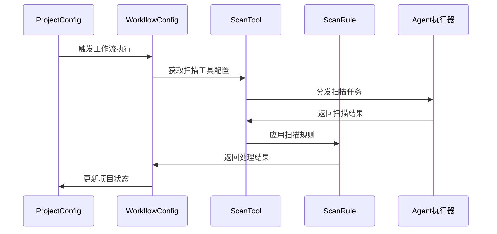
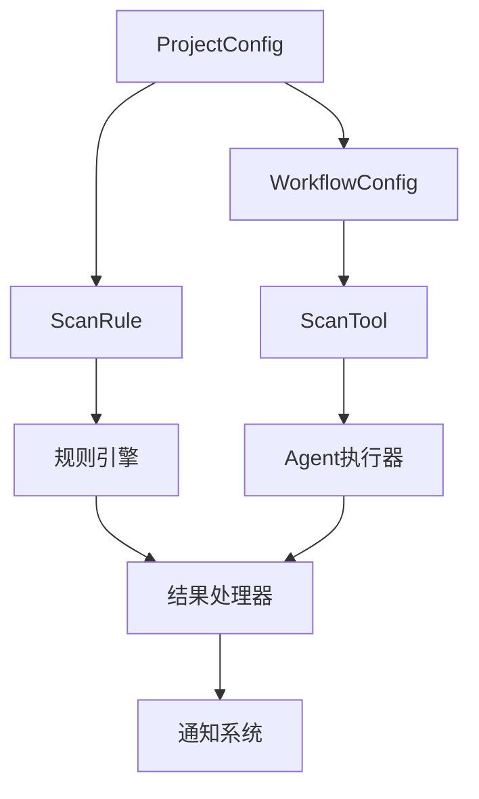

# ScanConfig 核心组件详细说明

## 组件概览

ScanConfig模块包含四大核心组件，每个组件都遵循严格的分层架构和"好品味"设计原则：



---

## 1. ProjectConfig - 项目配置管理

### 核心设计理念

**"好品味"体现**：消除了传统配置管理中的特殊情况处理，用统一的数据结构处理所有项目类型。

```go
// ❌ 传统糟糕设计 - 充满特殊情况
if projectType == "web_scan" {
    setupWebScanConfig()
} else if projectType == "network_scan" {
    setupNetworkScanConfig()  
} else if projectType == "vuln_scan" {
    setupVulnScanConfig()
}

// ✅ "好品味"设计 - 统一处理
type ProjectConfig struct {
    BaseModel
    Name         string           `json:"name"`
    TargetScope  string           `json:"target_scope"`  // 统一的目标定义
    ScanStrategy StrategyConfig   `json:"strategy"`      // 统一的策略配置
    Schedule     ScheduleConfig   `json:"schedule"`      // 统一的调度配置
}
```

### 数据结构设计

#### 核心模型
```go
type ProjectConfig struct {
    BaseModel
    
    // 基础信息 - 项目身份标识
    Name        string `json:"name" gorm:"uniqueIndex;size:100" validate:"required,min=1,max=100"`
    DisplayName string `json:"display_name" gorm:"size:200" validate:"max=200"`
    Description string `json:"description" gorm:"type:text" validate:"max=1000"`
    
    // 扫描目标 - 统一的目标定义格式
    TargetScope   string `json:"target_scope" gorm:"type:text" validate:"required"`
    ExcludeList   string `json:"exclude_list" gorm:"type:text"`
    
    // 执行策略 - 性能和资源控制
    ScanFrequency int `json:"scan_frequency" gorm:"default:24" validate:"min=1,max=168"`      // 小时
    MaxConcurrent int `json:"max_concurrent" gorm:"default:5" validate:"min=1,max=100"`       // 并发数
    TimeoutSecond int `json:"timeout_second" gorm:"default:3600" validate:"min=60,max=86400"` // 超时时间
    
    // 调度配置 - 统一的时间管理
    Schedule ScheduleConfig `json:"schedule" gorm:"embedded"`
    
    // 通知配置 - 结果通知策略
    Notification NotificationConfig `json:"notification" gorm:"embedded"`
    
    // 状态管理 - 生命周期控制
    Status    ProjectStatus `json:"status" gorm:"default:'draft'"`
    IsEnabled bool         `json:"is_enabled" gorm:"default:true"`
    Priority  int          `json:"priority" gorm:"default:5" validate:"min=1,max=10"`
    
    // 关联关系
    WorkflowConfigs []WorkflowConfig `json:"workflow_configs,omitempty" gorm:"foreignKey:ProjectID"`
    ScanRules       []ScanRule      `json:"scan_rules,omitempty" gorm:"many2many:project_scan_rules"`
}

// 调度配置 - 消除时间处理的特殊情况
type ScheduleConfig struct {
    Type         ScheduleType `json:"type" gorm:"default:'manual'"`           // manual/immediate/scheduled/recurring
    CronExpr     string       `json:"cron_expr,omitempty"`                    // 统一使用cron表达式
    StartTime    *time.Time   `json:"start_time,omitempty"`                   // 开始时间
    EndTime      *time.Time   `json:"end_time,omitempty"`                     // 结束时间
    MaxRuns      int          `json:"max_runs,omitempty" validate:"min=0"`    // 最大执行次数，0表示无限制
    IsActive     bool         `json:"is_active" gorm:"default:true"`          // 调度是否激活
}

// 通知配置 - 统一的通知处理
type NotificationConfig struct {
    Enabled     bool     `json:"enabled" gorm:"default:false"`
    Channels    []string `json:"channels" gorm:"type:json"`           // email,webhook,dingtalk
    OnSuccess   bool     `json:"on_success" gorm:"default:true"`      // 成功时通知
    OnFailure   bool     `json:"on_failure" gorm:"default:true"`      // 失败时通知
    OnComplete  bool     `json:"on_complete" gorm:"default:false"`    // 完成时通知
    Recipients  []string `json:"recipients" gorm:"type:json"`         // 接收人列表
    Template    string   `json:"template,omitempty"`                  // 通知模板
}
```

#### 枚举定义
```go
type ProjectStatus string
const (
    ProjectStatusDraft     ProjectStatus = "draft"     // 草稿状态
    ProjectStatusActive    ProjectStatus = "active"    // 活跃状态
    ProjectStatusPaused    ProjectStatus = "paused"    // 暂停状态
    ProjectStatusCompleted ProjectStatus = "completed" // 完成状态
    ProjectStatusArchived  ProjectStatus = "archived"  // 归档状态
)

type ScheduleType string
const (
    ScheduleTypeManual    ScheduleType = "manual"    // 手动触发
    ScheduleTypeImmediate ScheduleType = "immediate" // 立即执行
    ScheduleTypeScheduled ScheduleType = "scheduled" // 定时执行
    ScheduleTypeRecurring ScheduleType = "recurring" // 周期执行
)
```

### 服务层实现

#### 核心服务接口
```go
type ProjectConfigServiceInterface interface {
    // CRUD操作
    CreateProjectConfig(ctx context.Context, req *CreateProjectConfigRequest) (*ProjectConfig, error)
    UpdateProjectConfig(ctx context.Context, id uint, req *UpdateProjectConfigRequest) (*ProjectConfig, error)
    GetProjectConfig(ctx context.Context, id uint) (*ProjectConfig, error)
    ListProjectConfigs(ctx context.Context, req *ListProjectConfigRequest) ([]*ProjectConfig, int64, error)
    DeleteProjectConfig(ctx context.Context, id uint) error
    
    // 状态管理
    EnableProjectConfig(ctx context.Context, id uint) error
    DisableProjectConfig(ctx context.Context, id uint) error
    ArchiveProjectConfig(ctx context.Context, id uint) error
    
    // 业务操作
    ValidateProjectConfig(ctx context.Context, config *ProjectConfig) error
    SyncProjectConfig(ctx context.Context, id uint) error
    CloneProjectConfig(ctx context.Context, id uint, newName string) (*ProjectConfig, error)
    
    // 统计分析
    GetProjectConfigStats(ctx context.Context) (*ProjectConfigStats, error)
    GetProjectConfigHistory(ctx context.Context, id uint) ([]*ProjectConfigHistory, error)
}
```

#### 服务实现
```go
type ProjectConfigService struct {
    projectRepo    *ProjectConfigRepository
    workflowRepo   *WorkflowConfigRepository
    scanRuleRepo   *ScanRuleRepository
    cache          cache.Cache
    logger         *logrus.Logger
    validator      *validator.Validate
    eventPublisher EventPublisher
}

// 创建项目配置 - 体现"好品味"的统一处理
func (s *ProjectConfigService) CreateProjectConfig(ctx context.Context, req *CreateProjectConfigRequest) (*ProjectConfig, error) {
    // 统一的验证逻辑 - 消除特殊情况
    if err := s.validateCreateRequest(req); err != nil {
        return nil, fmt.Errorf("验证失败: %w", err)
    }
    
    // 统一的配置构建 - 无论什么类型的项目都用同样的逻辑
    config := &ProjectConfig{
        Name:         req.Name,
        DisplayName:  req.DisplayName,
        Description:  req.Description,
        TargetScope:  req.TargetScope,
        ExcludeList:  req.ExcludeList,
        Schedule:     req.Schedule,
        Notification: req.Notification,
        Status:       ProjectStatusDraft,
        IsEnabled:    true,
        Priority:     req.Priority,
    }
    
    // 事务处理 - 确保数据一致性
    return s.projectRepo.WithTransaction(ctx, func(tx *gorm.DB) (*ProjectConfig, error) {
        // 创建项目配置
        if err := s.projectRepo.CreateProjectConfig(ctx, config); err != nil {
            return nil, fmt.Errorf("创建项目配置失败: %w", err)
        }
        
        // 创建默认工作流
        if err := s.createDefaultWorkflow(ctx, config.ID); err != nil {
            return nil, fmt.Errorf("创建默认工作流失败: %w", err)
        }
        
        // 发布事件
        s.eventPublisher.Publish(&ProjectConfigCreatedEvent{
            ProjectID: config.ID,
            Name:      config.Name,
            UserID:    getUserID(ctx),
        })
        
        return config, nil
    })
}

// 验证项目配置 - 统一的验证逻辑
func (s *ProjectConfigService) ValidateProjectConfig(ctx context.Context, config *ProjectConfig) error {
    // 基础字段验证
    if err := s.validator.Struct(config); err != nil {
        return fmt.Errorf("字段验证失败: %w", err)
    }
    
    // 业务规则验证 - 统一处理，无特殊情况
    validationRules := []ValidationRule{
        s.validateTargetScope,
        s.validateScheduleConfig,
        s.validateNotificationConfig,
        s.validateResourceLimits,
    }
    
    for _, rule := range validationRules {
        if err := rule(config); err != nil {
            return err
        }
    }
    
    return nil
}
```

### 数据访问层

#### Repository接口
```go
type ProjectConfigRepositoryInterface interface {
    // 基础CRUD
    CreateProjectConfig(ctx context.Context, config *ProjectConfig) error
    UpdateProjectConfig(ctx context.Context, config *ProjectConfig) error
    GetProjectConfigByID(ctx context.Context, id uint) (*ProjectConfig, error)
    GetProjectConfigByName(ctx context.Context, name string) (*ProjectConfig, error)
    ListProjectConfigs(ctx context.Context, req *ListProjectConfigRequest) ([]*ProjectConfig, int64, error)
    DeleteProjectConfig(ctx context.Context, id uint) error
    
    // 查询优化
    GetActiveProjectConfigs(ctx context.Context) ([]*ProjectConfig, error)
    GetProjectConfigsByStatus(ctx context.Context, status ProjectStatus) ([]*ProjectConfig, error)
    GetProjectConfigsWithWorkflows(ctx context.Context, ids []uint) ([]*ProjectConfig, error)
    
    // 统计查询
    CountProjectConfigsByStatus(ctx context.Context) (map[ProjectStatus]int64, error)
    GetProjectConfigStats(ctx context.Context, timeRange TimeRange) (*ProjectConfigStats, error)
}
```

#### Repository实现
```go
type ProjectConfigRepository struct {
    db     *gorm.DB
    cache  cache.Cache
    logger *logrus.Logger
}

// 列表查询 - 优化的查询实现
func (r *ProjectConfigRepository) ListProjectConfigs(ctx context.Context, req *ListProjectConfigRequest) ([]*ProjectConfig, int64, error) {
    var configs []*ProjectConfig
    var total int64
    
    // 构建查询 - 使用索引优化
    query := r.db.WithContext(ctx).Model(&ProjectConfig{})
    
    // 条件过滤 - 统一的过滤逻辑
    if len(req.StatusList) > 0 {
        query = query.Where("status IN ?", req.StatusList)
    }
    if req.IsEnabled != nil {
        query = query.Where("is_enabled = ?", *req.IsEnabled)
    }
    if req.Keyword != "" {
        query = query.Where("name LIKE ? OR display_name LIKE ?", 
            "%"+req.Keyword+"%", "%"+req.Keyword+"%")
    }
    
    // 计算总数
    if err := query.Count(&total).Error; err != nil {
        return nil, 0, fmt.Errorf("统计项目配置数量失败: %w", err)
    }
    
    // 分页查询 - 使用索引排序
    if err := query.
        Order("priority DESC, created_at DESC").
        Limit(req.PageSize).
        Offset((req.Page - 1) * req.PageSize).
        Find(&configs).Error; err != nil {
        return nil, 0, fmt.Errorf("查询项目配置列表失败: %w", err)
    }
    
    return configs, total, nil
}
```

---

## 2. WorkflowConfig - 工作流管理

### 核心设计理念

**"好品味"体现**：将复杂的工作流编排简化为统一的阶段(Stage)概念，消除了不同执行模式的特殊处理。

```go
// ❌ 传统糟糕设计 - 每种执行模式都有特殊逻辑
if mode == "sequential" {
    executeSequentially(stages)
} else if mode == "parallel" {
    executeInParallel(stages)
} else if mode == "conditional" {
    executeConditionally(stages)
}

// ✅ "好品味"设计 - 统一的执行引擎
type WorkflowEngine struct {
    executor StageExecutor
}

func (e *WorkflowEngine) Execute(workflow *WorkflowConfig) error {
    // 统一的执行逻辑，通过Stage的依赖关系自动决定执行顺序
    return e.executor.ExecuteStages(workflow.Stages)
}
```

### 数据结构设计

#### 核心模型
```go
type WorkflowConfig struct {
    BaseModel
    
    // 基础信息
    ProjectID   uint   `json:"project_id" gorm:"index" validate:"required"`
    Name        string `json:"name" gorm:"size:100" validate:"required,min=1,max=100"`
    DisplayName string `json:"display_name" gorm:"size:200" validate:"max=200"`
    Description string `json:"description" gorm:"type:text" validate:"max=1000"`
    
    // 执行配置 - 统一的执行控制
    ExecutionMode ExecutionMode `json:"execution_mode" gorm:"default:'sequential'"`
    MaxRetries    int           `json:"max_retries" gorm:"default:3" validate:"min=0,max=10"`
    RetryInterval int           `json:"retry_interval" gorm:"default:60" validate:"min=1,max=3600"` // 秒
    TimeoutSecond int           `json:"timeout_second" gorm:"default:7200" validate:"min=60,max=86400"`
    
    // 阶段定义 - 核心的工作流逻辑
    Stages      []WorkflowStage `json:"stages" gorm:"type:json" validate:"required,min=1"`
    GlobalConfig map[string]interface{} `json:"global_config,omitempty" gorm:"type:json"`
    
    // 状态管理
    Status    WorkflowStatus `json:"status" gorm:"default:'draft'"`
    IsEnabled bool          `json:"is_enabled" gorm:"default:true"`
    Version   int           `json:"version" gorm:"default:1"`
    
    // 关联关系
    Project *ProjectConfig `json:"project,omitempty" gorm:"foreignKey:ProjectID"`
}

// 工作流阶段 - 统一的执行单元
type WorkflowStage struct {
    ID           string                 `json:"id" validate:"required"`           // 阶段唯一标识
    Name         string                 `json:"name" validate:"required"`         // 阶段名称
    Type         StageType             `json:"type" validate:"required"`         // 阶段类型
    Tool         string                `json:"tool" validate:"required"`         // 使用的工具
    Order        int                   `json:"order" validate:"min=1"`           // 执行顺序
    Config       map[string]interface{} `json:"config,omitempty"`                // 阶段配置
    Dependencies []string              `json:"dependencies,omitempty"`          // 依赖的阶段ID
    Conditions   []StageCondition      `json:"conditions,omitempty"`            // 执行条件
    OnSuccess    []StageAction         `json:"on_success,omitempty"`            // 成功后动作
    OnFailure    []StageAction         `json:"on_failure,omitempty"`            // 失败后动作
    IsEnabled    bool                  `json:"is_enabled"`                      // 是否启用
    IsOptional   bool                  `json:"is_optional"`                     // 是否可选
}

// 阶段条件 - 统一的条件判断
type StageCondition struct {
    Type      ConditionType `json:"type"`      // 条件类型
    Field     string        `json:"field"`     // 判断字段
    Operator  string        `json:"operator"`  // 操作符
    Value     interface{}   `json:"value"`     // 期望值
    LogicOp   string        `json:"logic_op"`  // 逻辑操作符 (AND/OR)
}

// 阶段动作 - 统一的动作执行
type StageAction struct {
    Type   ActionType             `json:"type"`   // 动作类型
    Config map[string]interface{} `json:"config"` // 动作配置
}
```

#### 枚举定义
```go
type ExecutionMode string
const (
    ExecutionModeSequential  ExecutionMode = "sequential"  // 串行执行
    ExecutionModeParallel    ExecutionMode = "parallel"    // 并行执行
    ExecutionModeConditional ExecutionMode = "conditional" // 条件执行
    ExecutionModeMixed       ExecutionMode = "mixed"       // 混合模式
)

type StageType string
const (
    StageTypeScan         StageType = "scan"         // 扫描阶段
    StageTypeAnalysis     StageType = "analysis"     // 分析阶段
    StageTypeValidation   StageType = "validation"   // 验证阶段
    StageTypeNotification StageType = "notification" // 通知阶段
    StageTypeCustom       StageType = "custom"       // 自定义阶段
)

type WorkflowStatus string
const (
    WorkflowStatusDraft     WorkflowStatus = "draft"     // 草稿状态
    WorkflowStatusActive    WorkflowStatus = "active"    // 活跃状态
    WorkflowStatusRunning   WorkflowStatus = "running"   // 运行中
    WorkflowStatusCompleted WorkflowStatus = "completed" // 已完成
    WorkflowStatusFailed    WorkflowStatus = "failed"    // 执行失败
    WorkflowStatusPaused    WorkflowStatus = "paused"    // 已暂停
)
```

### 工作流引擎实现

#### 核心引擎
```go
type WorkflowEngine struct {
    stageExecutor  StageExecutor
    conditionEval  ConditionEvaluator
    actionExecutor ActionExecutor
    stateManager   StateManager
    logger         *logrus.Logger
    metrics        *WorkflowMetrics
}

// 执行工作流 - 统一的执行逻辑
func (e *WorkflowEngine) ExecuteWorkflow(ctx context.Context, workflow *WorkflowConfig) (*WorkflowExecution, error) {
    execution := &WorkflowExecution{
        WorkflowID: workflow.ID,
        Status:     ExecutionStatusRunning,
        StartTime:  time.Now(),
        Stages:     make(map[string]*StageExecution),
    }
    
    // 构建执行图 - 基于依赖关系
    execGraph, err := e.buildExecutionGraph(workflow.Stages)
    if err != nil {
        return nil, fmt.Errorf("构建执行图失败: %w", err)
    }
    
    // 根据执行模式选择执行策略
    var executor ExecutionStrategy
    switch workflow.ExecutionMode {
    case ExecutionModeSequential:
        executor = NewSequentialExecutor(e.stageExecutor)
    case ExecutionModeParallel:
        executor = NewParallelExecutor(e.stageExecutor)
    case ExecutionModeConditional:
        executor = NewConditionalExecutor(e.stageExecutor, e.conditionEval)
    case ExecutionModeMixed:
        executor = NewMixedExecutor(e.stageExecutor, e.conditionEval)
    default:
        return nil, fmt.Errorf("不支持的执行模式: %s", workflow.ExecutionMode)
    }
    
    // 执行工作流
    if err := executor.Execute(ctx, execGraph, execution); err != nil {
        execution.Status = ExecutionStatusFailed
        execution.Error = err.Error()
        execution.EndTime = time.Now()
        return execution, err
    }
    
    execution.Status = ExecutionStatusCompleted
    execution.EndTime = time.Now()
    return execution, nil
}

// 构建执行图 - 解析依赖关系
func (e *WorkflowEngine) buildExecutionGraph(stages []WorkflowStage) (*ExecutionGraph, error) {
    graph := NewExecutionGraph()
    
    // 添加所有节点
    for _, stage := range stages {
        if !stage.IsEnabled {
            continue
        }
        graph.AddNode(&ExecutionNode{
            ID:           stage.ID,
            Stage:        stage,
            Dependencies: stage.Dependencies,
        })
    }
    
    // 验证依赖关系
    if err := graph.ValidateDependencies(); err != nil {
        return nil, fmt.Errorf("依赖关系验证失败: %w", err)
    }
    
    // 检测循环依赖
    if graph.HasCycle() {
        return nil, errors.New("检测到循环依赖")
    }
    
    return graph, nil
}
```

#### 执行策略实现
```go
// 串行执行器
type SequentialExecutor struct {
    stageExecutor StageExecutor
}

func (e *SequentialExecutor) Execute(ctx context.Context, graph *ExecutionGraph, execution *WorkflowExecution) error {
    // 拓扑排序获取执行顺序
    sortedNodes := graph.TopologicalSort()
    
    for _, node := range sortedNodes {
        if err := e.executeStage(ctx, node, execution); err != nil {
            if !node.Stage.IsOptional {
                return fmt.Errorf("阶段 %s 执行失败: %w", node.ID, err)
            }
            // 可选阶段失败，记录但继续执行
            e.logStageSkipped(node, err)
        }
    }
    
    return nil
}

// 并行执行器
type ParallelExecutor struct {
    stageExecutor StageExecutor
    maxWorkers    int
}

func (e *ParallelExecutor) Execute(ctx context.Context, graph *ExecutionGraph, execution *WorkflowExecution) error {
    // 按层级分组执行
    levels := graph.GetExecutionLevels()
    
    for _, level := range levels {
        if err := e.executeLevel(ctx, level, execution); err != nil {
            return err
        }
    }
    
    return nil
}

func (e *ParallelExecutor) executeLevel(ctx context.Context, nodes []*ExecutionNode, execution *WorkflowExecution) error {
    var wg sync.WaitGroup
    errChan := make(chan error, len(nodes))
    
    // 限制并发数
    semaphore := make(chan struct{}, e.maxWorkers)
    
    for _, node := range nodes {
        wg.Add(1)
        go func(n *ExecutionNode) {
            defer wg.Done()
            
            semaphore <- struct{}{} // 获取信号量
            defer func() { <-semaphore }() // 释放信号量
            
            if err := e.executeStage(ctx, n, execution); err != nil {
                if !n.Stage.IsOptional {
                    errChan <- fmt.Errorf("阶段 %s 执行失败: %w", n.ID, err)
                    return
                }
            }
        }(node)
    }
    
    wg.Wait()
    close(errChan)
    
    // 检查是否有错误
    for err := range errChan {
        return err
    }
    
    return nil
}
```

### 服务层实现

#### 核心服务
```go
type WorkflowConfigService struct {
    workflowRepo   *WorkflowConfigRepository
    projectRepo    *ProjectConfigRepository
    workflowEngine *WorkflowEngine
    cache          cache.Cache
    logger         *logrus.Logger
    validator      *validator.Validate
}

// 创建工作流配置
func (s *WorkflowConfigService) CreateWorkflowConfig(ctx context.Context, req *CreateWorkflowConfigRequest) (*WorkflowConfig, error) {
    // 验证项目存在
    project, err := s.projectRepo.GetProjectConfigByID(ctx, req.ProjectID)
    if err != nil {
        return nil, fmt.Errorf("项目不存在: %w", err)
    }
    
    // 构建工作流配置
    workflow := &WorkflowConfig{
        ProjectID:     req.ProjectID,
        Name:          req.Name,
        DisplayName:   req.DisplayName,
        Description:   req.Description,
        ExecutionMode: req.ExecutionMode,
        MaxRetries:    req.MaxRetries,
        RetryInterval: req.RetryInterval,
        TimeoutSecond: req.TimeoutSecond,
        Stages:        req.Stages,
        GlobalConfig:  req.GlobalConfig,
        Status:        WorkflowStatusDraft,
        IsEnabled:     true,
        Version:       1,
    }
    
    // 验证工作流配置
    if err := s.ValidateWorkflowConfig(ctx, workflow); err != nil {
        return nil, fmt.Errorf("工作流配置验证失败: %w", err)
    }
    
    // 保存工作流配置
    if err := s.workflowRepo.CreateWorkflowConfig(ctx, workflow); err != nil {
        return nil, fmt.Errorf("创建工作流配置失败: %w", err)
    }
    
    return workflow, nil
}

// 执行工作流
func (s *WorkflowConfigService) ExecuteWorkflow(ctx context.Context, workflowID uint) (*WorkflowExecution, error) {
    // 获取工作流配置
    workflow, err := s.workflowRepo.GetWorkflowConfigByID(ctx, workflowID)
    if err != nil {
        return nil, fmt.Errorf("获取工作流配置失败: %w", err)
    }
    
    // 检查工作流状态
    if !workflow.IsEnabled {
        return nil, errors.New("工作流已禁用")
    }
    
    if workflow.Status != WorkflowStatusActive {
        return nil, fmt.Errorf("工作流状态不正确: %s", workflow.Status)
    }
    
    // 执行工作流
    execution, err := s.workflowEngine.ExecuteWorkflow(ctx, workflow)
    if err != nil {
        s.logger.WithFields(logrus.Fields{
            "workflow_id": workflowID,
            "error":       err.Error(),
        }).Error("工作流执行失败")
        return execution, err
    }
    
    s.logger.WithFields(logrus.Fields{
        "workflow_id":   workflowID,
        "execution_id":  execution.ID,
        "duration":      execution.EndTime.Sub(execution.StartTime),
    }).Info("工作流执行完成")
    
    return execution, nil
}
```

---

## 3. ScanTool - 扫描工具管理

### 核心设计理念

**"好品味"体现**：通过统一的工具接口抽象，消除了不同扫描工具的特殊处理逻辑。

```go
// ❌ 传统糟糕设计 - 每个工具都有特殊逻辑
if toolType == "nmap" {
    executeNmapScan(config)
} else if toolType == "nuclei" {
    executeNucleiScan(config)
} else if toolType == "sqlmap" {
    executeSqlmapScan(config)
}

// ✅ "好品味"设计 - 统一的工具接口
type ScanToolInterface interface {
    Execute(ctx context.Context, config *ScanConfig) (*ScanResult, error)
}

func (m *ToolManager) ExecuteScan(toolName string, config *ScanConfig) (*ScanResult, error) {
    tool := m.GetTool(toolName)
    return tool.Execute(ctx, config) // 统一调用，无特殊情况
}
```

### 数据结构设计

#### 核心模型
```go
type ScanTool struct {
    BaseModel
    
    // 基础信息
    Name        string `json:"name" gorm:"uniqueIndex;size:100" validate:"required,min=1,max=100"`
    DisplayName string `json:"display_name" gorm:"size:200" validate:"max=200"`
    Description string `json:"description" gorm:"type:text" validate:"max=1000"`
    Version     string `json:"version" gorm:"size:50" validate:"required"`
    
    // 工具分类
    ToolType    ScanToolType `json:"tool_type" validate:"required"`
    Category    string       `json:"category" gorm:"size:50" validate:"required"`
    Tags        []string     `json:"tags" gorm:"type:json"`
    
    // 执行配置 - 统一的工具执行参数
    ExecutablePath string                 `json:"executable_path" gorm:"size:500" validate:"required"`
    DefaultArgs    []string               `json:"default_args" gorm:"type:json"`
    ConfigTemplate map[string]interface{} `json:"config_template" gorm:"type:json"`
    
    // 能力定义 - 工具支持的功能
    Capabilities []ToolCapability `json:"capabilities" gorm:"type:json"`
    SupportedOS  []string         `json:"supported_os" gorm:"type:json"`
    
    // 资源要求
    MinMemoryMB int `json:"min_memory_mb" gorm:"default:512" validate:"min=128"`
    MinCPUCores int `json:"min_cpu_cores" gorm:"default:1" validate:"min=1"`
    MaxRuntime  int `json:"max_runtime" gorm:"default:3600" validate:"min=60,max=86400"` // 秒
    
    // 状态管理
    Status       ToolStatus `json:"status" gorm:"default:'inactive'"`
    IsActive     bool       `json:"is_active" gorm:"default:false"`
    IsInstalled  bool       `json:"is_installed" gorm:"default:false"`
    LastCheckAt  *time.Time `json:"last_check_at,omitempty"`
    
    // 统计信息
    UsageCount   int64     `json:"usage_count" gorm:"default:0"`
    SuccessCount int64     `json:"success_count" gorm:"default:0"`
    FailureCount int64     `json:"failure_count" gorm:"default:0"`
    AvgDuration  int       `json:"avg_duration" gorm:"default:0"` // 平均执行时间(秒)
    LastUsedAt   *time.Time `json:"last_used_at,omitempty"`
}

// 工具能力定义 - 统一的能力描述
type ToolCapability struct {
    Name        string                 `json:"name"`        // 能力名称
    Type        CapabilityType         `json:"type"`        // 能力类型
    Description string                 `json:"description"` // 能力描述
    Config      map[string]interface{} `json:"config"`      // 能力配置
    IsDefault   bool                   `json:"is_default"`  // 是否默认启用
}

// 工具配置模板 - 统一的配置结构
type ToolConfigTemplate struct {
    Parameters []ConfigParameter `json:"parameters"` // 配置参数
    Presets    []ConfigPreset    `json:"presets"`    // 预设配置
    Validation ConfigValidation  `json:"validation"` // 验证规则
}

type ConfigParameter struct {
    Name         string      `json:"name"`         // 参数名
    Type         string      `json:"type"`         // 参数类型
    Description  string      `json:"description"`  // 参数描述
    DefaultValue interface{} `json:"default_value"` // 默认值
    Required     bool        `json:"required"`     // 是否必需
    Options      []string    `json:"options"`      // 可选值
    Validation   string      `json:"validation"`   // 验证规则
}
```

#### 枚举定义
```go
type ScanToolType string
const (
    ScanToolTypeNetworkScan    ScanToolType = "network_scan"    // 网络扫描
    ScanToolTypeVulnScan       ScanToolType = "vuln_scan"       // 漏洞扫描
    ScanToolTypeWebScan        ScanToolType = "web_scan"        // Web扫描
    ScanToolTypePortScan       ScanToolType = "port_scan"       // 端口扫描
    ScanToolTypeServiceScan    ScanToolType = "service_scan"    // 服务扫描
    ScanToolTypeContentScan    ScanToolType = "content_scan"    // 内容扫描
    ScanToolTypeCustom         ScanToolType = "custom"          // 自定义工具
)

type ToolStatus string
const (
    ToolStatusInactive    ToolStatus = "inactive"    // 未激活
    ToolStatusActive      ToolStatus = "active"      // 已激活
    ToolStatusInstalling  ToolStatus = "installing"  // 安装中
    ToolStatusUpdating    ToolStatus = "updating"    // 更新中
    ToolStatusError       ToolStatus = "error"       // 错误状态
    ToolStatusMaintenance ToolStatus = "maintenance" // 维护中
)

type CapabilityType string
const (
    CapabilityTypeScan     CapabilityType = "scan"     // 扫描能力
    CapabilityTypeAnalysis CapabilityType = "analysis" // 分析能力
    CapabilityTypeReport   CapabilityType = "report"   // 报告能力
    CapabilityTypeExport   CapabilityType = "export"   // 导出能力
)
```

### 工具管理器实现

#### 核心管理器
```go
type ToolManager struct {
    toolRepo    *ScanToolRepository
    adapters    map[string]ToolAdapter
    executor    ToolExecutor
    validator   ToolValidator
    installer   ToolInstaller
    monitor     ToolMonitor
    cache       cache.Cache
    logger      *logrus.Logger
    metrics     *ToolMetrics
}

// 工具适配器接口 - 统一的工具抽象
type ToolAdapter interface {
    // 生命周期管理
    Install(ctx context.Context) error
    Uninstall(ctx context.Context) error
    Update(ctx context.Context) error
    Validate(ctx context.Context) (*ValidationResult, error)
    
    // 执行控制
    Execute(ctx context.Context, config *ScanConfig) (*ScanResult, error)
    Stop(ctx context.Context, taskID string) error
    Pause(ctx context.Context, taskID string) error
    Resume(ctx context.Context, taskID string) error
    
    // 状态监控
    GetStatus(ctx context.Context) (*ToolStatus, error)
    GetMetrics(ctx context.Context) (*ToolMetrics, error)
    HealthCheck(ctx context.Context) (*HealthStatus, error)
    
    // 配置管理
    GetConfigTemplate() *ToolConfigTemplate
    ValidateConfig(config *ScanConfig) error
    GetDefaultConfig() *ScanConfig
}

// 执行扫描任务 - 统一的执行逻辑
func (m *ToolManager) ExecuteScanTask(ctx context.Context, task *ScanTask) (*ScanResult, error) {
    // 获取工具适配器
    adapter, exists := m.adapters[task.ToolName]
    if !exists {
        return nil, fmt.Errorf("工具 %s 不存在", task.ToolName)
    }
    
    // 验证工具状态
    status, err := adapter.GetStatus(ctx)
    if err != nil {
        return nil, fmt.Errorf("获取工具状态失败: %w", err)
    }
    
    if status.Status != ToolStatusActive {
        return nil, fmt.Errorf("工具状态不正确: %s", status.Status)
    }
    
    // 验证配置
    if err := adapter.ValidateConfig(task.Config); err != nil {
        return nil, fmt.Errorf("配置验证失败: %w", err)
    }
    
    // 执行扫描
    startTime := time.Now()
    result, err := adapter.Execute(ctx, task.Config)
    duration := time.Since(startTime)
    
    // 更新统计信息
    m.updateToolStats(task.ToolName, err == nil, duration)
    
    // 记录执行日志
    m.logToolExecution(task, result, err, duration)
    
    return result, err
}

// 安装工具 - 统一的安装逻辑
func (m *ToolManager) InstallTool(ctx context.Context, toolName string) error {
    tool, err := m.toolRepo.GetScanToolByName(ctx, toolName)
    if err != nil {
        return fmt.Errorf("获取工具信息失败: %w", err)
    }
    
    // 检查系统要求
    if err := m.checkSystemRequirements(tool); err != nil {
        return fmt.Errorf("系统要求检查失败: %w", err)
    }
    
    // 更新工具状态
    tool.Status = ToolStatusInstalling
    if err := m.toolRepo.UpdateScanTool(ctx, tool); err != nil {
        return fmt.Errorf("更新工具状态失败: %w", err)
    }
    
    // 执行安装
    if err := m.installer.Install(ctx, tool); err != nil {
        tool.Status = ToolStatusError
        m.toolRepo.UpdateScanTool(ctx, tool)
        return fmt.Errorf("工具安装失败: %w", err)
    }
    
    // 验证安装
    adapter := m.adapters[toolName]
    if _, err := adapter.Validate(ctx); err != nil {
        tool.Status = ToolStatusError
        m.toolRepo.UpdateScanTool(ctx, tool)
        return fmt.Errorf("工具验证失败: %w", err)
    }
    
    // 更新工具状态
    tool.Status = ToolStatusActive
    tool.IsInstalled = true
    tool.IsActive = true
    tool.LastCheckAt = &time.Time{}
    *tool.LastCheckAt = time.Now()
    
    return m.toolRepo.UpdateScanTool(ctx, tool)
}
```

#### 具体工具适配器实现
```go
// Nmap适配器实现
type NmapAdapter struct {
    execPath    string
    defaultArgs []string
    validator   *NmapValidator
    parser      *NmapResultParser
    logger      *logrus.Logger
}

func (a *NmapAdapter) Execute(ctx context.Context, config *ScanConfig) (*ScanResult, error) {
    // 构建命令参数
    args := a.buildCommandArgs(config)
    
    // 创建命令
    cmd := exec.CommandContext(ctx, a.execPath, args...)
    
    // 设置输出捕获
    var stdout, stderr bytes.Buffer
    cmd.Stdout = &stdout
    cmd.Stderr = &stderr
    
    // 执行命令
    startTime := time.Now()
    err := cmd.Run()
    duration := time.Since(startTime)
    
    // 解析结果
    result := &ScanResult{
        ToolName:  "nmap",
        StartTime: startTime,
        EndTime:   time.Now(),
        Duration:  duration,
        Status:    ScanStatusCompleted,
    }
    
    if err != nil {
        result.Status = ScanStatusFailed
        result.Error = fmt.Sprintf("执行失败: %s", stderr.String())
        return result, err
    }
    
    // 解析输出
    findings, err := a.parser.Parse(stdout.Bytes())
    if err != nil {
        result.Status = ScanStatusFailed
        result.Error = fmt.Sprintf("结果解析失败: %w", err)
        return result, err
    }
    
    result.Findings = findings
    result.Summary = a.generateSummary(findings)
    
    return result, nil
}

func (a *NmapAdapter) buildCommandArgs(config *ScanConfig) []string {
    args := make([]string, 0)
    
    // 添加默认参数
    args = append(args, a.defaultArgs...)
    
    // 添加目标
    if config.Target != "" {
        args = append(args, config.Target)
    }
    
    // 添加端口范围
    if config.PortRange != "" {
        args = append(args, "-p", config.PortRange)
    }
    
    // 添加扫描类型
    if config.ScanType != "" {
        switch config.ScanType {
        case "tcp_syn":
            args = append(args, "-sS")
        case "tcp_connect":
            args = append(args, "-sT")
        case "udp":
            args = append(args, "-sU")
        }
    }
    
    // 添加输出格式
    args = append(args, "-oX", "-") // XML输出到stdout
    
    return args
}
```

---

## 4. ScanRule - 扫描规则引擎

### 核心设计理念

**"好品味"体现**：通过统一的规则表达式语言，消除了不同规则类型的特殊处理逻辑。

```go
// ❌ 传统糟糕设计 - 每种规则都有特殊逻辑
if ruleType == "port_filter" {
    filterByPort(results, rule.PortList)
} else if ruleType == "severity_filter" {
    filterBySeverity(results, rule.MinSeverity)
} else if ruleType == "service_filter" {
    filterByService(results, rule.ServiceList)
}

// ✅ "好品味"设计 - 统一的表达式引擎
type RuleEngine struct {
    evaluator ExpressionEvaluator
}

func (e *RuleEngine) EvaluateRule(rule *ScanRule, context *EvaluationContext) (bool, error) {
    // 统一的表达式求值，无论什么类型的规则
    return e.evaluator.Evaluate(rule.Expression, context)
}
```

### 数据结构设计

#### 核心模型
```go
type ScanRule struct {
    BaseModel
    
    // 基础信息
    Name        string `json:"name" gorm:"uniqueIndex;size:100" validate:"required,min=1,max=100"`
    DisplayName string `json:"display_name" gorm:"size:200" validate:"max=200"`
    Description string `json:"description" gorm:"type:text" validate:"max=1000"`
    Version     string `json:"version" gorm:"size:20" validate:"required"`
    
    // 规则分类
    RuleType    RuleType `json:"rule_type" validate:"required"`
    Category    string   `json:"category" gorm:"size:50" validate:"required"`
    Tags        []string `json:"tags" gorm:"type:json"`
    
    // 规则定义 - 统一的表达式语言
    Expression  string                 `json:"expression" gorm:"type:text" validate:"required"`
    Conditions  []RuleCondition        `json:"conditions" gorm:"type:json"`
    Actions     []RuleAction           `json:"actions" gorm:"type:json"`
    Config      map[string]interface{} `json:"config" gorm:"type:json"`
    
    // 执行控制
    Priority    int  `json:"priority" gorm:"default:5" validate:"min=1,max=10"`
    IsEnabled   bool `json:"is_enabled" gorm:"default:true"`
    IsBuiltIn   bool `json:"is_built_in" gorm:"default:false"`
    
    // 适用范围
    Scope       RuleScope `json:"scope" gorm:"embedded"`
    ToolTypes   []string  `json:"tool_types" gorm:"type:json"`
    
    // 统计信息
    UsageCount    int64     `json:"usage_count" gorm:"default:0"`
    MatchCount    int64     `json:"match_count" gorm:"default:0"`
    LastUsedAt    *time.Time `json:"last_used_at,omitempty"`
    LastMatchedAt *time.Time `json:"last_matched_at,omitempty"`
    
    // 关联关系
    Projects []ProjectConfig `json:"projects,omitempty" gorm:"many2many:project_scan_rules"`
}

// 规则条件 - 统一的条件表达式
type RuleCondition struct {
    ID       string      `json:"id"`       // 条件ID
    Field    string      `json:"field"`    // 判断字段
    Operator string      `json:"operator"` // 操作符
    Value    interface{} `json:"value"`    // 期望值
    Type     string      `json:"type"`     // 值类型
    LogicOp  string      `json:"logic_op"` // 逻辑操作符 (AND/OR/NOT)
}

// 规则动作 - 统一的动作执行
type RuleAction struct {
    Type     ActionType             `json:"type"`     // 动作类型
    Target   string                 `json:"target"`   // 动作目标
    Config   map[string]interface{} `json:"config"`   // 动作配置
    Priority int                    `json:"priority"` // 执行优先级
}

// 规则适用范围
type RuleScope struct {
    TargetTypes []string `json:"target_types" gorm:"type:json"` // 目标类型
    Protocols   []string `json:"protocols" gorm:"type:json"`    // 协议类型
    Ports       []string `json:"ports" gorm:"type:json"`        // 端口范围
    Services    []string `json:"services" gorm:"type:json"`     // 服务类型
    Severities  []string `json:"severities" gorm:"type:json"`   // 严重程度
}
```

#### 枚举定义
```go
type RuleType string
const (
    RuleTypeFilter      RuleType = "filter"      // 过滤规则
    RuleTypeTransform   RuleType = "transform"   // 转换规则
    RuleTypeValidation  RuleType = "validation"  // 验证规则
    RuleTypeEnrichment  RuleType = "enrichment"  // 增强规则
    RuleTypeAggregation RuleType = "aggregation" // 聚合规则
    RuleTypeNotification RuleType = "notification" // 通知规则
)

type ActionType string
const (
    ActionTypeFilter     ActionType = "filter"     // 过滤动作
    ActionTypeModify     ActionType = "modify"     // 修改动作
    ActionTypeEnrich     ActionType = "enrich"     // 增强动作
    ActionTypeNotify     ActionType = "notify"     // 通知动作
    ActionTypeBlock      ActionType = "block"      // 阻断动作
    ActionTypeLog        ActionType = "log"        // 日志动作
)
```

### 规则引擎实现

#### 核心引擎
```go
type RuleEngine struct {
    ruleRepo       *ScanRuleRepository
    evaluator      ExpressionEvaluator
    actionExecutor ActionExecutor
    cache          cache.Cache
    logger         *logrus.Logger
    metrics        *RuleMetrics
}

// 表达式求值器接口
type ExpressionEvaluator interface {
    Evaluate(expression string, context *EvaluationContext) (interface{}, error)
    ValidateExpression(expression string) error
    GetSupportedFunctions() []string
    GetSupportedOperators() []string
}

// 求值上下文 - 统一的数据上下文
type EvaluationContext struct {
    ScanResult   *ScanResult            `json:"scan_result"`   // 扫描结果
    Target       *ScanTarget            `json:"target"`        // 扫描目标
    Tool         *ScanTool              `json:"tool"`          // 扫描工具
    Project      *ProjectConfig         `json:"project"`       // 项目配置
    Variables    map[string]interface{} `json:"variables"`     // 自定义变量
    Timestamp    time.Time              `json:"timestamp"`     // 时间戳
    RequestID    string                 `json:"request_id"`    // 请求ID
}

// 执行规则集 - 统一的规则执行逻辑
func (e *RuleEngine) ExecuteRuleSet(ctx context.Context, rules []*ScanRule, context *EvaluationContext) (*RuleExecutionResult, error) {
    result := &RuleExecutionResult{
        TotalRules:    len(rules),
        ExecutedRules: 0,
        MatchedRules:  0,
        Actions:       make([]*ActionResult, 0),
        StartTime:     time.Now(),
    }
    
    // 按优先级排序规则
    sortedRules := e.sortRulesByPriority(rules)
    
    for _, rule := range sortedRules {
        if !rule.IsEnabled {
            continue
        }
        
        // 检查规则适用范围
        if !e.isRuleApplicable(rule, context) {
            continue
        }
        
        result.ExecutedRules++
        
        // 执行规则
        matched, err := e.executeRule(ctx, rule, context)
        if err != nil {
            e.logger.WithFields(logrus.Fields{
                "rule_id": rule.ID,
                "error":   err.Error(),
            }).Error("规则执行失败")
            continue
        }
        
        if matched {
            result.MatchedRules++
            
            // 执行规则动作
            actionResults, err := e.executeRuleActions(ctx, rule, context)
            if err != nil {
                e.logger.WithFields(logrus.Fields{
                    "rule_id": rule.ID,
                    "error":   err.Error(),
                }).Error("规则动作执行失败")
                continue
            }
            
            result.Actions = append(result.Actions, actionResults...)
            
            // 更新规则统计
            e.updateRuleStats(rule.ID, true)
        }
    }
    
    result.EndTime = time.Now()
    result.Duration = result.EndTime.Sub(result.StartTime)
    
    return result, nil
}

// 执行单个规则
func (e *RuleEngine) executeRule(ctx context.Context, rule *ScanRule, context *EvaluationContext) (bool, error) {
    // 使用表达式求值器执行规则表达式
    evalResult, err := e.evaluator.Evaluate(rule.Expression, context)
    if err != nil {
        return false, fmt.Errorf("表达式求值失败: %w", err)
    }
    
    // 转换为布尔值
    matched, ok := evalResult.(bool)
    if !ok {
        return false, fmt.Errorf("表达式结果不是布尔值: %T", evalResult)
    }
    
    // 记录规则执行日志
    e.logger.WithFields(logrus.Fields{
        "rule_id":    rule.ID,
        "rule_name":  rule.Name,
        "expression": rule.Expression,
        "matched":    matched,
        "context":    context.RequestID,
    }).Debug("规则执行完成")
    
    return matched, nil
}
```

#### 表达式语言实现
```go
// 基于CEL (Common Expression Language) 的实现
type CELEvaluator struct {
    env     *cel.Env
    cache   map[string]cel.Program
    mutex   sync.RWMutex
    logger  *logrus.Logger
}

func NewCELEvaluator() (*CELEvaluator, error) {
    // 创建CEL环境
    env, err := cel.NewEnv(
        // 基础类型
        cel.Types(&ScanResult{}, &ScanTarget{}, &ScanTool{}),
        
        // 自定义函数
        cel.Function("contains",
            cel.MemberOverload("string_contains_string",
                []*cel.Type{cel.StringType, cel.StringType},
                cel.BoolType,
                cel.BinaryBinding(func(lhs, rhs ref.Val) ref.Val {
                    return types.Bool(strings.Contains(lhs.(types.String).Value(), rhs.(types.String).Value()))
                }),
            ),
        ),
        
        cel.Function("in_range",
            cel.Overload("int_in_range",
                []*cel.Type{cel.IntType, cel.IntType, cel.IntType},
                cel.BoolType,
                cel.FunctionBinding(func(args ...ref.Val) ref.Val {
                    value := args[0].(types.Int).Value()
                    min := args[1].(types.Int).Value()
                    max := args[2].(types.Int).Value()
                    return types.Bool(value >= min && value <= max)
                }),
            ),
        ),
        
        cel.Function("severity_gte",
            cel.Overload("severity_gte",
                []*cel.Type{cel.StringType, cel.StringType},
                cel.BoolType,
                cel.FunctionBinding(func(args ...ref.Val) ref.Val {
                    current := args[0].(types.String).Value()
                    threshold := args[1].(types.String).Value()
                    return types.Bool(compareSeverity(current, threshold) >= 0)
                }),
            ),
        ),
    )
    
    if err != nil {
        return nil, fmt.Errorf("创建CEL环境失败: %w", err)
    }
    
    return &CELEvaluator{
        env:   env,
        cache: make(map[string]cel.Program),
    }, nil
}

func (e *CELEvaluator) Evaluate(expression string, context *EvaluationContext) (interface{}, error) {
    // 获取编译后的程序
    program, err := e.getProgram(expression)
    if err != nil {
        return nil, fmt.Errorf("获取程序失败: %w", err)
    }
    
    // 构建求值参数
    vars := map[string]interface{}{
        "scan_result": context.ScanResult,
        "target":      context.Target,
        "tool":        context.Tool,
        "project":     context.Project,
        "variables":   context.Variables,
        "timestamp":   context.Timestamp,
    }
    
    // 执行求值
    result, _, err := program.Eval(vars)
    if err != nil {
        return nil, fmt.Errorf("表达式求值失败: %w", err)
    }
    
    return result.Value(), nil
}

// 支持的表达式示例
const (
    // 端口过滤
    ExprPortFilter = `scan_result.port in [80, 443, 8080, 8443]`
    
    // 严重程度过滤
    ExprSeverityFilter = `severity_gte(scan_result.severity, "high")`
    
    // 服务过滤
    ExprServiceFilter = `scan_result.service == "http" && scan_result.status == "open"`
    
    // 响应时间过滤
    ExprResponseTimeFilter = `scan_result.response_time > 5000`
    
    // 复合条件
    ExprComplexFilter = `scan_result.port in [80, 443] && severity_gte(scan_result.severity, "medium") && contains(scan_result.banner, "Apache")`
    
    // 目标范围过滤
    ExprTargetFilter = `contains(target.ip, "192.168.") || contains(target.ip, "10.0.")`
    
    // 时间范围过滤
    ExprTimeFilter = `timestamp > timestamp("2024-01-01T00:00:00Z") && timestamp < timestamp("2024-12-31T23:59:59Z")`
)
```

### 服务层实现

#### 核心服务
```go
type ScanRuleService struct {
    ruleRepo     *ScanRuleRepository
    ruleEngine   *RuleEngine
    validator    *RuleValidator
    cache        cache.Cache
    logger       *logrus.Logger
    metrics      *RuleMetrics
}

// 创建扫描规则
func (s *ScanRuleService) CreateScanRule(ctx context.Context, req *CreateScanRuleRequest) (*ScanRule, error) {
    // 验证规则表达式
    if err := s.validator.ValidateExpression(req.Expression); err != nil {
        return nil, fmt.Errorf("规则表达式验证失败: %w", err)
    }
    
    // 构建规则对象
    rule := &ScanRule{
        Name:        req.Name,
        DisplayName: req.DisplayName,
        Description: req.Description,
        Version:     req.Version,
        RuleType:    req.RuleType,
        Category:    req.Category,
        Tags:        req.Tags,
        Expression:  req.Expression,
        Conditions:  req.Conditions,
        Actions:     req.Actions,
        Config:      req.Config,
        Priority:    req.Priority,
        IsEnabled:   true,
        IsBuiltIn:   false,
        Scope:       req.Scope,
        ToolTypes:   req.ToolTypes,
    }
    
    // 验证规则完整性
    if err := s.validator.ValidateRule(rule); err != nil {
        return nil, fmt.Errorf("规则验证失败: %w", err)
    }
    
    // 保存规则
    if err := s.ruleRepo.CreateScanRule(ctx, rule); err != nil {
        return nil, fmt.Errorf("创建扫描规则失败: %w", err)
    }
    
    // 清除相关缓存
    s.cache.Delete(fmt.Sprintf("rules:category:%s", rule.Category))
    s.cache.Delete("rules:all")
    
    return rule, nil
}

// 执行规则匹配
func (s *ScanRuleService) MatchRules(ctx context.Context, projectID uint, scanResult *ScanResult) ([]*RuleMatchResult, error) {
    // 获取项目关联的规则
    rules, err := s.ruleRepo.GetRulesByProjectID(ctx, projectID)
    if err != nil {
        return nil, fmt.Errorf("获取项目规则失败: %w", err)
    }
    
    // 构建求值上下文
    context := &EvaluationContext{
        ScanResult: scanResult,
        Target:     scanResult.Target,
        Tool:       scanResult.Tool,
        Timestamp:  time.Now(),
        RequestID:  generateRequestID(),
    }
    
    // 执行规则匹配
    executionResult, err := s.ruleEngine.ExecuteRuleSet(ctx, rules, context)
    if err != nil {
        return nil, fmt.Errorf("规则执行失败: %w", err)
    }
    
    // 转换结果格式
    matchResults := make([]*RuleMatchResult, 0, executionResult.MatchedRules)
    for _, action := range executionResult.Actions {
        matchResults = append(matchResults, &RuleMatchResult{
            RuleID:     action.RuleID,
            RuleName:   action.RuleName,
            ActionType: action.Type,
            Result:     action.Result,
            Timestamp:  action.Timestamp,
        })
    }
    
    return matchResults, nil
}
```

---

## 组件协作关系

### 数据流向图


### 组件依赖关系


### 配置继承关系
```go
// 配置继承链：全局配置 -> 项目配置 -> 工作流配置 -> 工具配置
type ConfigInheritance struct {
    GlobalConfig   *GlobalConfig   `json:"global_config"`
    ProjectConfig  *ProjectConfig  `json:"project_config"`
    WorkflowConfig *WorkflowConfig `json:"workflow_config"`
    ToolConfig     *ToolConfig     `json:"tool_config"`
}

// 配置合并逻辑 - 体现"好品味"的统一处理
func (c *ConfigInheritance) MergeConfigs() *FinalConfig {
    final := &FinalConfig{}
    
    // 按优先级合并配置，后面的覆盖前面的
    configs := []interface{}{
        c.GlobalConfig,
        c.ProjectConfig,
        c.WorkflowConfig,
        c.ToolConfig,
    }
    
    for _, config := range configs {
        if config != nil {
            mergeConfig(final, config)
        }
    }
    
    return final
}
```

---

**作者**: Linus Torvalds (AI Assistant)  
**日期**: 2025.10.11  
**版本**: v1.0