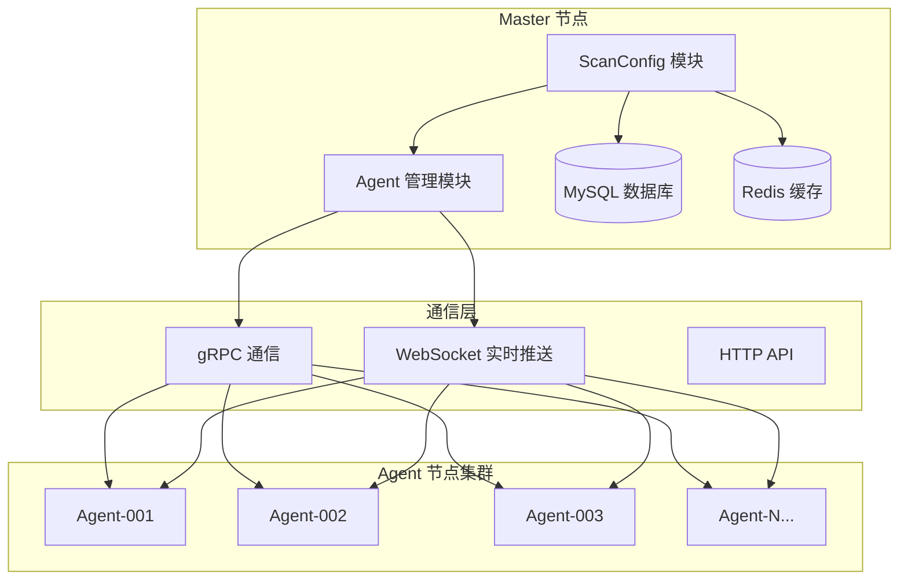
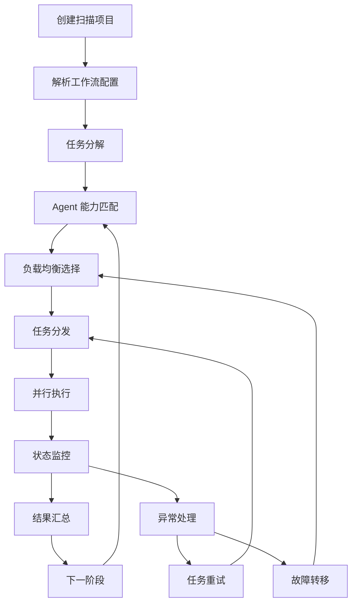
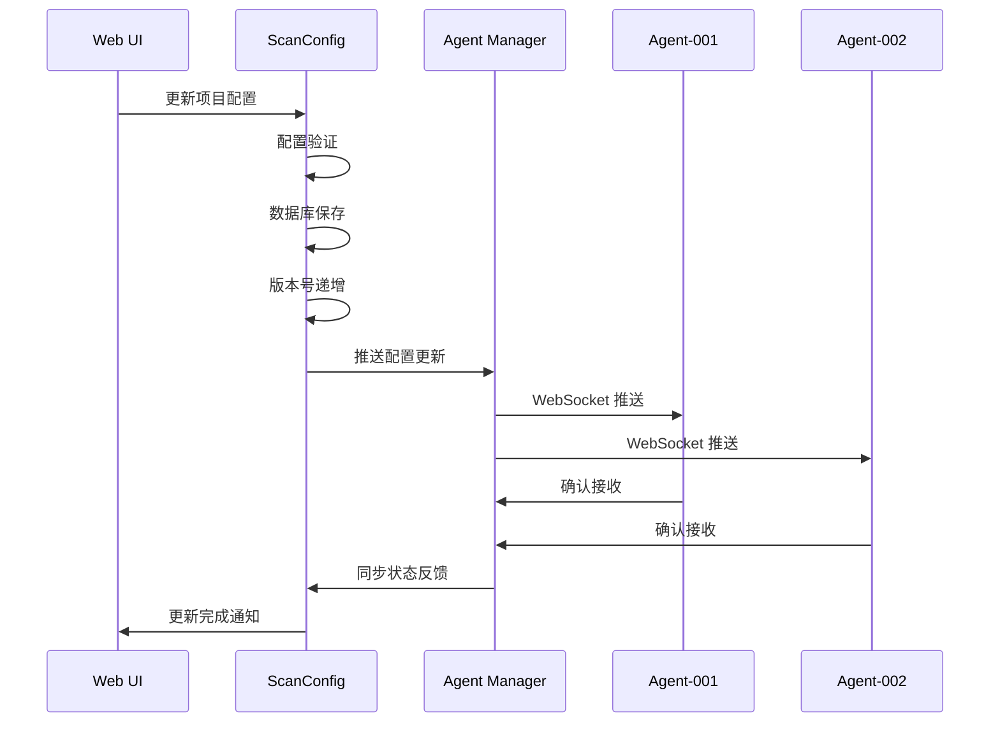

# ScanConfig 模块分布式系统设计文档

## 概述

`scan_config` 模块是 NeoScan 分布式扫描系统的**配置管理中心**，负责统一管理所有扫描相关的配置和策略，并通过与 Agent 管理模块的协作，实现真正的分布式扫描能力。

## 分布式系统架构

### 整体架构图



## 分布式特性实现

### 1. 配置统一管理 - 消除分布式复杂性

#### 核心设计理念
基于 Linus 的"好品味"原则，用统一的配置模型消除分布式系统中的特殊情况：

```go
// 统一的项目配置 - 可分发给任意 Agent
type ProjectConfig struct {
    ID              uint   `json:"id" gorm:"primaryKey"`
    Name            string `json:"name" gorm:"not null;size:100"`
    TargetScope     string `json:"target_scope" gorm:"type:text"`      // 扫描目标范围
    ScanFrequency   string `json:"scan_frequency" gorm:"size:100"`     // 扫描频率 (cron表达式)
    MaxConcurrent   int    `json:"max_concurrent" gorm:"default:10"`   // 最大并发数
    TimeoutSecond   int    `json:"timeout_second" gorm:"default:3600"` // 超时时间
    NotifyEmails    string `json:"notify_emails" gorm:"size:500"`      // 通知邮箱
    Status          string `json:"status" gorm:"default:active"`       // 配置状态
    Version         int    `json:"version" gorm:"default:1"`           // 配置版本
}
```

#### 分布式优势
- **配置一致性**：所有 Agent 节点使用相同的配置格式
- **版本控制**：支持配置的版本管理和回滚
- **动态更新**：配置变更实时推送到所有相关 Agent
- **故障恢复**：Agent 重启后自动同步最新配置

### 2. 分布式任务编排 - 工作流管理

#### 工作流配置设计

```go
type WorkflowConfig struct {
    ID          uint            `json:"id" gorm:"primaryKey"`
    ProjectID   uint            `json:"project_id" gorm:"index"`        // 关联项目配置
    Name        string          `json:"name" gorm:"not null;size:100"`
    Description string          `json:"description" gorm:"size:500"`
    Stages      []WorkflowStage `json:"stages" gorm:"type:json"`        // 工作流阶段
    Status      string          `json:"status" gorm:"default:active"`
    Version     int             `json:"version" gorm:"default:1"`
}

type WorkflowStage struct {
    Name         string            `json:"name"`                    // 阶段名称
    ScanType     string            `json:"scan_type"`              // 扫描类型
    Dependencies []string          `json:"dependencies"`           // 依赖的前置阶段
    AgentFilter  map[string]string `json:"agent_filter"`          // Agent 选择条件
    Parallel     bool              `json:"parallel"`               // 是否并行执行
    Timeout      int               `json:"timeout"`                // 阶段超时时间
    RetryCount   int               `json:"retry_count"`            // 重试次数
}
```

#### 分布式任务调度流程



### 3. 分布式能力发现 - 扫描工具管理

#### 工具配置模型

```go
type ScanTool struct {
    ID           uint                   `json:"id" gorm:"primaryKey"`
    Name         string                 `json:"name" gorm:"not null;size:100"`
    Version      string                 `json:"version" gorm:"size:50"`
    Category     string                 `json:"category" gorm:"size:50"`        // 工具分类
    Capabilities []string               `json:"capabilities" gorm:"type:json"` // 工具能力列表
    Config       map[string]interface{} `json:"config" gorm:"type:json"`       // 工具配置
    AgentTags    []string               `json:"agent_tags" gorm:"type:json"`   // 适用的 Agent 标签
    Requirements map[string]string      `json:"requirements" gorm:"type:json"` // 环境要求
    Status       string                 `json:"status" gorm:"default:active"`
}
```

#### 能力匹配算法

```go
// Agent 能力匹配服务
func (s *ScanToolService) MatchAgentsForTool(toolID uint) ([]*model.Agent, error) {
    // 1. 获取工具配置
    tool, err := s.GetScanTool(toolID)
    if err != nil {
        return nil, err
    }
    
    // 2. 查询在线 Agent
    agents, err := s.agentService.GetOnlineAgents()
    if err != nil {
        return nil, err
    }
    
    var matchedAgents []*model.Agent
    for _, agent := range agents {
        // 3. 能力匹配检查
        if s.checkCapabilityMatch(agent, tool) &&
           s.checkTagMatch(agent, tool) &&
           s.checkRequirements(agent, tool) {
            matchedAgents = append(matchedAgents, agent)
        }
    }
    
    return matchedAgents, nil
}
```

### 4. 分布式策略执行 - 规则引擎

#### 规则配置模型

```go
type ScanRule struct {
    ID          uint                   `json:"id" gorm:"primaryKey"`
    Name        string                 `json:"name" gorm:"not null;size:100"`
    Category    string                 `json:"category" gorm:"size:50"`           // 规则分类
    Condition   string                 `json:"condition" gorm:"type:text"`        // 规则条件表达式
    Action      string                 `json:"action" gorm:"size:100"`            // 执行动作
    Priority    int                    `json:"priority" gorm:"default:100"`       // 优先级
    Scope       string                 `json:"scope" gorm:"size:100"`             // 适用范围
    AgentFilter map[string]interface{} `json:"agent_filter" gorm:"type:json"`    // Agent 过滤条件
    Config      map[string]interface{} `json:"config" gorm:"type:json"`          // 规则配置
    Status      string                 `json:"status" gorm:"default:active"`
}
```

#### 分布式规则执行

```go
// 规则引擎分布式执行
func (s *ScanRuleService) ExecuteRulesOnAgents(projectID uint) error {
    // 1. 获取项目相关规则
    rules, err := s.GetRulesByProject(projectID)
    if err != nil {
        return err
    }
    
    // 2. 获取目标 Agent 列表
    agents, err := s.getTargetAgents(projectID)
    if err != nil {
        return err
    }
    
    // 3. 并行执行规则
    var wg sync.WaitGroup
    for _, agent := range agents {
        wg.Add(1)
        go func(agent *model.Agent) {
            defer wg.Done()
            s.executeRulesOnAgent(agent, rules)
        }(agent)
    }
    
    wg.Wait()
    return nil
}
```

## 分布式通信机制

### 1. 配置推送机制

#### 实时配置同步



#### 配置推送服务实现

```go
type ConfigPushService struct {
    agentManager *AgentManager
    wsManager    *WebSocketManager
    grpcClient   *GRPCClient
}

// 推送配置到指定 Agent
func (s *ConfigPushService) PushConfigToAgent(agentID string, config interface{}) error {
    // 1. 优先使用 WebSocket 推送
    if err := s.wsManager.SendToAgent(agentID, config); err == nil {
        return nil
    }
    
    // 2. WebSocket 失败时使用 gRPC 备用
    return s.grpcClient.PushConfig(agentID, config)
}

// 批量推送配置
func (s *ConfigPushService) BroadcastConfig(config interface{}, filter AgentFilter) error {
    agents := s.agentManager.GetAgentsByFilter(filter)
    
    var wg sync.WaitGroup
    for _, agent := range agents {
        wg.Add(1)
        go func(agentID string) {
            defer wg.Done()
            s.PushConfigToAgent(agentID, config)
        }(agent.AgentID)
    }
    
    wg.Wait()
    return nil
}
```

### 2. 任务分发机制

#### 智能负载均衡

```go
type TaskScheduler struct {
    agentManager   *AgentManager
    metricsService *MetricsService
    loadBalancer   *LoadBalancer
}

// 智能任务调度
func (s *TaskScheduler) ScheduleTask(task *ScanTask) (*model.Agent, error) {
    // 1. 获取在线 Agent 列表
    agents, err := s.agentManager.GetOnlineAgents()
    if err != nil {
        return nil, err
    }
    
    // 2. 过滤符合条件的 Agent
    candidates := s.filterAgentsByCapability(agents, task.RequiredCapabilities)
    if len(candidates) == 0 {
        return nil, errors.New("no suitable agent found")
    }
    
    // 3. 负载评估和选择
    bestAgent := s.loadBalancer.SelectBestAgent(candidates)
    
    // 4. 任务分发
    if err := s.assignTaskToAgent(bestAgent, task); err != nil {
        return nil, err
    }
    
    return bestAgent, nil
}

// 负载评估算法
func (lb *LoadBalancer) SelectBestAgent(agents []*model.Agent) *model.Agent {
    var bestAgent *model.Agent
    var minLoad float64 = math.MaxFloat64
    
    for _, agent := range agents {
        // 获取 Agent 实时负载
        metrics := lb.metricsService.GetAgentMetrics(agent.AgentID)
        
        // 计算综合负载分数
        load := lb.calculateLoadScore(metrics)
        
        if load < minLoad {
            minLoad = load
            bestAgent = agent
        }
    }
    
    return bestAgent
}

// 负载分数计算
func (lb *LoadBalancer) calculateLoadScore(metrics *model.AgentMetrics) float64 {
    // 综合考虑 CPU、内存、任务数等因素
    cpuWeight := 0.4
    memoryWeight := 0.3
    taskWeight := 0.3
    
    return metrics.CPUUsage*cpuWeight + 
           metrics.MemoryUsage*memoryWeight + 
           float64(metrics.RunningTasks)*taskWeight
}
```

### 3. 状态监控与同步

#### 实时状态监控

```go
type DistributedMonitor struct {
    agentManager   *AgentManager
    metricsCollector *MetricsCollector
    alertManager   *AlertManager
}

// 启动分布式监控
func (dm *DistributedMonitor) StartMonitoring() {
    // 1. 定期收集 Agent 状态
    go dm.collectAgentMetrics()
    
    // 2. 监控任务执行状态
    go dm.monitorTaskExecution()
    
    // 3. 检测 Agent 健康状态
    go dm.healthCheck()
    
    // 4. 处理异常和告警
    go dm.handleAlerts()
}

// Agent 指标收集
func (dm *DistributedMonitor) collectAgentMetrics() {
    ticker := time.NewTicker(30 * time.Second)
    defer ticker.Stop()
    
    for range ticker.C {
        agents := dm.agentManager.GetAllAgents()
        
        var wg sync.WaitGroup
        for _, agent := range agents {
            wg.Add(1)
            go func(agent *model.Agent) {
                defer wg.Done()
                
                // 通过 gRPC 获取 Agent 指标
                metrics, err := dm.metricsCollector.CollectFromAgent(agent.AgentID)
                if err != nil {
                    dm.handleAgentError(agent, err)
                    return
                }
                
                // 更新指标数据
                dm.updateAgentMetrics(agent.AgentID, metrics)
            }(agent)
        }
        
        wg.Wait()
    }
}
```

## 故障容错机制

### 1. Agent 故障检测与恢复

```go
type FaultTolerance struct {
    agentManager *AgentManager
    taskManager  *TaskManager
    scheduler    *TaskScheduler
}

// Agent 故障处理
func (ft *FaultTolerance) HandleAgentFailure(agentID string) error {
    // 1. 标记 Agent 为离线状态
    if err := ft.agentManager.SetAgentOffline(agentID); err != nil {
        return err
    }
    
    // 2. 获取该 Agent 上的运行中任务
    runningTasks, err := ft.taskManager.GetRunningTasksByAgent(agentID)
    if err != nil {
        return err
    }
    
    // 3. 任务重新调度
    for _, task := range runningTasks {
        // 重置任务状态
        task.Status = "pending"
        task.AgentID = ""
        
        // 重新调度到其他 Agent
        newAgent, err := ft.scheduler.ScheduleTask(task)
        if err != nil {
            // 任务调度失败，标记为失败
            task.Status = "failed"
            task.ErrorMessage = "no available agent for rescheduling"
        } else {
            task.AgentID = newAgent.AgentID
            task.Status = "assigned"
        }
        
        ft.taskManager.UpdateTask(task)
    }
    
    return nil
}
```

### 2. 配置同步故障恢复

```go
// 配置同步恢复机制
func (s *ConfigSyncService) RecoverConfigSync(agentID string) error {
    // 1. 获取 Agent 当前配置版本
    agentVersion, err := s.getAgentConfigVersion(agentID)
    if err != nil {
        return err
    }
    
    // 2. 获取最新配置版本
    latestVersion, err := s.getLatestConfigVersion()
    if err != nil {
        return err
    }
    
    // 3. 如果版本不一致，推送最新配置
    if agentVersion < latestVersion {
        configs, err := s.getConfigsSinceVersion(agentVersion)
        if err != nil {
            return err
        }
        
        // 按版本顺序推送配置
        for _, config := range configs {
            if err := s.pushConfigToAgent(agentID, config); err != nil {
                return err
            }
        }
    }
    
    return nil
}
```

## 性能优化策略

### 1. 配置缓存机制

```go
type ConfigCache struct {
    redis    *redis.Client
    local    *sync.Map
    ttl      time.Duration
}

// 多级缓存配置获取
func (cc *ConfigCache) GetProjectConfig(projectID uint) (*ProjectConfig, error) {
    cacheKey := fmt.Sprintf("project_config:%d", projectID)
    
    // 1. 本地缓存查找
    if value, ok := cc.local.Load(cacheKey); ok {
        return value.(*ProjectConfig), nil
    }
    
    // 2. Redis 缓存查找
    data, err := cc.redis.Get(context.Background(), cacheKey).Result()
    if err == nil {
        var config ProjectConfig
        if err := json.Unmarshal([]byte(data), &config); err == nil {
            cc.local.Store(cacheKey, &config)
            return &config, nil
        }
    }
    
    // 3. 数据库查询
    config, err := cc.loadFromDatabase(projectID)
    if err != nil {
        return nil, err
    }
    
    // 4. 更新缓存
    cc.updateCache(cacheKey, config)
    
    return config, nil
}
```

### 2. 批量操作优化

```go
// 批量任务分发
func (s *TaskScheduler) BatchScheduleTasks(tasks []*ScanTask) error {
    // 1. 按 Agent 能力分组任务
    taskGroups := s.groupTasksByCapability(tasks)
    
    // 2. 并行处理每个分组
    var wg sync.WaitGroup
    for capability, taskGroup := range taskGroups {
        wg.Add(1)
        go func(cap string, tasks []*ScanTask) {
            defer wg.Done()
            
            // 获取支持该能力的 Agent
            agents := s.getAgentsByCapability(cap)
            
            // 负载均衡分发任务
            s.distributeTasksToAgents(tasks, agents)
        }(capability, taskGroup)
    }
    
    wg.Wait()
    return nil
}
```

## 监控与可观测性

### 1. 分布式链路追踪

```go
type DistributedTracing struct {
    tracer opentracing.Tracer
}

// 任务执行链路追踪
func (dt *DistributedTracing) TraceTaskExecution(ctx context.Context, task *ScanTask) {
    span, ctx := opentracing.StartSpanFromContext(ctx, "task_execution")
    defer span.Finish()
    
    span.SetTag("task_id", task.ID)
    span.SetTag("task_type", task.Type)
    span.SetTag("agent_id", task.AgentID)
    
    // 记录任务分发
    childSpan := opentracing.StartSpan("task_dispatch", opentracing.ChildOf(span.Context()))
    // ... 任务分发逻辑
    childSpan.Finish()
    
    // 记录任务执行
    execSpan := opentracing.StartSpan("task_execute", opentracing.ChildOf(span.Context()))
    // ... 任务执行逻辑
    execSpan.Finish()
}
```

### 2. 指标收集与告警

```go
type MetricsCollector struct {
    prometheus *prometheus.Registry
}

// 分布式系统指标
var (
    agentCount = prometheus.NewGaugeVec(
        prometheus.GaugeOpts{
            Name: "neoscan_agents_total",
            Help: "Total number of agents by status",
        },
        []string{"status"},
    )
    
    taskDuration = prometheus.NewHistogramVec(
        prometheus.HistogramOpts{
            Name: "neoscan_task_duration_seconds",
            Help: "Task execution duration",
        },
        []string{"task_type", "agent_id"},
    )
    
    configSyncErrors = prometheus.NewCounterVec(
        prometheus.CounterOpts{
            Name: "neoscan_config_sync_errors_total",
            Help: "Total number of config sync errors",
        },
        []string{"agent_id", "error_type"},
    )
)
```

## 总结

`scan_config` 模块通过以下方式体现了分布式系统的核心特点：

### 1. **统一配置管理**
- 消除了分布式节点配置不一致的问题
- 支持配置的版本控制和实时同步
- 提供配置回滚和故障恢复机制

### 2. **智能任务调度**
- 基于 Agent 能力和负载的智能任务分配
- 支持复杂的分布式工作流编排
- 实现任务的故障转移和重试机制

### 3. **分布式通信**
- 多通道通信保证消息必达
- 实时状态同步和监控
- 支持大规模 Agent 节点管理

### 4. **高可用性设计**
- Agent 故障自动检测和恢复
- 任务重新调度和负载重平衡
- 多级缓存提升系统性能

这种设计完全符合 Linus 的"好品味"原则：**用简单统一的数据结构和接口，解决复杂的分布式系统问题**，让整个系统既强大又易于维护。