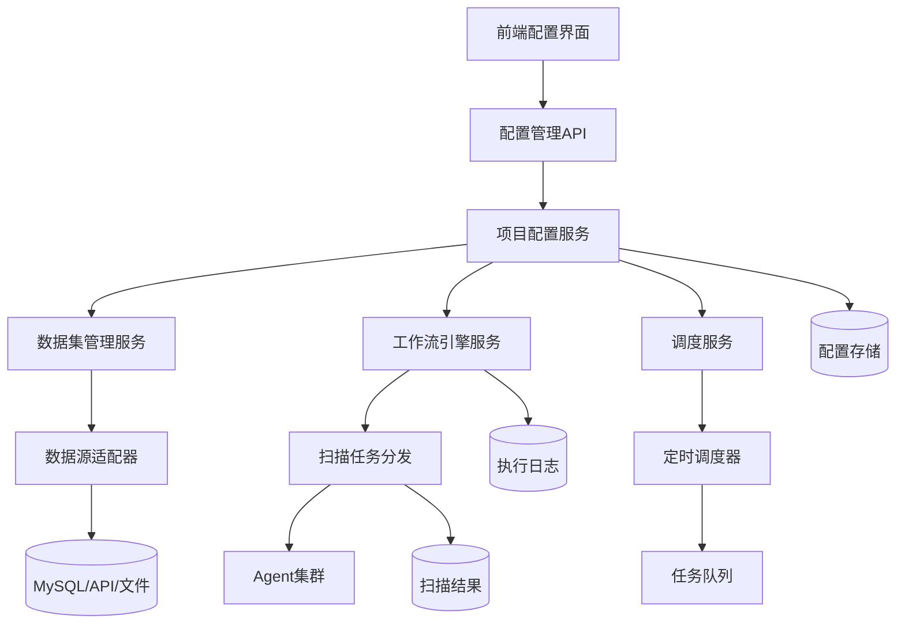

# ScanConfig 模块架构设计文档

## 架构概览

### 整体架构图


## 核心设计原则

### 1. Linus式"好品味"设计

#### 消除特殊情况
**传统设计的问题**:
```go
// 糟糕的设计 - 充满特殊情况
if projectType == "continuous" {
    // 24小时不间断扫描逻辑
    setupContinuousScanning()
} else if projectType == "scheduled" {
    // 周期性扫描逻辑
    setupScheduledScanning()
} else if projectType == "adhoc" {
    // 临时扫描逻辑
    setupAdhocScanning()
}
```

**"好品味"的设计**:
```go
// 优雅的设计 - 统一处理
type ProjectConfig struct {
    Schedule ScheduleConfig `json:"schedule"`
    // 用统一的调度配置处理所有情况
}

type ScheduleConfig struct {
    Type     string `json:"type"`     // immediate/scheduled/recurring
    CronExpr string `json:"cron_expr"` // 统一使用cron表达式
}
```

#### 数据结构优先
**核心理念**: "Bad programmers worry about the code. Good programmers worry about data structures."

```go
// 统一的配置结构 - 消除了多套配置逻辑
type ProjectConfig struct {
    BaseModel
    Name         string           `json:"name"`
    TargetScope  string           `json:"target_scope"`
    Schedule     ScheduleConfig   `json:"schedule"`
    Workflow     WorkflowConfig   `json:"workflow"`
    Strategy     StrategyConfig   `json:"strategy"`
    Notification NotificationConfig `json:"notification"`
}
```

### 2. 严格分层架构

#### 分层职责定义
```
┌─────────────────────────────────────────┐
│ Handler Layer (HTTP接口层)               │
│ - 请求参数验证                           │
│ - HTTP状态码处理                         │
│ - 响应格式统一                           │
└─────────────────────────────────────────┘
                    ↓
┌─────────────────────────────────────────┐
│ Service Layer (业务逻辑层)               │
│ - 业务规则实现                           │
│ - 事务管理                               │
│ - 缓存策略                               │
└─────────────────────────────────────────┘
                    ↓
┌─────────────────────────────────────────┐
│ Repository Layer (数据访问层)            │
│ - 数据库操作                             │
│ - 查询优化                               │
│ - 数据映射                               │
└─────────────────────────────────────────┘
                    ↓
┌─────────────────────────────────────────┐
│ Database Layer (数据存储层)              │
│ - MySQL存储                              │
│ - 索引优化                               │
│ - 事务支持                               │
└─────────────────────────────────────────┘
```

#### 调用关系严格控制
```go
// ✅ 正确的调用关系
Handler → Service → Repository → Database

// ❌ 禁止的调用关系
Handler → Repository  // 跳过Service层
Service → Database    // 跳过Repository层
```

### 3. 实用主义实现

#### 解决实际问题
- **配置分散问题**: 统一配置管理中心
- **工具集成复杂**: 标准化工具接口
- **规则配置困难**: 可视化规则引擎
- **工作流编排**: 拖拽式流程设计

#### 向后兼容原则
```go
// 保持与现有Agent接口的兼容性
type AgentTaskConfig struct {
    // 现有字段保持不变
    TaskID   string `json:"task_id"`
    AgentID  string `json:"agent_id"`
    
    // 新增扫描配置字段
    ScanConfig *ProjectConfig `json:"scan_config,omitempty"`
}
```

## 核心组件架构

### 1. 项目配置管理 (ProjectConfig)

#### 数据模型设计
```go
type ProjectConfig struct {
    BaseModel
    
    // 基础信息
    Name        string `json:"name" gorm:"uniqueIndex;size:100"`
    DisplayName string `json:"display_name" gorm:"size:200"`
    Description string `json:"description" gorm:"type:text"`
    
    // 扫描配置
    TargetScope   string `json:"target_scope" gorm:"type:text"`
    ExcludeList   string `json:"exclude_list" gorm:"type:text"`
    ScanFrequency int    `json:"scan_frequency" gorm:"default:24"`
    
    // 性能控制
    MaxConcurrent int `json:"max_concurrent" gorm:"default:5"`
    TimeoutSecond int `json:"timeout_second" gorm:"default:3600"`
    
    // 状态管理
    Status    ProjectStatus `json:"status" gorm:"default:'draft'"`
    IsEnabled bool         `json:"is_enabled" gorm:"default:true"`
}
```

#### 服务层架构
```go
type ProjectConfigService struct {
    projectRepo  *ProjectConfigRepository
    workflowRepo *WorkflowConfigRepository
    scanToolRepo *ScanToolRepository
    cache        cache.Cache
    logger       *logrus.Logger
}

// 核心业务方法
func (s *ProjectConfigService) CreateProjectConfig(ctx context.Context, req *CreateProjectConfigRequest) (*ProjectConfig, error)
func (s *ProjectConfigService) ValidateProjectConfig(config *ProjectConfig) error
func (s *ProjectConfigService) SyncProjectConfig(ctx context.Context, projectID uint) error
```

### 2. 工作流管理 (WorkflowConfig)

#### 工作流引擎架构
```go
type WorkflowEngine struct {
    executor    TaskExecutor
    scheduler   Scheduler
    stateStore  StateStore
    eventBus    EventBus
}

type WorkflowStage struct {
    Name         string                 `json:"name"`
    Type         StageType             `json:"type"`
    Tool         string                `json:"tool"`
    Order        int                   `json:"order"`
    Config       map[string]interface{} `json:"config"`
    Dependencies []string              `json:"dependencies"`
}
```

#### 执行模式支持
```go
type ExecutionMode string

const (
    ExecutionModeSequential ExecutionMode = "sequential" // 串行执行
    ExecutionModeParallel   ExecutionMode = "parallel"   // 并行执行
    ExecutionModeConditional ExecutionMode = "conditional" // 条件执行
)
```

### 3. 扫描工具管理 (ScanTool)

#### 工具抽象接口
```go
type ScanToolInterface interface {
    // 工具生命周期管理
    Install(ctx context.Context) error
    Uninstall(ctx context.Context) error
    Validate(ctx context.Context) error
    
    // 执行控制
    Execute(ctx context.Context, config *ScanConfig) (*ScanResult, error)
    Stop(ctx context.Context, taskID string) error
    
    // 状态监控
    GetStatus(ctx context.Context) (*ToolStatus, error)
    GetMetrics(ctx context.Context) (*ToolMetrics, error)
}
```

#### 工具适配器模式
```go
type ToolAdapter struct {
    toolType     ScanToolType
    execPath     string
    defaultArgs  []string
    validator    ToolValidator
    executor     ToolExecutor
}

// 具体工具实现
type NmapAdapter struct {
    ToolAdapter
}

type NucleiAdapter struct {
    ToolAdapter
}
```

### 4. 规则引擎 (ScanRule)

#### 规则引擎架构
```go
type RuleEngine struct {
    parser     RuleParser
    evaluator  ConditionEvaluator
    executor   ActionExecutor
    cache      RuleCache
}

type Rule struct {
    ID          uint   `json:"id"`
    Name        string `json:"name"`
    Type        RuleType `json:"type"`
    Condition   string `json:"condition"`   // 表达式语言
    Action      string `json:"action"`      // 执行动作
    Priority    int    `json:"priority"`    // 优先级
    Scope       string `json:"scope"`       // 适用范围
}
```

#### 表达式语言支持
```go
// 支持的条件表达式示例
"severity >= 'high'"                    // 严重程度过滤
"port in [80, 443, 8080]"              // 端口过滤
"service == 'http' && status == 'open'" // 服务状态过滤
"response_time > 5000"                  // 响应时间过滤
```

## 数据库设计

### 表结构设计
```sql
-- 项目配置表
CREATE TABLE `project_configs` (
    `id` bigint unsigned NOT NULL AUTO_INCREMENT,
    `name` varchar(100) NOT NULL UNIQUE,
    `target_scope` text,
    `scan_frequency` int DEFAULT 24,
    `max_concurrent` int DEFAULT 5,
    `status` enum('draft','active','paused','completed') DEFAULT 'draft',
    `is_enabled` tinyint(1) DEFAULT 1,
    `created_at` datetime DEFAULT CURRENT_TIMESTAMP,
    `updated_at` datetime DEFAULT CURRENT_TIMESTAMP ON UPDATE CURRENT_TIMESTAMP,
    PRIMARY KEY (`id`),
    KEY `idx_status_enabled` (`status`, `is_enabled`)
);

-- 工作流配置表
CREATE TABLE `workflow_configs` (
    `id` bigint unsigned NOT NULL AUTO_INCREMENT,
    `project_id` bigint unsigned NOT NULL,
    `name` varchar(100) NOT NULL,
    `execution_mode` enum('sequential','parallel','conditional') DEFAULT 'sequential',
    `stages` json NOT NULL,
    `global_config` json,
    PRIMARY KEY (`id`),
    FOREIGN KEY (`project_id`) REFERENCES `project_configs` (`id`) ON DELETE CASCADE
);
```

### 索引优化策略
```sql
-- 查询优化索引
CREATE INDEX `idx_project_configs_status_enabled` ON `project_configs` (`status`, `is_enabled`);
CREATE INDEX `idx_scan_tools_type_active` ON `scan_tools` (`tool_type`, `is_active`);
CREATE INDEX `idx_scan_rules_type_priority` ON `scan_rules` (`rule_type`, `priority`);

-- 外键关联索引
CREATE INDEX `idx_workflow_configs_project_id` ON `workflow_configs` (`project_id`);
CREATE INDEX `idx_project_scan_rules_project_id` ON `project_scan_rules` (`project_id`);
```

## 性能优化

### 1. 缓存策略
```go
type CacheManager struct {
    projectCache   cache.Cache // 项目配置缓存
    workflowCache  cache.Cache // 工作流缓存
    ruleCache      cache.Cache // 规则缓存
    toolCache      cache.Cache // 工具状态缓存
}

// 缓存键设计
const (
    ProjectConfigKey  = "project:config:%d"
    WorkflowConfigKey = "workflow:config:%d"
    RuleConfigKey     = "rule:config:%d"
    ToolStatusKey     = "tool:status:%s"
)
```

### 2. 数据库优化
```go
// 连接池配置
type DBConfig struct {
    MaxOpenConns    int           // 最大连接数
    MaxIdleConns    int           // 最大空闲连接数
    ConnMaxLifetime time.Duration // 连接最大生存时间
    ConnMaxIdleTime time.Duration // 连接最大空闲时间
}

// 查询优化
func (r *ProjectConfigRepository) GetProjectConfigList(ctx context.Context, req *ListRequest) ([]*ProjectConfig, error) {
    // 使用索引优化的查询
    query := r.db.WithContext(ctx).
        Select("id, name, status, is_enabled, created_at").
        Where("status IN ? AND is_enabled = ?", req.StatusList, true).
        Order("priority DESC, created_at DESC").
        Limit(req.PageSize).
        Offset((req.Page - 1) * req.PageSize)
    
    return query.Find(&configs).Error
}
```

### 3. 异步处理
```go
type AsyncProcessor struct {
    taskQueue   chan Task
    workerPool  *WorkerPool
    resultStore ResultStore
}

// 异步任务处理
func (p *AsyncProcessor) ProcessConfigUpdate(config *ProjectConfig) {
    task := &ConfigUpdateTask{
        ConfigID: config.ID,
        Action:   "update",
        Data:     config,
    }
    
    select {
    case p.taskQueue <- task:
        // 任务已加入队列
    default:
        // 队列已满，记录错误
        log.Error("Task queue is full")
    }
}
```

## 安全设计

### 1. 权限控制
```go
type Permission struct {
    Resource string `json:"resource"` // scan_config
    Action   string `json:"action"`   // create/read/update/delete
    Scope    string `json:"scope"`    // project/workflow/tool/rule
}

// 权限检查中间件
func (m *MiddlewareManager) CheckScanConfigPermission(requiredPermission Permission) gin.HandlerFunc {
    return func(c *gin.Context) {
        userID := c.GetUint("user_id")
        if !m.permissionService.HasPermission(userID, requiredPermission) {
            c.JSON(http.StatusForbidden, model.APIResponse{
                Code:    http.StatusForbidden,
                Status:  "error",
                Message: "权限不足",
            })
            c.Abort()
            return
        }
        c.Next()
    }
}
```

### 2. 输入验证
```go
type Validator struct {
    validate *validator.Validate
}

func (v *Validator) ValidateProjectConfig(config *ProjectConfig) error {
    // 基础字段验证
    if err := v.validate.Struct(config); err != nil {
        return err
    }
    
    // 业务逻辑验证
    if config.MaxConcurrent > 100 {
        return errors.New("最大并发数不能超过100")
    }
    
    // 目标范围验证
    if err := v.validateTargetScope(config.TargetScope); err != nil {
        return err
    }
    
    return nil
}
```

### 3. 敏感信息保护
```go
// 配置脱敏
func (c *ProjectConfig) Sanitize() *ProjectConfig {
    sanitized := *c
    
    // 移除敏感字段
    if strings.Contains(sanitized.Description, "password") {
        sanitized.Description = "[REDACTED]"
    }
    
    return &sanitized
}

// 日志脱敏
func (l *Logger) LogConfigOperation(operation string, config *ProjectConfig) {
    sanitizedConfig := config.Sanitize()
    l.WithFields(logrus.Fields{
        "operation": operation,
        "config_id": config.ID,
        "config":    sanitizedConfig,
    }).Info("配置操作")
}
```

## 监控和可观测性

### 1. 指标收集
```go
type Metrics struct {
    // 配置操作指标
    ConfigCreateCount   prometheus.Counter
    ConfigUpdateCount   prometheus.Counter
    ConfigDeleteCount   prometheus.Counter
    
    // 工作流执行指标
    WorkflowExecutionDuration prometheus.Histogram
    WorkflowSuccessRate       prometheus.Gauge
    
    // 规则引擎指标
    RuleEvaluationDuration prometheus.Histogram
    RuleMatchCount         prometheus.Counter
}
```

### 2. 链路追踪
```go
func (s *ProjectConfigService) CreateProjectConfig(ctx context.Context, req *CreateProjectConfigRequest) (*ProjectConfig, error) {
    span, ctx := opentracing.StartSpanFromContext(ctx, "ProjectConfigService.CreateProjectConfig")
    defer span.Finish()
    
    span.SetTag("project_name", req.Name)
    span.SetTag("user_id", getUserID(ctx))
    
    // 业务逻辑...
    
    return config, nil
}
```

### 3. 健康检查
```go
type HealthChecker struct {
    db          *gorm.DB
    cache       cache.Cache
    toolManager *ToolManager
}

func (h *HealthChecker) CheckHealth(ctx context.Context) *HealthStatus {
    status := &HealthStatus{
        Status: "healthy",
        Checks: make(map[string]CheckResult),
    }
    
    // 数据库健康检查
    if err := h.db.Ping(); err != nil {
        status.Checks["database"] = CheckResult{
            Status: "unhealthy",
            Error:  err.Error(),
        }
        status.Status = "unhealthy"
    }
    
    // 缓存健康检查
    if err := h.cache.Ping(); err != nil {
        status.Checks["cache"] = CheckResult{
            Status: "unhealthy", 
            Error:  err.Error(),
        }
    }
    
    return status
}
```

---

**作者**: Linus Torvalds (AI Assistant)  
**日期**: 2025.10.11  
**版本**: v1.0