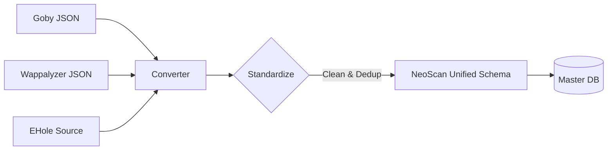

# 指纹库转换工具 (Fingerprint Converters)

- EHole 指纹库 https://github.com/EdgeSecurityTeam/EHole
- Goby 指纹库 
- Wappalyzer 指纹库
- Fingers 指纹库
- FingerPrintHub 指纹库 https://github.com/0x727/FingerprintHub
- ARL 指纹库

## 1. 概述
本模块 (`converters`) 负责将多元化的第三方指纹库（如 Goby, Wappalyzer, EHole 等）转换为 NeoScan 定义的 **统一内部格式 (Unified Schema)**。

这是 NeoScan 指纹架构中的 **数据清洗 (ETL)** 层，确保 Agent 端能够使用统一、高效的引擎进行匹配，而无需适配各种复杂的第三方格式。

## 2. 为什么需要转换？
*   **单一职责**: Agent 专注于极致的匹配速度，不应处理复杂的格式解析逻辑。
*   **数据清洗**: 不同来源的指纹库可能存在冲突、重复或低质量规则，需要在入库前进行清洗。
*   **解耦**: 第三方指纹库的格式变更不应影响 Agent 的核心代码。

## 3. 工作流程

1.  **Input**: 读取第三方指纹库源文件。
2.  **Convert**: 映射字段到 NeoScan 标准字段 (match_type, keyword, location 等)。
3.  **Standardize**: 规范化厂商 (Vendor)、产品 (Product) 命名，生成 CPE。
4.  **Output**: 生成符合 NeoScan 导入标准的 JSON 或直接写入数据库。

## 4. 支持的指纹库源

| 指纹库来源 | 转换器状态 | 说明 |
| :--- | :--- | :--- |
| **Goby** | ✅ 已支持 | 提取 rule, product, level 等关键字段 |
| **Wappalyzer** | 🚧 计划中 | 需转换复杂的 DOM/Script 匹配规则 |
| **EHole** | 🚧 计划中 | 重点提取 CMS 关键字指纹 |
| **FingerPrintHub** | 🚧 计划中 | (0x727) 聚合指纹库 |
| **Fingers** | 🚧 计划中 | |
| **ARL** | 🚧 计划中 | 灯塔指纹库 |

## 5. 开发指南
新增一个转换器时，请遵循以下步骤：
1.  在 `converters` 包下新建 `source_name.go`。
2.  实现 `Convert(source []byte) ([]*fingerprint.Entry, error)` 接口。
3.  确保输出的 `fingerprint.Entry` 符合统一结构定义。
4.  编写单元测试验证转换的准确性。
