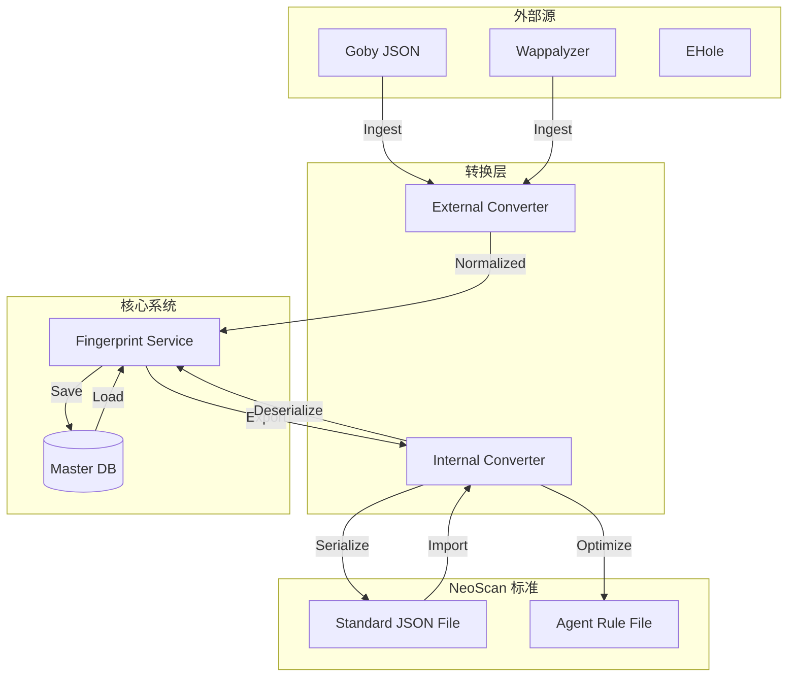

# 指纹规则转换器 (Fingerprint Converters)

- EHole 指纹库 https://github.com/EdgeSecurityTeam/EHole
- Goby 指纹库 
- Wappalyzer 指纹库
- Fingers 指纹库
- FingerPrintHub 指纹库 https://github.com/0x727/FingerprintHub
- ARL 指纹库

## 1. 概述
本模块 (`converters`) 充当指纹数据的 **"通用适配器"**。它不仅负责将外部多元指纹库引入系统，还负责系统内部规则的序列化与反序列化，以支持导入导出和 Agent 分发。

**核心职责**:
1.  **Ingest (摄入)**: 将第三方格式 (Goby, EHole 等) 清洗并转换为 NeoScan 内部格式。
2.  **Export (导出)**: 将数据库中的规则导出为标准 JSON 文件，供管理员备份或 Agent 下载使用。
3.  **Import (导入)**: 解析标准 JSON 文件，还原为系统规则，支持管理员手动录入。

## 2. 为什么需要转换？
*   **单一事实来源 (SSOT)**: 无论指纹来自 Goby 还是管理员手动录入，最终都必须转化为数据库中的统一结构 (`AssetFinger` / `AssetCPE`)。
*   **数据流动**: 
    *   **DB -> Agent**: Agent 需要紧凑、预编译的 JSON 规则文件，而不是直接连数据库。
    *   **Admin -> DB**: 管理员需要通过 JSON 文件批量上传私有规则。
*   **解耦**: 外部格式变更 (如 Goby 升级) 或内部存储变更 (如 DB 字段调整) 互不影响，由转换器层屏蔽差异。

## 3. 工作流程与数据流



## 4. 支持的格式与转换器

### 4.1 外部源转换 (Ingest)
负责将第三方生态的指纹库引入 NeoScan。

| 指纹库来源 | 转换器 | 状态 | 说明 |
| :--- | :--- | :--- | :--- |
| **Goby** | `goby.go` | ✅ 已支持 | 提取 rule, product, level 等关键字段 |
| **Wappalyzer** | `wappalyzer.go` | 🚧 计划中 | 需转换复杂的 DOM/Script 匹配规则 |
| **EHole** | `ehole.go` | 🚧 计划中 | 重点提取 CMS 关键字指纹 |

### 4.2 内部标准转换 (Import/Export)
负责系统数据的输入输出。

| 格式 | 转换器 | 用途 | 说明 |
| :--- | :--- | :--- | :--- |
| **Standard JSON** | `internal_json.go` | ✅ 核心 | **管理员导入/导出**。包含完整元数据，与 DB 结构 1:1 映射。 |
| **Agent Rule** | `agent_rule.go` | 🚧 计划中 | **Agent 分发**。可能是 Standard JSON 的精简版或预编译格式，追求解析速度。 |

## 5. 开发指南

### 5.1 转换器接口定义
所有转换器应遵循统一的接口模式（根据具体需求可能略有差异，但理念一致）：

```go
type RuleConverter interface {
    // Decode 将字节流解析为标准规则对象列表
    Decode(data []byte) ([]*asset.AssetFinger, []*asset.AssetCPE, error)
    
    // Encode 将规则对象列表序列化为字节流
    Encode(fingers []*asset.AssetFinger, cpes []*asset.AssetCPE) ([]byte, error)
}
```

### 5.2 新增步骤
1.  在 `converters` 包下新建文件 (如 `internal_json.go`)。
2.  定义该格式对应的数据结构 (DTO)。
3.  实现 `Decode` 和 `Encode` 逻辑。
4.  编写单元测试，确保数据无损转换。


### 各种种类规则的导入导出
- internal/service/fingerprint/rule_manager.go -> 实现指纹的导入导出
- internal/service/poc/rule_manager.go -> 实现 PoC 的 YAML 解析和沙箱校验
- internal/service/webshell/rule_manager.go -> 实现 YARA 规则编译和测试
- 等等