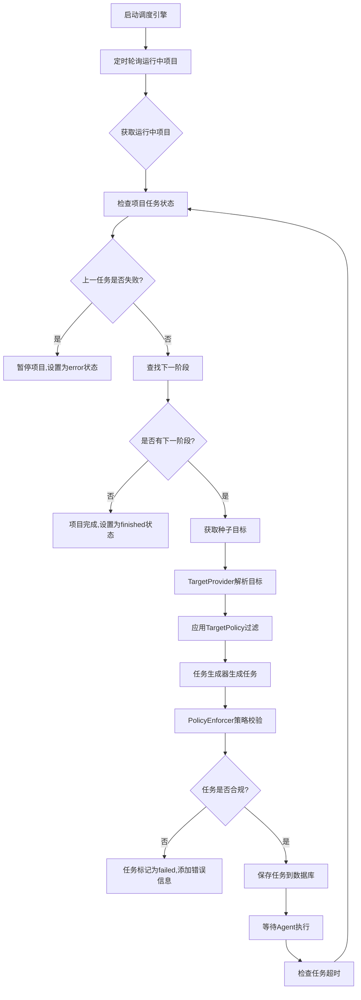
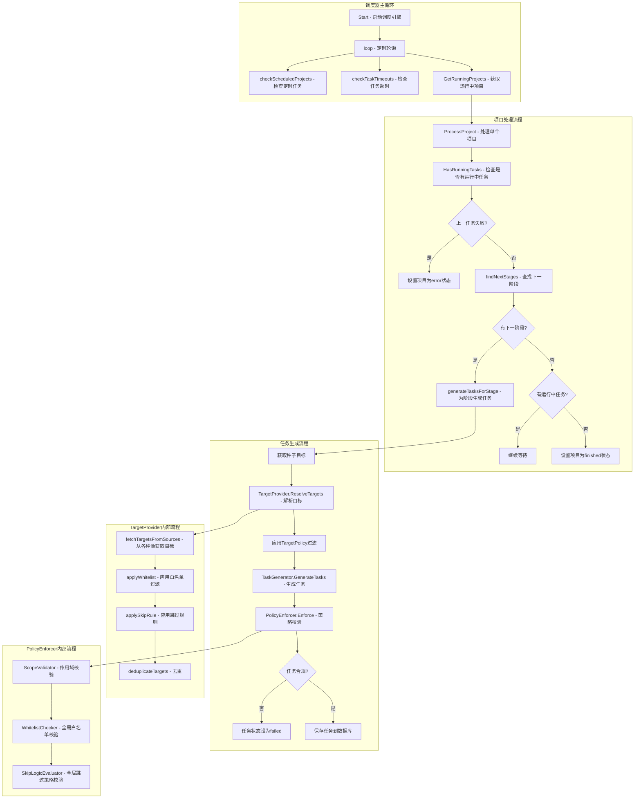
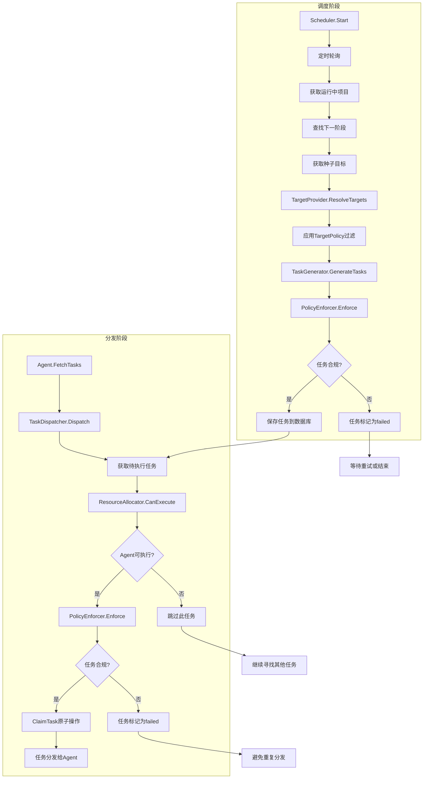
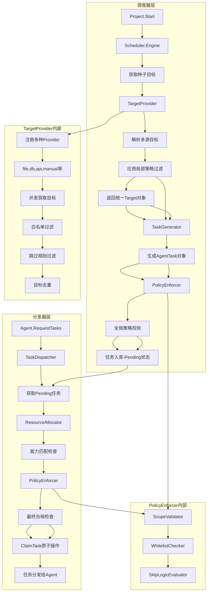

Orchestrator : 项目、工作流、阶段、工具模板、结果存储、统计
scheduler目录下的模块是NeoScan扫描编排系统的核心调度引擎，包含以下模块：

## 模块作用

Scheduler 目录
- engine.go：调度引擎主服务，负责定时任务管理、项目状态跟踪、阶段流转控制
- generator.go：任务生成器，将扫描阶段配置和目标列表转换为具体的Agent任务
TaskDispatcher 目录
- dispatcher.go：任务分发器，负责将待执行任务分发给合适的Agent
- agent_task.go：Agent任务服务，处理Agent的任务获取、状态更新等操作

### 1. engine.go - 调度引擎主服务
- **职责**：负责定时触发和项目级流程控制
- **核心功能**：
    - 定时任务管理：检查并触发配置了Cron表达式的定时扫描项目
    - 项目状态跟踪：监控运行中项目的进度和状态
    - 阶段流转控制：确保项目按预定义的工作流顺序执行各个阶段
    - 任务生成：根据阶段配置和目标生成具体可执行的任务
    - 策略执行：在任务执行前进行安全和合规性检查

### 2. generator.go - 任务生成器
- **职责**：将扫描阶段配置和目标列表转换为具体的Agent任务
- **核心功能**：
    - 根据扫描阶段配置生成任务
    - 将目标列表按分块大小分割成多个批次
    - 构造任务参数和策略快照
    - 生成可下发给Agent的任务对象

### 3. README.md - 模块说明
- 简要说明调度器的核心组件和职责

## 与TargetProvider和PolicyEnforcer的配合

### TargetProvider配合
- 在 engine.go 的 generateTasksForStage方法中：
    - 获取项目种子目标（从Project.TargetScope）
    - 使用TargetProvider的 ResolveTargets 方法解析最终目标
    - 应用 ScanStage.TargetPolicy 进行目标转换和过滤
    - 将解析后的目标传递给任务生成器

### PolicyEnforcer配合
- 在 engine.go 的 generateTasksForStage 方法中：
    - 在任务保存到数据库前，调用PolicyEnforcer的 Enforce 方法
    - 对生成的任务进行最终安全校验
    - 如果校验不通过，任务状态设置为"failed"并添加错误信息

## 工作流程

## 详细流程图

## 关键配合点

1. **目标解析**：调度器通过TargetProvider将多种来源的目标统一为标准格式
2. **策略过滤**：TargetProvider应用局部策略（阶段级）进行初步过滤
3. **最终校验**：PolicyEnforcer对生成的任务进行全局策略校验
4. **任务生成**：任务生成器将过滤后的目标转换为可执行的Agent任务
5. **流程控制**：调度器控制整个工作流的执行顺序和状态流转

## 补充-工作流程

## 补充-协作详细流程

## 配合点
- 目标生成：调度器使用TargetProvider从多种来源获取并标准化目标
- 策略过滤：调度器应用局部策略过滤目标，生成任务后进行全局策略校验
- 任务分发：分发器在分发前再次进行策略校验，确保任务合规
- 资源匹配：分发器结合资源分配器，确保任务分发给合适的Agent
- 状态管理：两层策略校验确保只有合规任务才能执行
- 这种设计实现了分层控制：调度器负责任务生成和初步校验，分发器负责运行时分发和最终校验，确保了系统的安全性和可靠性
