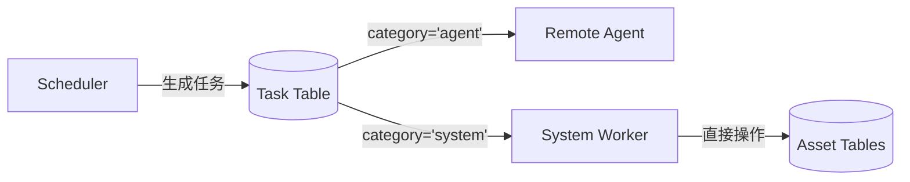
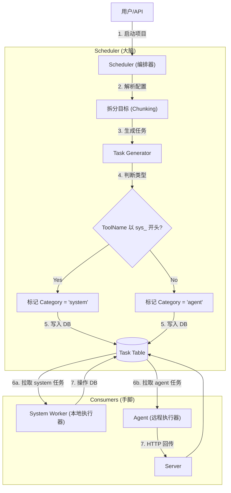

# System Task Worker (System Worker)

## 1. 概述 (Overview)

`SystemTaskWorker` 是 NeoScan 编排器 (Orchestrator) 中的核心组件之一，充当 **本地消费者 (Local Consumer)** 的角色。

它的核心职责是执行那些 **不适合分发给 Agent** 的系统级任务。这些任务通常具有以下特征：
*   **数据密集型 (Data-Intensive)**: 需要大量读取和写入数据库 (如全量资产打标)。
*   **无需网络探测**: 不涉及向外部目标发包。
*   **高权限**: 需要直接操作核心数据库表。

## 2. 架构角色 (Architecture)

在 NeoScan 的 "生产者-消费者" 调度模型中：

*   **Scheduler (生产者)**: 生成任务，并根据 `ToolName` 将任务标记为 `agent` 或 `system` 类。
*   **Remote Agent (消费者 A)**: 消费 `agent` 类任务 (如 Nmap 扫描)。
*   **System Worker (消费者 B)**: 消费 `system` 类任务 (如标签传播)。

## 3. 支持的任务类型 (Supported Tasks)

目前支持以下系统任务 (ToolName 以 `sys_` 开头)：

### 3.1 标签传播 (sys_tag_propagation)
*   **作用**: 基于复杂规则 (Matcher Rule) 批量给资产打标签。
*   **场景**: "给所有 192.168.1.0/24 网段的主机打上 `internal` 标签"。
*   **逻辑**:
    1.  解析 Payload (`TagPropagationPayload`)。
    2.  分批读取资产 (Host/Web/Network)。
    3.  在内存中运行规则匹配 (`matcher.Match`)。
    4.  更新匹配资产的 `tags` 字段。

### 3.2 资产清洗 (sys_asset_cleanup)
*   **作用**: 基于规则批量删除垃圾资产或过期资产。
*   **场景**: "删除所有标记为 `deprecated` 且 30 天未更新的资产"。
*   **逻辑**:
    1.  解析 Payload (`AssetCleanupPayload`)。
    2.  分批读取资产。
    3.  运行规则匹配。
    4.  执行硬删除 (`DELETE`)。

## 4. 工作流程 (Workflow)

System Worker 作为一个后台 Goroutine 运行，遵循标准的 **Fetch-Execute-Update** 循环：

1.  **轮询 (Poll)**: 每隔一定时间 (默认 5s) 检查数据库。
2.  **获取任务 (Fetch)**: 调用 `taskRepo.GetPendingTasks` 获取 `category='system'` 且状态为 `pending` 的任务。
3.  **锁定状态 (Lock)**: 将任务状态更新为 `running`。
4.  **分发执行 (Dispatch)**: 根据 `ToolName` 调用相应的处理函数 (如 `handleTagPropagation`)。
    *   *优化*: 使用 `FindInBatches` 进行批处理 (默认 100 条/批)，避免内存溢出。
5.  **结果回写 (Update)**:
    *   成功: 更新状态为 `completed`，写入 `OutputResult` (如 `{"processed_count": 500}`)。
    *   失败: 更新状态为 `failed`，写入 `ErrorMsg`。

## 5. 代码结构

*   **`worker.go`**: 包含所有核心逻辑。
    *   `NewSystemTaskWorker`: 初始化。
    *   `run()`: 主循环。
    *   `processTasks()`: 任务获取与分发。
    *   `handleTagPropagation()` / `handleAssetCleanup()`: 具体业务逻辑。
    *   `structToMap()` / `updateTags()`: 辅助工具函数。

## 6. 扩展指南

若需添加新的系统任务：
1.  在 `DESIGN` 文档中定义新的 `ToolName` (如 `sys_report_gen`)。
2.  定义 Payload 结构体。
3.  在 `worker.go` 的 `switch task.ToolName` 中添加 case。
4.  实现具体的处理函数 `handleReportGen`。

## 7. 流程图
