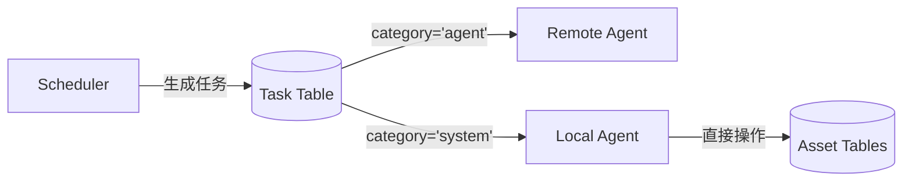
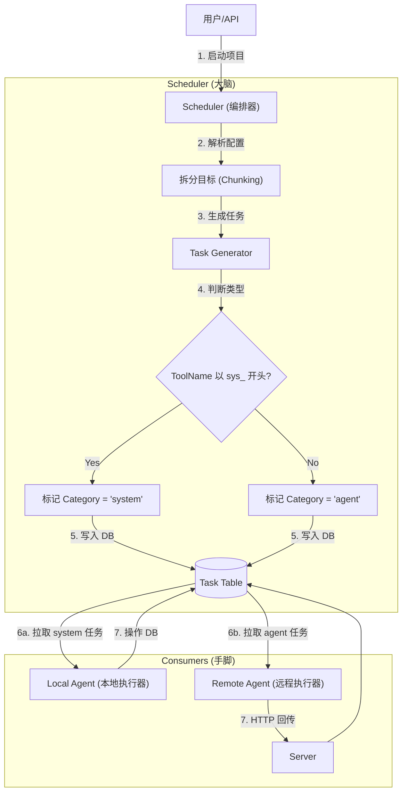

# Local Agent (原 System Worker)

## 1. 概述 (Overview)

`LocalAgent` 是 NeoScan 编排器 (Orchestrator) 中的核心组件之一，它是一个 **运行在 Master 进程内的特殊 Agent**。

与远程 Agent 不同，Local Agent 不通过网络拉取任务，而是直接连接数据库消费任务。它的存在是为了统一 "Agent" 的概念：**无论是谁在执行任务，它都是一个 Agent。**

LocalAgent (对应文档中的 System Executor ) 的定位是 "特种部队" ，负责执行 Master 内部产生的、需要直接操作数据库的 系统级任务 （如：标签传播、数据清洗、过期资产清理）。它是 主动拉取 (Pull) category='system' 的任务来执行的

它的核心职责是执行那些 **不适合分发给远程 Agent** 的任务，通常具有以下特征：
*   **数据密集型 (Data-Intensive)**: 需要大量读取和写入数据库 (如全量资产打标)。
*   **无需网络探测**: 不涉及向外部目标发包。
*   **高权限**: 需要直接操作核心数据库表。

## 2. 架构角色 (Architecture)

在 NeoScan 的 "生产者-消费者" 调度模型中：

*   **Scheduler (生产者)**: 生成任务，并根据 `ToolName` 将任务标记为 `agent` 或 `system` 类。
*   **Remote Agent (消费者 A)**: 消费 `agent` 类任务 (如 Nmap 扫描)，通过 HTTP/gRPC 通信。
*   **Local Agent (消费者 B)**: 消费 `system` 类任务 (如标签传播)，通过 In-Process 直接调用。

### 2.1 设计决策：为何直接操作数据库？ (Design Decision)

你可能会问：*为什么 LocalAgent 作为 Service 层组件，却绕过了 Repository 层直接操作数据库？这不是违反了分层架构原则吗？*

这是一个基于 **实用主义 (Pragmatism)** 和 **好品味 (Good Taste)** 的工程选择。我们有三个无法反驳的理由：

1.  **批量处理的性能 (Batch Processing Performance)**
    *   **问题**: LocalAgent 处理的是 `FindInBatches` 级别的海量数据操作。
    *   **原因**: 如果走标准的 Repo 层，需要在 Repo 中封装复杂的 Callback 逻辑，这会导致 Service 逻辑泄露到 Repo 层，或者在内存中加载大量数据导致 OOM。
    *   **结论**: 直接在 Service 层控制 Batch 游标是最高效、最安全的做法。

2.  **跨域操作的事务边界 (Cross-Domain Boundaries)**
    *   **问题**: LocalAgent 经常需要在一个任务中同时清洗 `Host`, `Web`, `Network` 等多张表。
    *   **原因**: 标准 Repo 模式是按领域划分的。如果通过 Repo，需要注入多个 Repo 并协调事务。LocalAgent 本质上是一个 **"运行在 Go 进程内的 SQL 脚本执行器"**，它需要的是上帝视角的数据操作能力，而不是被领域模型束缚。

3.  **避免 Repository 膨胀 (Avoiding Repository Bloat)**
    *   **问题**: 任务逻辑依赖高度动态的 `Matcher Rule`。
    *   **原因**: 将这种"基于动态规则删除数据"的一次性复杂逻辑下沉到 Repo 层，会污染 Repo 接口，使其变得臃肿且难以复用。
    *   **结论**: 让 Repo 层保持纯净（只做 CRUD），让脏活累活在 LocalAgent 内部闭环解决。

**总结**: LocalAgent 不是普通的 Service，它是系统的 **DBA**。

### 2.2 设计决策 II：为何选择事件触发而非定时轮询？ (Event-Driven vs Polling)

在标签系统的设计中，我们面临一个经典选择：**是让 LocalAgent 定期轮询所有规则进行匹配，还是在规则变更时触发任务？**

我们坚定地选择了 **事件触发 (Event-Driven)** 模式，理由如下：

1.  **实时性 (Real-time Experience)**
    *   **触发式**: 用户点击"保存规则"后，系统立即计算，标签毫秒级生效。这是现代软件应有的 "所见即所得" (WYSIWYG) 体验。
    *   **轮询式**: 用户保存后需要等待定时任务唤醒（例如 1 小时一次），这种延迟在交互上是灾难级的。

2.  **资源效率 (Resource Efficiency)**
    *   **触发式**: **按需计算**。只有当规则变更或新资产录入时才消耗 CPU。如果系统闲置，资源消耗为 0。
    *   **轮询式**: **盲目轮询**。无论数据是否变化，都要定期把所有资产和规则拉出来跑一遍匹配。在资产规模增长时（如 10万+ Host），这是对算力的极大浪费——你在用宝贵的资源验证"一切都没变"。

3.  **复杂度与扩展性 (Complexity & Scalability)**
    *   **触发式**: 将大任务拆解为无数个微小的原子操作（针对单个规则、单个资产），天然分散了负载。
    *   **轮询式**: 随着数据增长，一次全量扫描可能耗时极长，甚至超过定时间隔，导致任务堆积、重叠执行和锁竞争等复杂问题。

**结论**: 
*   **主路径**: 坚持事件触发，服务用户体验。
*   **兜底路径**: 仅在必要时（如担心数据不一致）引入极低频的"对账机制" (Reconciliation)，类似于文件系统的 `fsck`，用于修复异常而非执行业务。

## 3. 支持的任务类型 (Supported Tasks)

目前支持以下系统任务 (ToolName 以 `sys_` 开头)：

### 3.1 标签传播 (sys_tag_propagation)
*   **作用**: 基于复杂规则 (Matcher Rule) 批量给资产打标签。
*   **场景**: "给所有 192.168.1.0/24 网段的主机打上 `internal` 标签"。
*   **逻辑**:
    1.  解析 Payload (`TagPropagationPayload`)。
    2.  分批读取资产 (Host/Web/Network)。
    3.  在内存中运行规则匹配 (`matcher.Match`)。
    4.  更新匹配资产的 `tags` 字段。

### 3.2 资产清洗 (sys_asset_cleanup)
*   **作用**: 基于规则批量删除垃圾资产或过期资产。
*   **场景**: "删除所有标记为 `deprecated` 且 30 天未更新的资产"。
*   **逻辑**:
    1.  解析 Payload (`AssetCleanupPayload`)。
    2.  分批读取资产。
    3.  运行规则匹配。
    4.  执行硬删除 (`DELETE`)。

## 4. 工作流程 (Workflow)

Local Agent 作为一个后台 Goroutine 运行，遵循标准的 **Fetch-Execute-Update** 循环：

1.  **轮询 (Poll)**: 每隔一定时间 (默认 5s) 检查数据库。
2.  **获取任务 (Fetch)**: 调用 `taskRepo.GetPendingTasks` 获取 `category='system'` 且状态为 `pending` 的任务。
3.  **锁定状态 (Lock)**: 将任务状态更新为 `running`。
4.  **分发执行 (Dispatch)**: 根据 `ToolName` 调用相应的处理函数 (如 `handleTagPropagation`)。
    *   *优化*: 使用 `FindInBatches` 进行批处理 (默认 100 条/批)，避免内存溢出。
5.  **结果回写 (Update)**:
    *   成功: 更新状态为 `completed`，写入 `OutputResult` (如 `{"processed_count": 500}`)。
    *   失败: 更新状态为 `failed`，写入 `ErrorMsg`。

## 5. 代码结构

*   **`agent.go`**: 包含所有核心逻辑。
    *   `NewLocalAgent`: 初始化。
    *   `run()`: 主循环。
    *   `processTasks()`: 任务获取与分发。
    *   `handleTagPropagation()` / `handleAssetCleanup()`: 具体业务逻辑。
    *   `structToMap()` / `updateTags()`: 辅助工具函数。

## 6. 扩展指南

若需添加新的系统任务：
1.  在 `DESIGN` 文档中定义新的 `ToolName` (如 `sys_report_gen`)。
2.  定义 Payload 结构体。
3.  在 `agent.go` 的 `switch task.ToolName` 中添加 case。
4.  实现具体的处理函数 `handleReportGen`。

## 7. 流程图
