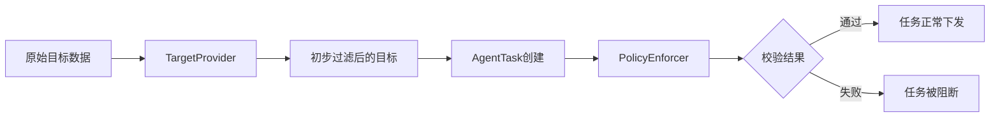

# TargetProvider 与 PolicyEnforcer 模块职责划分

## 概述

在 NeoScan 扫描编排系统中，TargetProvider 和 PolicyEnforcer 是两个负责不同层次策略控制的核心模块。它们协同工作，确保扫描任务既符合业务需求又满足安全合规要求。

Policy Enforcer (策略执行器)
职责: 在任务下发前的最后一道防线，负责"安检"与合规。
核心组件:
- WhitelistChecker: 强制阻断。检查目标是否命中 AssetWhitelist。
原则: 必须在 Master 端拦截，严禁将白名单目标下发给 Agent。
- SkipLogicEvaluator: 动态跳过。执行 AssetSkipPolicy 逻辑。
场景: "如果是生产环境标签 && 当前时间是工作日 -> 跳过高风险扫描"。
- ScopeValidator: 范围校验。确保扫描目标严格限制在 Project 定义的 TargetScope 内，防止意外扫描互联网。

## TargetProvider 模块

### 职责定位
- **功能定位**：目标数据的获取、转换和初步过滤
- **处理阶段**：策略解析和目标生成阶段
- **作用域**：局部策略（基于 ScanStage 配置）

### 核心功能

#### 1. 目标获取
- 从多种异构数据源获取扫描目标
    - 文件（file）
    - 数据库（database）
    - API 接口（api）
    - 手动输入（manual）
    - 前一阶段结果（previous_stage）
    - 项目种子目标（project_target）

#### 2. 目标过滤（局部策略）--- 基于 ScanStage.target_policy 配置
- **白名单过滤**：
    - 基于值的白名单（通过 `whitelist_sources` 配置）
    - 只保留白名单中的目标
- **规则过滤**：
    - 基于 `skip_rule` 的条件过滤
    - 跳过不符合规则的目标

#### 3. 目标转换
- 将不同来源的数据统一转换为标准的 [Target](NeoScan\neoMaster\internal\model\orchestrator\target.go#L15-L20) 对象格式
- 支持多种目标类型：`ip`、`ip_range`、`domain` 等

### 处理逻辑
- 位于策略处理链的上游
- 根据 `ScanStage.target_policy` 配置执行过滤
- 不会阻断任务下发，只过滤目标列表

## PolicyEnforcer 模块

### 职责定位
- **功能定位**：任务下发前的最终安全校验
- **处理阶段**：任务下发阶段
- **作用域**：全局策略（基于数据库配置）

### 核心功能

#### 1. 作用域校验（ScopeValidator）
- 验证扫描目标是否在项目定义的 [TargetScope](NeoScan\neoMaster\internal\model\orchestrator\project.go#L17-L17) 范围内
- 防止意外扫描互联网或其他非授权范围
- 确保扫描活动符合项目边界

#### 2. 全局策略校验 --- 基于数据库中的 AssetWhitelist 和 AssetSkipPolicy
- **全局白名单校验**（WhitelistChecker）：
    - 检查目标是否命中 [AssetWhitelist](NeoScan\neoMaster\internal\model\asset\asset_policy.go#L9-L24)
    - 强制阻断命中白名单的目标
    - 原则：必须在 Master 端拦截，严禁将白名单目标下发给 Agent
- **全局跳过策略校验**（SkipLogicEvaluator）：
    - 执行 [AssetSkipPolicy](NeoScan\neoMaster\internal\model\asset\asset_policy.go#L33-L49) 逻辑
    - 场景：根据环境标签、时间等条件动态跳过扫描(后续添加)

### 处理逻辑
- 位于策略处理链的下游（最后一道防线）
- 使用数据库中的全局规则配置
- **会阻断任务下发**，如果校验不通过

## 模块关系与协作

### 协作流程
1. **TargetProvider** 首先处理目标数据，根据局部策略过滤目标
2. **PolicyEnforcer** 对经过初步过滤的目标进行最终校验
3. 只有通过两层校验的目标才会被下发给 Agent 执行

### 策略层次
- **局部策略**（TargetProvider）：基于具体扫描阶段的配置，灵活性高
- **全局策略**（PolicyEnforcer）：基于系统级配置，强制性高

## 总结

| 特性 | TargetProvider | PolicyEnforcer |
|------|----------------|----------------|
| **处理时机** | 目标生成阶段 | 任务下发前 |
| **策略范围** | 局部策略 | 全局策略 |
| **配置来源** | ScanStage 配置 | 数据库全局配置 |
| **任务阻断** | 否 | 是 |
| **主要功能** | 目标获取与转换 | 最终安全校验 |
| **作用域** | 扫描阶段级别 | 系统级别 |

这两个模块形成了分层的安全防护体系，TargetProvider 负责业务逻辑层面的目标处理，PolicyEnforcer 负责系统安全层面的最终校验，共同保障了扫描任务的准确性和安全性。