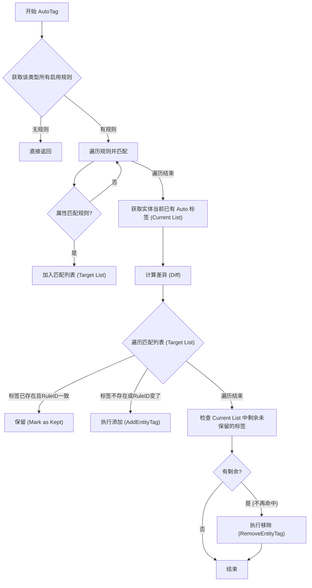

# Tag System Design Philosophy & Implementation

#### 目前支持打标的实体：
- Agnet
- project
- workflow
- ScanStage

#### AgnetTask 也是借助 tag_system 来实现 系统任务 和 普通任务之间的区分。
- system 任务：LocalAgent 
- agent 任务：其他 Agent 执行的任务

#### 资产相关的实体后续也需要支持打标
- AssetHost
- AssetService
- AssetWeb
- AssetWebDetail(不需要)
- AssetVuln
- AssetVulnPoc
- AssetUnified（资产统一模型）
- AssetNetwork
- AssetWhitelist
- AssetSkipPolicy
- AssetFinger(finger_cms/finger_cpe)

#### 系统RBAC也应该支持打标(尚未实现)


本文档记录了标签系统针对三种核心业务场景的设计思考与实现方案。我们的核心准则是**实用主义**和**避免过度设计**。

## 核心哲学 (Core Philosophy)

我们在设计时遵循以下原则：
1.  **拒绝特例**：不要为每个业务场景写死代码 (Hardcoding)。所有的打标逻辑都应抽象为"规则匹配"或"关系传播"。
2.  **复用机制**：如果现有的规则引擎 (`matcher`) 能解决，就不要写新代码。
3.  **好品味 (Good Taste)**：复杂的问题通常只需要一个正确的数据结构就能简化。

---

## 场景分析与解决方案 (Scenarios Analysis)

我们针对用户提出的三个具体场景进行了深入分析，并给出了基于现有架构的最简解法。

### 场景 1: 外部资产自动打标 (External Asset Auto-Tagging)

*   **需求描述**: 资产入库时，如果发现主机开放了 Web 服务（如 80/443 端口），自动打上 "web" 标签。
*   **Linus 分析**:
    *   **判断**: 这是一个单纯的**状态匹配**问题。
    *   **思考**: 这不是代码问题，这是配置问题。如果我们在代码里写 `if port == 80 then tag = "web"`，那我们就是傻瓜。
    *   **决策**: 完全依赖现有的 `matcher` 规则引擎。
*   **实现方式**:
    *   **机制**: 资产入库调用 `AutoTag` 接口。
    *   **配置 (JSON Rule)**:
        ```json
        {
          "field": "port",
          "operator": "in",
          "value": [80, 443, 8080]
        }
        ```
    *   **结果**: 零代码新增，纯数据驱动。

### 场景 2: 手动网段标签传播 (Manual Network-to-Host Propagation)

*   **需求描述**: 管理员给一个网段 (Network) 打上标签（如 "生产网"），点击应用后，该网段下的所有 IP (Host) 自动继承该标签。
*   **Linus 分析**:
    *   **判断**: 这是一个**真问题**。网段和主机存在物理上的层级包含关系 (CIDR)。
    *   **挑战**: 如何在不引入复杂的图遍历或大量数据库查询的情况下实现传播？
    *   **洞察**: "传播"的本质就是一次带范围限制的批量打标。我们可以利用 CIDR 的特性。
    *   **魔法 (The Trick)**：我们在内存中构造一个**虚拟规则 (Virtual Rule)**。我们不需要遍历数据库去找哪些 Host 属于这个 Network，我们只需要告诉执行层："凡是 IP 属于 `192.168.1.0/24` 的，都给我打上标"。
*   **实现方式**:
    *   **代码**: `internal/service/tag_system/tag_service.go` -> `SubmitEntityPropagationTask`
    *   **逻辑**:
        1. 获取网段的 CIDR (例如 `10.0.0.0/8`)。
        2. 构造虚拟规则: `field: "ip", operator: "cidr", value: "10.0.0.0/8"`。
        3. 将此规则包装为 `sys_tag_propagation` 任务提交给 LocalAgent。
    *   **结果**: 复用了现有的自动化任务处理管线，无需编写专门的"网段扫描器"。

### 场景 3: 特定域名自动打标 (Pattern-based Auto-Tagging)

*   **需求描述**: 扫描发现 `cdn*` 开头的域名资产，自动打上 "cdn" 标签。
*   **Linus 分析**:
    *   **判断**: 同场景 1，这是标准的**字符串模式匹配**。
    *   **要求**: 我们的 `matcher` 库必须支持基础的字符串操作，否则就是基础设施的失败。
*   **实现方式**:
    *   **机制**: `AutoTag` 接口。
    *   **配置 (JSON Rule)**:
        ```json
        {
          "field": "domain",
          "operator": "starts_with",
          "value": "cdn"
        }
        ```
    *   **验证**: 检查 `internal/pkg/matcher` 包，确认已支持 `starts_with` 操作符。

---

## 总结 (Conclusion)

通过上述分析，我们只为系统增加了一个核心功能点：**基于实体的虚拟规则传播** (`SubmitEntityPropagationTask`)。其他的需求全部通过配置解决。

这保持了系统的简洁性 (Simplicity) 和正交性 (Orthogonality)。

## AutoTag 函数流程
有剩余不再命中的标签自动删除
